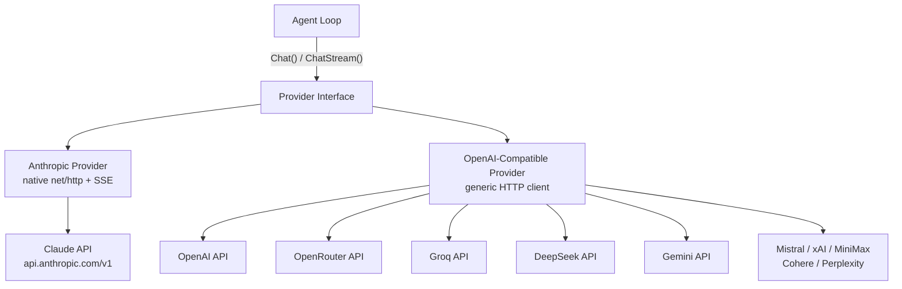
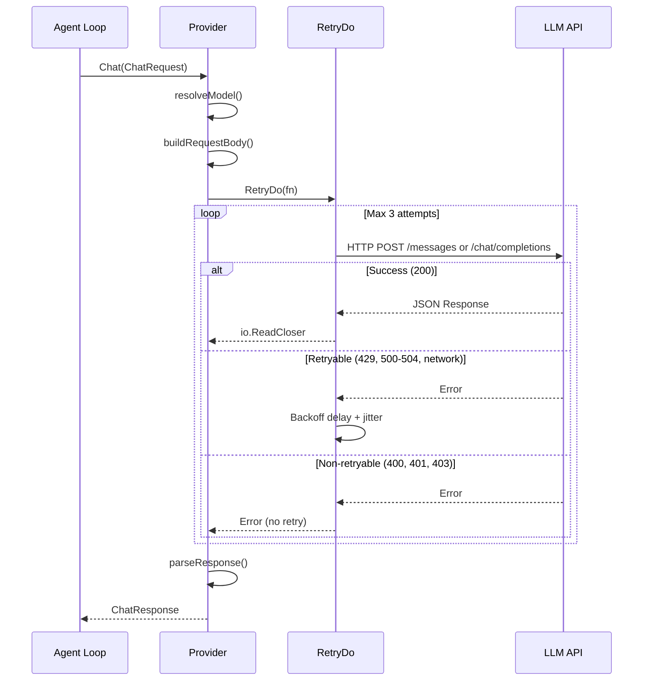
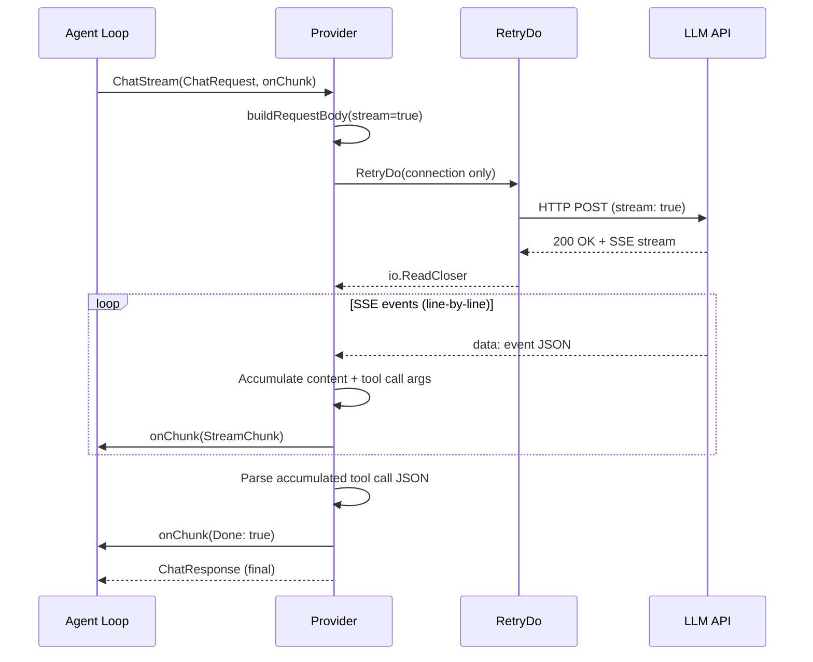
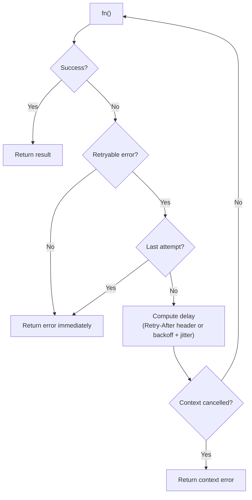
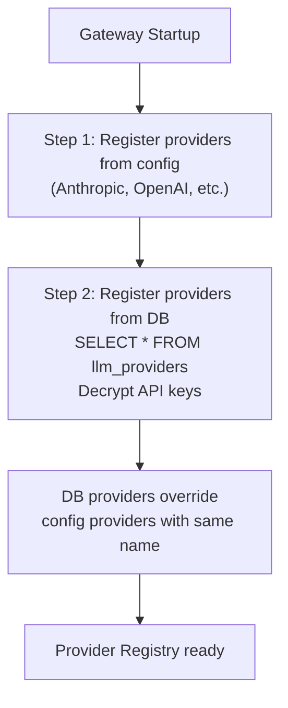
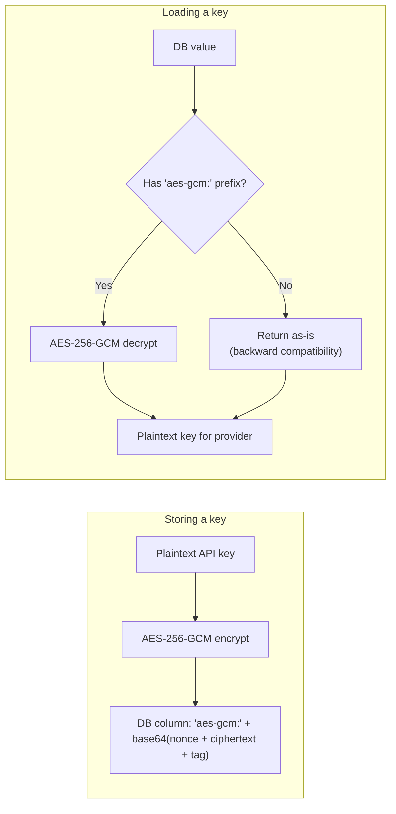
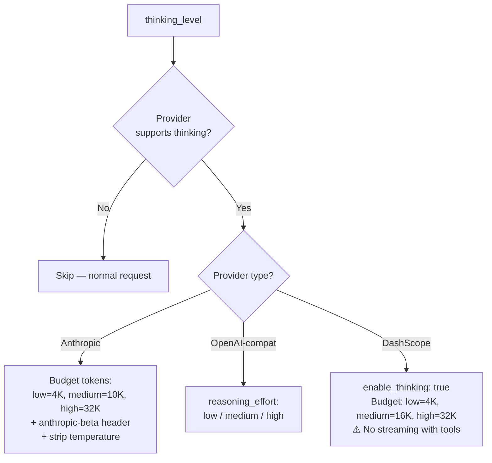
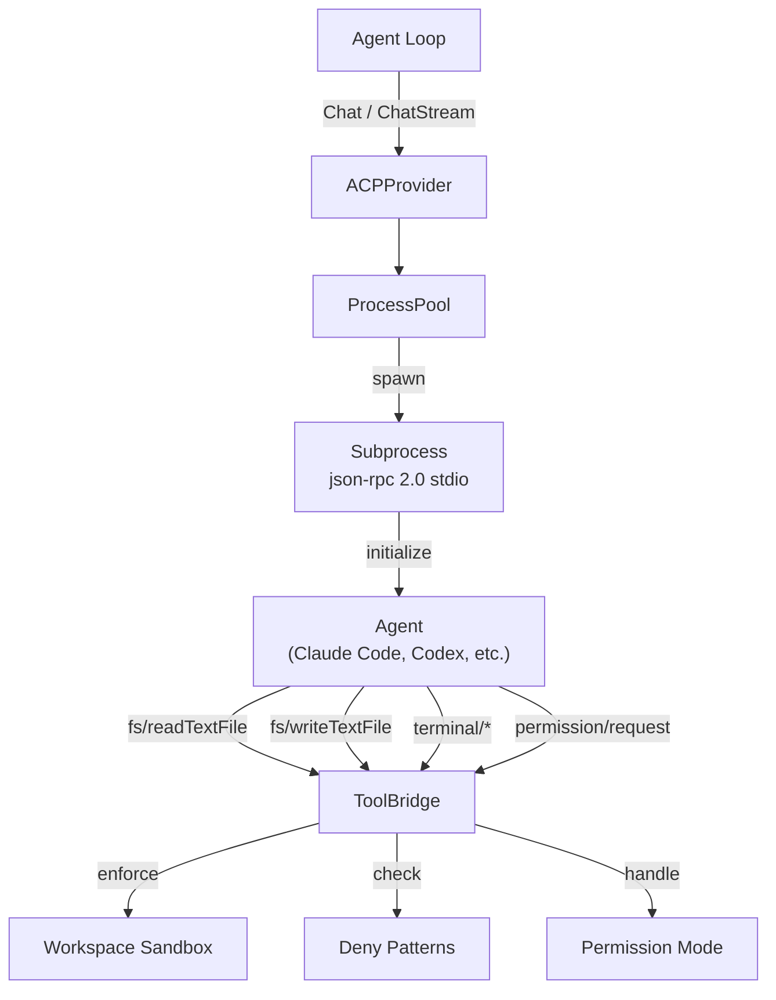

# 02 - LLM Providers

GoClaw abstracts LLM communication behind a single `Provider` interface, allowing the agent loop to work with any backend without knowing the wire format. Two concrete implementations exist: an Anthropic provider using native `net/http` with SSE streaming, and a generic OpenAI-compatible provider that covers 10+ API endpoints.

---

## 1. Provider Architecture

All providers implement four methods: `Chat()`, `ChatStream()`, `Name()`, and `DefaultModel()`. The agent loop calls `Chat()` for non-streaming requests and `ChatStream()` for token-by-token streaming. Both return a unified `ChatResponse` with content, tool calls, finish reason, and token usage.



The Anthropic provider uses `x-api-key` header authentication and the `anthropic-version: 2023-06-01` header. The OpenAI-compatible provider uses `Authorization: Bearer` tokens and targets each provider's `/chat/completions` endpoint. Both providers set an HTTP client timeout of 120 seconds.

---

## 2. Supported Providers

| Provider | Type | API Base / Binary | Default Model |
|----------|------|----------|---------------|
| anthropic | Native HTTP + SSE | `https://api.anthropic.com/v1` | `claude-sonnet-4-5-20250929` |
| openai | OpenAI-compatible | `https://api.openai.com/v1` | `gpt-4o` |
| openrouter | OpenAI-compatible | `https://openrouter.ai/api/v1` | `anthropic/claude-sonnet-4-5-20250929` |
| groq | OpenAI-compatible | `https://api.groq.com/openai/v1` | `llama-3.3-70b-versatile` |
| deepseek | OpenAI-compatible | `https://api.deepseek.com/v1` | `deepseek-chat` |
| gemini | OpenAI-compatible | `https://generativelanguage.googleapis.com/v1beta/openai` | `gemini-2.0-flash` |
| mistral | OpenAI-compatible | `https://api.mistral.ai/v1` | `mistral-large-latest` |
| xai | OpenAI-compatible | `https://api.x.ai/v1` | `grok-3-mini` |
| minimax | OpenAI-compatible | `https://api.minimax.chat/v1` | `MiniMax-M2.5` |
| cohere | OpenAI-compatible | `https://api.cohere.com/v2` | `command-a` |
| perplexity | OpenAI-compatible | `https://api.perplexity.ai` | `sonar-pro` |
| dashscope | OpenAI-compatible | `https://dashscope-intl.aliyuncs.com/compatible-mode/v1` | `qwen3-max` |
| bailian | OpenAI-compatible | `https://coding-intl.dashscope.aliyuncs.com/v1` | `qwen3.5-plus` |
| zai | OpenAI-compatible | `https://api.z.ai/api/paas/v4` | `glm-5` |
| zai_coding | OpenAI-compatible | `https://api.z.ai/api/coding/paas/v4` | `glm-5` |
| acp | ACP (JSON-RPC 2.0 stdio) | `claude`, `codex`, `gemini` (binary name) | `claude` |

---

## 3. Call Flow

### Non-Streaming (Chat)



### Streaming (ChatStream)



Key difference: non-streaming wraps the entire request in `RetryDo`. Streaming retries only the connection phase -- once SSE events start flowing, no retry occurs mid-stream.

---

## 4. Anthropic vs OpenAI-Compatible

| Aspect | Anthropic | OpenAI-Compatible |
|--------|-----------|-------------------|
| Base URL override | `WithAnthropicBaseURL()` option | Via config `api_base` field |
| Implementation | Native `net/http` | Generic HTTP client |
| System messages | Separate `system` field (array of text blocks) | Inline in `messages` array with `role: "system"` |
| Tool definitions | `name` + `description` + `input_schema` | Standard OpenAI function schema |
| Tool results | `role: "user"` with `tool_result` content block + `tool_use_id` | `role: "tool"` with `tool_call_id` |
| Tool call arguments | `map[string]interface{}` (parsed JSON object) | JSON string in `function.arguments` (manual marshal) |
| Tool call streaming | `input_json_delta` events | `delta.tool_calls[].function.arguments` fragments |
| Stop reason mapping | `tool_use` mapped to `tool_calls`, `max_tokens` mapped to `length` | Direct passthrough of `finish_reason` |
| Gemini compatibility | N/A | Skip empty `content` field in assistant messages with tool_calls |
| OpenRouter compatibility | N/A | Model must contain `/` (e.g., `anthropic/claude-...`); unprefixed falls back to default |

---

## 5. Retry Logic

### RetryDo[T] Generic Function

`RetryDo` is a generic function that wraps any provider call with exponential backoff, jitter, and context cancellation support.

### Configuration

| Parameter | Default | Description |
|-----------|---------|-------------|
| Attempts | 3 | Total tries (1 = no retry) |
| MinDelay | 300ms | Initial delay before first retry |
| MaxDelay | 30s | Upper cap on delay |
| Jitter | 0.1 (10%) | Random variation applied to each delay |

### Backoff Formula

```
delay = MinDelay * 2^(attempt - 1)
delay = min(delay, MaxDelay)
delay = delay +/- (delay * jitter * random)

Example:
  Attempt 1: 300ms (+/-30ms)  -> 270ms..330ms
  Attempt 2: 600ms (+/-60ms)  -> 540ms..660ms
  Attempt 3: 1200ms (+/-120ms) -> 1080ms..1320ms
```

If the response includes a `Retry-After` header (HTTP 429 or 503), the header value completely replaces the computed backoff. The header is parsed as integer seconds or RFC 1123 date format.

### Retryable vs Non-Retryable Errors

| Category | Conditions |
|----------|------------|
| Retryable | HTTP 429, 500, 502, 503, 504; network errors (`net.Error`); connection reset; broken pipe; EOF; timeout |
| Non-retryable | HTTP 400, 401, 403, 404; all other status codes |

### Retry Flow



---

## 6. Schema Cleaning

Some providers reject tool schemas containing unsupported JSON Schema fields. `CleanSchemaForProvider()` recursively removes these fields from the entire schema tree, including nested `properties`, `anyOf`, `oneOf`, and `allOf`.

| Provider | Fields Removed |
|----------|---------------|
| Gemini | `$ref`, `$defs`, `additionalProperties`, `examples`, `default` |
| Anthropic | `$ref`, `$defs` |
| All others | No cleaning applied |

The Anthropic provider calls `CleanSchemaForProvider("anthropic", ...)` when converting tool definitions to the `input_schema` format. The OpenAI-compatible provider calls `CleanToolSchemas()` which applies the same logic per provider name.

---

## 7. Providers from Database

Providers are loaded from the `llm_providers` table in addition to the config file. Database providers override config providers with the same name.

### Loading Flow



### API Key Encryption



`GOCLAW_ENCRYPTION_KEY` accepts three formats:
- **Hex**: 64 characters (32 bytes decoded)
- **Base64**: 44 characters (32 bytes decoded)
- **Raw**: 32 characters (32 bytes direct)

---

## 8. Extended Thinking

Extended thinking allows LLMs to generate internal reasoning tokens before producing a response, improving quality for complex tasks. GoClaw supports this across multiple providers with a unified `thinking_level` configuration. See [12-extended-thinking.md](./12-extended-thinking.md) for full details.

### Provider Mapping



### Streaming

- **Anthropic**: `thinking_delta` events accumulate into `StreamChunk.Thinking`
- **OpenAI-compat**: `reasoning_content` in response delta
- **DashScope**: Falls back to non-streaming when tools are present, synthesizes chunk callbacks

### Tool Loop Handling

Anthropic requires thinking blocks (including cryptographic signatures) to be echoed back in subsequent tool-use turns. `RawAssistantContent` preserves these raw blocks for API passback. Other providers handle reasoning content as independent per-turn metadata.

---

## 9. DashScope and Bailian Providers

Two providers for the Alibaba Cloud AI ecosystem.

### DashScope (Alibaba Qwen)

Wraps the OpenAI-compatible provider with a critical override: when tools are present, streaming is disabled. The provider falls back to a single `Chat()` call and synthesizes chunk callbacks to maintain the event flow.

- **Default model**: `qwen3-max`
- **Thinking support**: Custom budget mapping (low=4,096, medium=16,384, high=32,768)
- **Known limitation**: No simultaneous streaming + tools

### Bailian Coding

Standard OpenAI-compatible provider targeting the Alibaba Coding API.

- **Default model**: `qwen3.5-plus`
- **Base URL**: `https://coding-intl.dashscope.aliyuncs.com/v1`

---

## 10. ACP Provider (Agent Client Protocol)

The ACP provider enables GoClaw to orchestrate external coding agents (Claude Code, Codex CLI, Gemini CLI, or any ACP-compatible agent) as subprocesses via JSON-RPC 2.0 over stdio. This allows delegating complex code generation tasks to specialized agents while maintaining GoClaw's unified interface.

### Architecture Overview



### Configuration

ACPConfig struct fields:

```go
type ACPConfig struct {
	Binary   string   // agent binary name or path (e.g. "claude", "codex")
	Args     []string // extra spawn args
	Model    string   // default model/agent name (e.g. "claude")
	WorkDir  string   // base workspace dir
	IdleTTL  string   // process idle TTL (e.g. "5m")
	PermMode string   // "approve-all" (default), "approve-reads", "deny-all"
}
```

Example config.json:

```json5
{
  "providers": {
    "acp": {
      "binary": "claude",
      "args": ["--profile", "goclaw"],
      "model": "claude",
      "work_dir": "/tmp/workspace",
      "idle_ttl": "5m",
      "perm_mode": "approve-all"
    }
  }
}
```

Database-based provider registration:

- `provider_type = "acp"`
- `api_base = "claude"` (binary name)
- `settings = { "args": [...], "idle_ttl": "5m", "perm_mode": "approve-all", "work_dir": "..." }`

### Session Management

#### ProcessPool

Manages subprocess lifecycle with idle TTL reaping and crash recovery:

1. **GetOrSpawn** — Retrieve existing session or spawn new subprocess
2. **Idle TTL** — Reap idle processes after configured duration (default 5m)
3. **Crash Recovery** — Restart failed subprocesses transparently

#### ToolBridge

Handles agent → client requests for filesystem and terminal operations:

- **fs/readTextFile** — Read file within workspace sandbox
- **fs/writeTextFile** — Write file within workspace sandbox
- **terminal/createTerminal** — Spawn terminal subprocess
- **terminal/terminalOutput** — Fetch terminal output + exit status
- **terminal/waitForTerminalExit** — Block until terminal exit
- **terminal/releaseTerminal** — Clean up terminal resources
- **terminal/killTerminal** — Force-terminate terminal
- **permission/request** — Request user approval (approve-all, approve-reads, deny-all)

### Content Handling

ACP messages use `ContentBlock` with three types:

```go
type ContentBlock struct {
	Type     string // "text", "image", "audio"
	Text     string // text content
	Data     string // base64 for image/audio
	MimeType string // e.g., "image/png", "audio/wav"
}
```

Request extraction:

1. Extract system prompt + user message from GoClaw `ChatRequest.Messages`
2. Prepend system prompt to first user message (ACP agents lack separate system API)
3. Attach images as separate blocks

Response collection:

1. Accumulate `SessionUpdate` notifications during prompt execution
2. Collect text blocks into response content
3. Return finish reason mapped from `stopReason` ("maxContextLength" → "length", others → "stop")

### Security & Sandboxing

#### Workspace Isolation

All file operations are scoped to `WorkDir`. Attempts to escape (e.g., `../../../etc/passwd`) are rejected.

#### Deny Patterns

Regex patterns (from config or tools policy) prevent access to sensitive paths:

```
[
  "^/etc/",
  "^\\.env",
  "^secret",
  "^[Cc]redentials"
]
```

Each agent request is validated against deny patterns before execution.

#### Permission Modes

| Mode | Behavior |
|------|----------|
| `approve-all` | All requests approved (default) |
| `approve-reads` | Read-only; filesystem writes denied |
| `deny-all` | All requests denied |

### Session Sequencing

Per-session requests are serialized via `sessionMu` mutex to prevent concurrent tool access that could corrupt file state:

```go
unlock := p.lockSession(sessionKey)
defer unlock()
// ... execute Chat or ChatStream with guaranteed serial access
```

### Streaming vs Non-Streaming

#### Chat (Non-Streaming)

Returns complete response after agent execution finishes. Collects all text blocks and returns single `ChatResponse`.

#### ChatStream

Emits `StreamChunk` for each text delta via callback. Supports context cancellation by sending `session/cancel` notification. Returns combined response when complete.

---

## 11. Agent Evaluators (Hook System)

Agent evaluators in the quality gate / hook system (see [03-tools-system.md](./03-tools-system.md)) use the same provider resolution as normal agent runs. When a quality gate is configured with `"type": "agent"`, the hook engine delegates to the specified reviewer agent, which resolves its own provider through the standard provider registry. No separate provider configuration is needed for evaluator agents.

---

## File Reference

| File | Purpose |
|------|---------|
| `internal/providers/types.go` | Provider interface, ChatRequest, ChatResponse, Message, ToolCall, Usage types |
| `internal/providers/anthropic.go` | Anthropic provider implementation (native HTTP + SSE streaming) |
| `internal/providers/openai.go` | OpenAI-compatible provider implementation (generic HTTP) |
| `internal/providers/retry.go` | RetryDo[T] generic function, RetryConfig, IsRetryableError, backoff computation |
| `internal/providers/schema_cleaner.go` | CleanSchemaForProvider, CleanToolSchemas, recursive schema field removal |
| `internal/providers/dashscope.go` | DashScope provider: thinking budget, tools+streaming fallback |
| `internal/providers/acp_provider.go` | ACPProvider implementation: orchestrates ACP agents as subprocesses |
| `internal/providers/acp/types.go` | ACP protocol types: InitializeRequest, SessionUpdate, ContentBlock, etc. |
| `internal/providers/acp/process.go` | ProcessPool: subprocess lifecycle, idle TTL reaping, crash recovery |
| `internal/providers/acp/jsonrpc.go` | JSON-RPC 2.0 request/response marshaling over stdio |
| `internal/providers/acp/tool_bridge.go` | ToolBridge: handles fs and terminal requests, workspace sandboxing |
| `internal/providers/acp/terminal.go` | Terminal lifecycle: create, output, exit, release, kill |
| `internal/providers/acp/session.go` | Session state tracking per ACP agent |
| `cmd/gateway_providers.go` | Provider registration from config and database during gateway startup |

---

## Cross-References

| Document | Relevant Content |
|----------|-----------------|
| [12-extended-thinking.md](./12-extended-thinking.md) | Full extended thinking documentation |
| [01-agent-loop.md](./01-agent-loop.md) | LLM iteration loop, streaming chunk handling |
