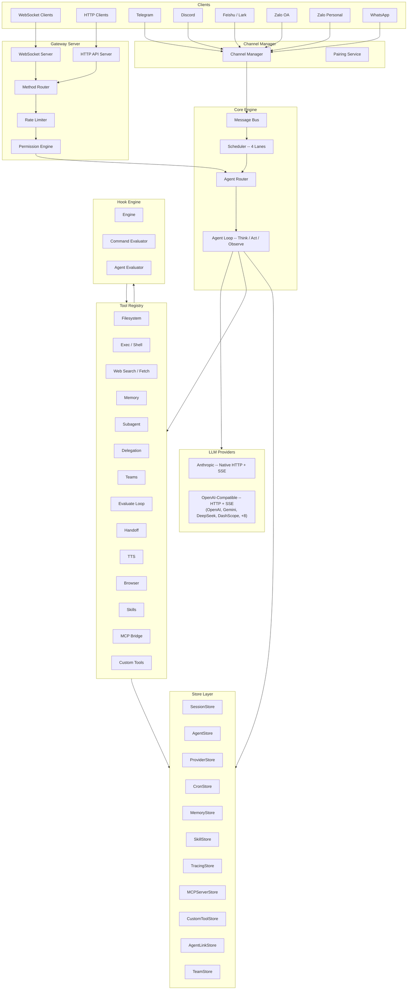
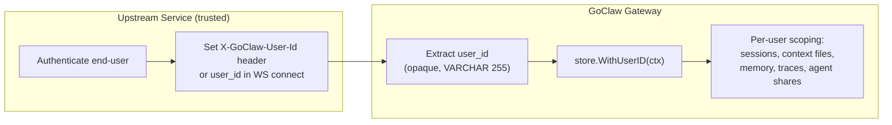
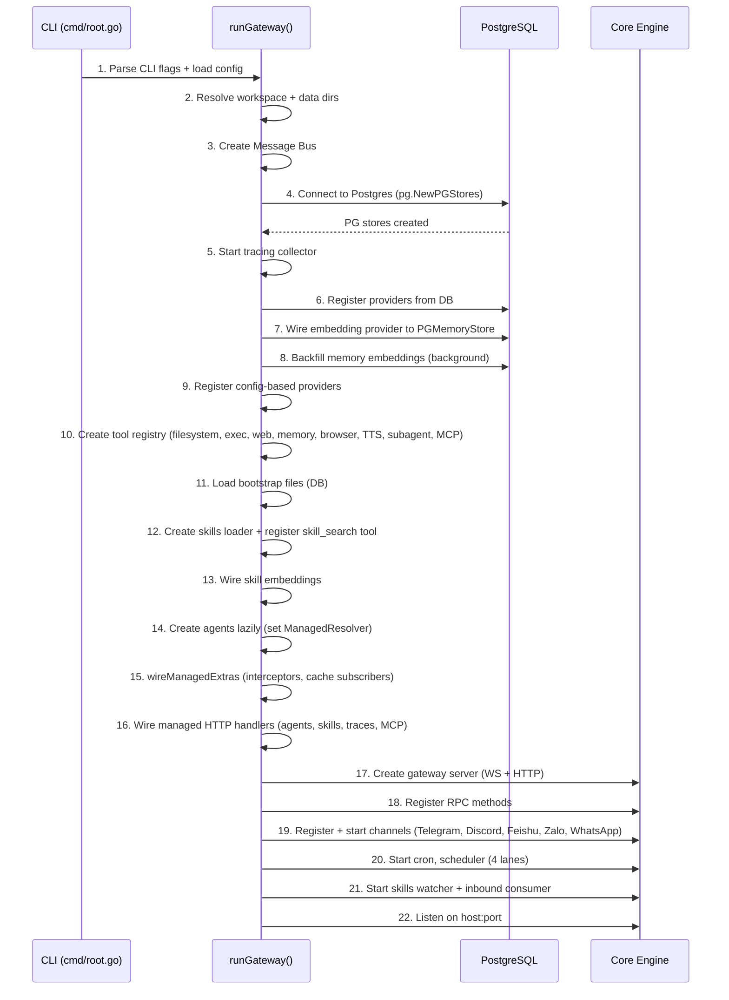
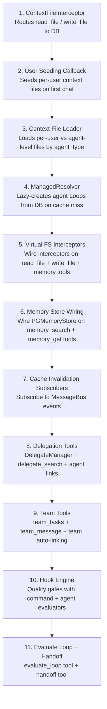
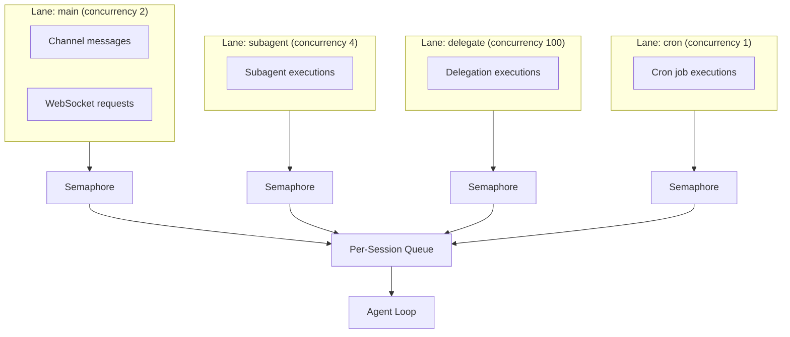
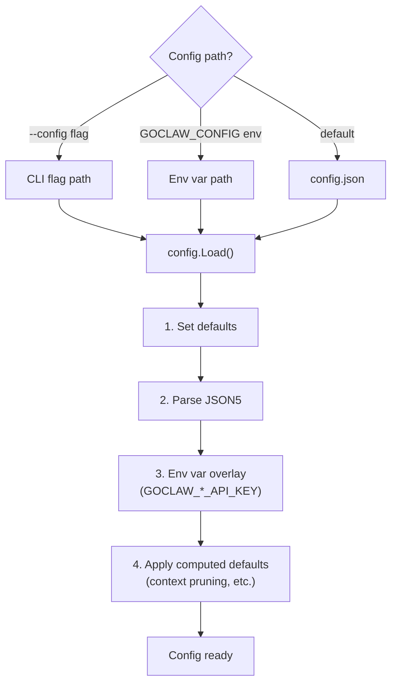

# 00 - 架构概述

## 1. 概述

GoClaw 是一个用 Go 语言编写的 AI Agent 网关。它提供 WebSocket RPC (v3) 接口和兼容 OpenAI 的 HTTP API，用于编排基于 LLM 的 Agent。系统使用 PostgreSQL 作为存储后端，具备完整的多租户隔离、每用户上下文文件、加密凭证、Agent 委派、团队和 LLM 调用追踪功能。

## 2. 组件图



## 3. 模块映射

| 模块 | 描述 |
|--------|-------------|
| `internal/gateway/` | WebSocket + HTTP 服务器，客户端处理，方法路由器 |
| `internal/gateway/methods/` | RPC 方法处理器：chat、agents、agent_links、teams、delegations、sessions、config、skills、cron、pairing、exec approval、usage、send |
| `internal/agent/` | Agent 循环（think、act、observe），路由器，解析器，系统提示构建器，清理，裁剪，追踪，内存刷新，DELEGATION.md + TEAM.md 注入 |
| `internal/providers/` | LLM 提供商：Anthropic（原生 HTTP + SSE 流式）、OpenAI 兼容（HTTP + SSE，12+ 提供商）、DashScope（Qwen）、扩展思考支持、重试逻辑 |
| `internal/tools/` | 工具注册表，文件系统操作，exec/shell，策略引擎，子 Agent，委派管理器，团队工具，评估循环，切换，上下文文件 + 内存拦截器，凭证清理，速率限制，PathDenyable |
| `internal/tools/dynamic_loader.go` | 自定义工具加载器：LoadGlobal（启动时）、LoadForAgent（每 Agent 克隆）、ReloadGlobal（缓存失效） |
| `internal/tools/dynamic_tool.go` | 自定义工具执行器：命令模板渲染，shell 转义，加密环境变量 |
| `internal/hooks/` | Hook 引擎：质量门控，命令评估器，Agent 评估器，递归防护（`WithSkipHooks`） |
| `internal/store/` | Store 接口：SessionStore、AgentStore、ProviderStore、SkillStore、MemoryStore、CronStore、PairingStore、TracingStore、MCPServerStore、AgentLinkStore、TeamStore、ChannelInstanceStore、ConfigSecretsStore |
| `internal/store/pg/` | PostgreSQL 实现（`database/sql` + `pgx/v5`） |
| `internal/bootstrap/` | 系统提示文件（AGENTS.md、SOUL.md、TOOLS.md、IDENTITY.md、USER.md、BOOTSTRAP.md）+ 种子数据 + 截断 |
| `internal/config/` | 配置加载（JSON5）+ 环境变量覆盖 |
| `internal/skills/` | SKILL.md 加载器（5 层层级）+ BM25 搜索 + 通过 fsnotify 热重载 |
| `internal/channels/` | 频道管理器 + 适配器：Telegram（论坛主题、STT、机器人命令）、飞书/Lark（流式卡片、媒体）、Zalo OA、Zalo Personal、Discord、WhatsApp |
| `internal/mcp/` | MCP 服务器桥接（stdio、SSE、streamable-HTTP 传输） |
| `internal/scheduler/` | 基于通道的并发控制（main、subagent、cron、delegate 通道），每会话序列化 |
| `internal/memory/` | 内存系统（pgvector 混合搜索） |
| `internal/permissions/` | RBAC 策略引擎（admin、operator、viewer 角色） |
| `internal/store/pg/pairing.go` | DM/设备配对服务（8 字符代码，数据库支持） |
| `internal/sessions/` | 会话管理器 |
| `internal/bus/` | 事件发布/订阅（Message Bus） |
| `internal/sandbox/` | 基于 Docker 的代码执行沙箱 |
| `internal/tts/` | 文本转语音提供商：OpenAI、ElevenLabs、Edge、MiniMax |
| `internal/http/` | HTTP API 处理器：/v1/chat/completions、/v1/agents、/v1/skills、/v1/traces、/v1/mcp、/v1/delegations、summoner |
| `internal/crypto/` | AES-256-GCM 加密（用于 API 密钥） |
| `internal/tracing/` | LLM 调用追踪（traces + spans），内存缓冲区定期存储刷新 |
| `internal/tracing/otelexport/` | 可选 OpenTelemetry OTLP 导出器（通过构建标签选择加入；添加 gRPC + protobuf） |

---

## 4. 多租户身份模型

GoClaw 使用**身份传播**模式（也称为**受信任子系统**）。它不实现身份验证或授权——而是信任使用网关令牌进行身份验证的上游服务提供准确的用户身份。



### 身份流程

| 入口点 | user_id 提供方式 | 强制执行 |
|-------------|------------------------|-------------|
| HTTP API | `X-GoClaw-User-Id` 头 | 必需 |
| WebSocket | `connect` 握手中的 `user_id` 字段 | 必需 |
| Channels | 从平台发送者 ID 派生（如 Telegram user ID） | 自动 |

### 复合用户 ID 约定

`user_id` 字段对 GoClaw 是**不透明**的——它不解释或验证格式。对于多租户部署，推荐的约定是：

```
tenant.{tenantId}.user.{userId}
```

这种分层格式确保租户之间的自然隔离。由于 `user_id` 在所有每用户表（`user_context_files`、`user_agent_profiles`、`user_agent_overrides`、`agent_shares`、`sessions`、`traces`）中用作作用域键，复合格式保证来自不同租户的用户无法访问彼此的数据。

### user_id 使用位置

| 组件 | 用途 |
|-----------|-------|
| Session 键 | `agent:{agentId}:{channel}:direct:{peerId}` — peerId 从 user_id 派生 |
| 上下文文件 | `user_context_files` 表按 `(agent_id, user_id)` 限定范围 |
| 用户配置 | `user_agent_profiles` 表 — 首次/最后可见、工作区 |
| 用户覆盖 | `user_agent_overrides` — 每用户提供商/模型偏好 |
| Agent 共享 | `agent_shares` 表 — 用户级访问控制 |
| 内存 | 通过上下文传播的每用户内存条目 |
| 追踪 | `traces` 表包含 `user_id` 用于过滤 |
| MCP 授权 | `mcp_user_grants` — 每用户 MCP 服务器访问 |
| Skills 授权 | `skill_user_grants` — 每用户技能访问 |

---

## 6. 网关启动序列



---

## 7. 数据库连接

`cmd/gateway_managed.go` 中的 `wireManagedExtras()` 函数连接多租户组件：



### 缓存失效事件

| 事件 | 订阅者 | 动作 |
|-------|-----------|--------|
| `cache:bootstrap` | ContextFileInterceptor | `InvalidateAgent()` 或 `InvalidateAll()` |
| `cache:agent` | AgentRouter | `InvalidateAgent()` — 强制从 DB 重新解析 |
| `cache:skills` | SkillStore | `BumpVersion()` |
| `cache:cron` | CronStore | `InvalidateCache()` |
| `cache:custom_tools` | DynamicToolLoader | `ReloadGlobal()` + `AgentRouter.InvalidateAll()` |

---

## 8. 调度器通道

调度器使用基于通道的并发模型。每个通道是一个具有有界信号量的命名工作池。每会话队列控制每个会话内的并发。



### 通道默认值

| 通道 | 并发数 | 环境变量覆盖 | 用途 |
|------|:-----------:|-------------|---------|
| `main` | 2 | `GOCLAW_LANE_MAIN` | 主要用户聊天会话 |
| `subagent` | 4 | `GOCLAW_LANE_SUBAGENT` | 衍生的子 Agent |
| `delegate` | 100 | `GOCLAW_LANE_DELEGATE` | Agent 委派执行 |
| `cron` | 1 | `GOCLAW_LANE_CRON` | 定时 Cron 任务 |

### 会话队列并发

每会话队列现在支持可配置的 `maxConcurrent`：
- **DM（私聊）**：`maxConcurrent = 1`（每用户单线程）
- **群组**：`maxConcurrent = 3`（多个并发响应）
- **自适应节流**：当会话历史超过上下文窗口 60% 时，并发降至 1

### 队列模式

| 模式 | 行为 |
|------|----------|
| `queue` | FIFO — 新消息等待当前运行完成 |
| `followup` | 将传入消息作为后续合并到待处理队列 |
| `interrupt` | 取消活动运行并用新消息替换 |

默认队列配置：容量 10，丢弃策略 `old`（溢出时丢弃最旧），防抖 800ms。

### /stop 和 /stopall

- `/stop` — 取消最旧的运行任务（其他继续）
- `/stopall` — 取消所有运行任务 + 清空队列

两者都在防抖器之前被拦截，以避免与普通消息合并。

---

## 9. 优雅关闭

当进程收到 SIGINT 或 SIGTERM 时：

1. 向所有连接的 WebSocket 客户端广播 `shutdown` 事件。
2. `channelMgr.StopAll()` — 停止所有频道适配器。
3. `cronStore.Stop()` — 停止 cron 调度器。
4. `sandboxMgr.Stop()` + `ReleaseAll()` — 释放 Docker 容器。
6. `cancel()` — 取消根上下文，传播到消费者 + 调度器。
7. 延迟清理：刷新追踪收集器、关闭内存存储、关闭浏览器管理器、停止调度器通道。
8. HTTP 服务器关闭，**5 秒超时**（`context.WithTimeout`）。

---

## 10. 配置系统

配置从带有环境变量覆盖的 JSON5 文件加载。密钥永远不会持久化到配置文件。



### 关键配置节

| 节 | 用途 |
|---------|---------|
| `gateway` | host、port、token、allowed_origins、rate_limit_rpm、max_message_chars |
| `agents` | 默认值（provider、model、context_window）+ 列表（每 Agent 覆盖） |
| `tools` | profile、allow/deny 列表、exec_approval、web、browser、mcp_servers、rate_limit_per_hour |
| `channels` | 每频道：enabled、token、dm_policy、group_policy、allow_from |
| `database` | postgres_dsn 仅从环境变量读取 |

### 密钥处理

- 密钥仅存在于环境变量或 `.env.local` 中 — 从不在 `config.json` 中。
- `GOCLAW_POSTGRES_DSN` 标记为 `json:"-"`，无法从配置文件读取。
- `MaskedCopy()` 在通过 WebSocket 返回配置时将 API 密钥替换为 `"***"`。
- `StripSecrets()` 在将配置写入磁盘前移除密钥。
- 配置热重载通过 `fsnotify` 监视器实现，带 300ms 防抖。

---

## 11. 文件参考

| 文件 | 用途 |
|------|---------|
| `cmd/root.go` | Cobra CLI 入口点，标志解析 |
| `cmd/gateway.go` | 网关启动编排器（`runGateway()`） |
| `cmd/gateway_managed.go` | 数据库连接（`wireManagedExtras()`、`wireManagedHTTP()`） |
| `cmd/gateway_callbacks.go` | 共享回调（用户种子、上下文文件加载） |
| `cmd/gateway_consumer.go` | 入站消息消费者（子 Agent、委派、队友、切换路由） |
| `cmd/gateway_providers.go` | 提供商注册（基于配置 + 基于 DB） |
| `cmd/gateway_methods.go` | RPC 方法注册 |
| `internal/config/config.go` | 配置结构定义 |
| `internal/config/config_load.go` | JSON5 加载 + 环境变量覆盖 |
| `internal/config/config_channels.go` | 频道配置结构 |
| `internal/gateway/server.go` | WS + HTTP 服务器，CORS，速率限制器设置 |
| `internal/gateway/client.go` | WebSocket 客户端处理，读取限制（512KB） |
| `internal/gateway/router.go` | RPC 方法路由 |
| `internal/scheduler/lanes.go` | 通道定义，基于信号量的并发 |
| `internal/scheduler/queue.go` | 每会话队列，队列模式，防抖 |
| `internal/hooks/engine.go` | Hook 引擎：评估器注册表，`EvaluateHooks` |
| `internal/hooks/command_evaluator.go` | Shell 命令评估器（exit 0 = 通过） |
| `internal/hooks/agent_evaluator.go` | Agent 委派评估器（APPROVED/REJECTED） |
| `internal/hooks/context.go` | `WithSkipHooks` / `SkipHooksFromContext`（递归防护） |
| `internal/store/stores.go` | `Stores` 容器结构（所有 14 个 store 接口） |
| `internal/store/types.go` | `StoreConfig`、`BaseModel` |

---

## 交叉引用

| 文档 | 内容 |
|----------|---------|
| [01-agent-loop.md](./01-agent-loop.md) | Agent 循环详情，清理管道，历史管理 |
| [02-providers.md](./02-providers.md) | LLM 提供商，重试逻辑，schema 清理 |
| [03-tools-system.md](./03-tools-system.md) | 工具注册表，策略引擎，拦截器，自定义工具，MCP 授权 |
| [04-gateway-protocol.md](./04-gateway-protocol.md) | WebSocket 协议 v3，HTTP API，RBAC，身份传播 |
| [05-channels-messaging.md](./05-channels-messaging.md) | 频道适配器，Telegram 格式化，配对，每用户作用域 |
| [06-store-data-model.md](./06-store-data-model.md) | Store 接口，PostgreSQL schema，会话缓存，自定义工具 store |
| [07-bootstrap-skills-memory.md](./07-bootstrap-skills-memory.md) | 引导文件，技能系统，内存，技能授权 |
| [08-scheduling-cron.md](./08-scheduling-cron.md) | 调度器通道，cron 生命周期 |
| [09-security.md](./09-security.md) | 防御层，加密，速率限制，RBAC，沙箱 |
| [10-tracing-observability.md](./10-tracing-observability.md) | 追踪收集器，span 层次结构，OTel 导出，trace API |
| [11-agent-teams.md](./11-agent-teams.md) | Agent 团队，任务板，邮箱，委派集成 |
| [12-extended-thinking.md](./12-extended-thinking.md) | 扩展思考，每提供商支持，流式传输 |