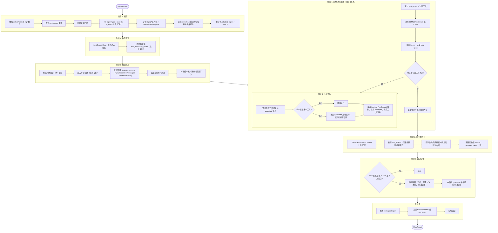
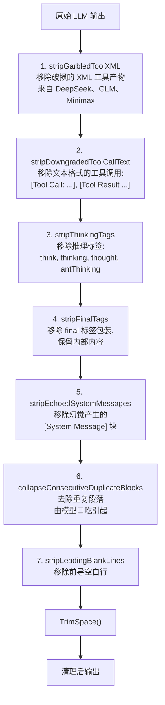
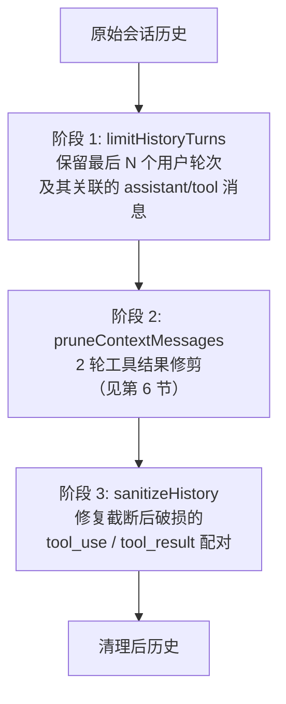
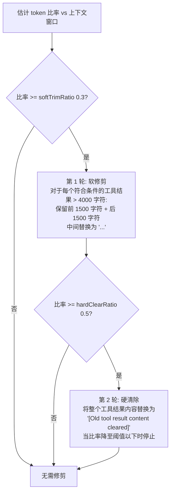
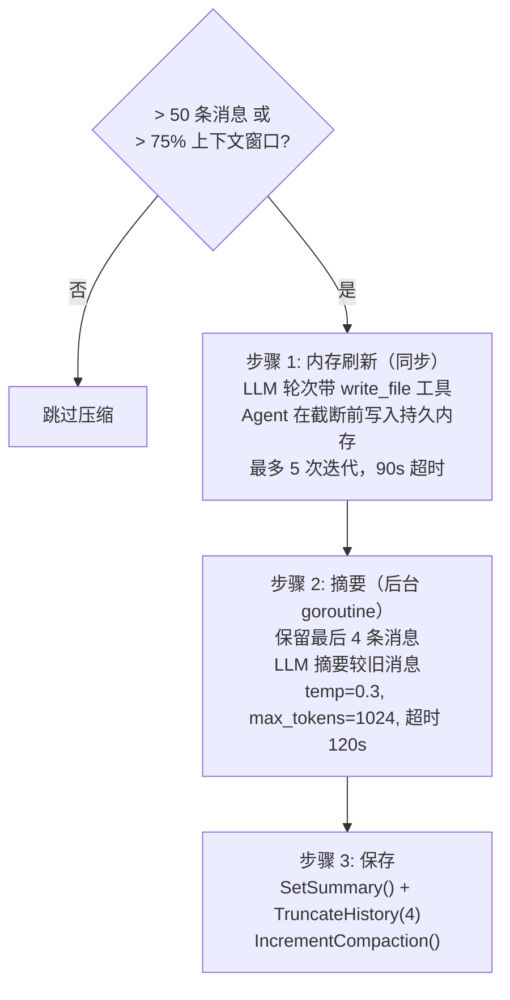
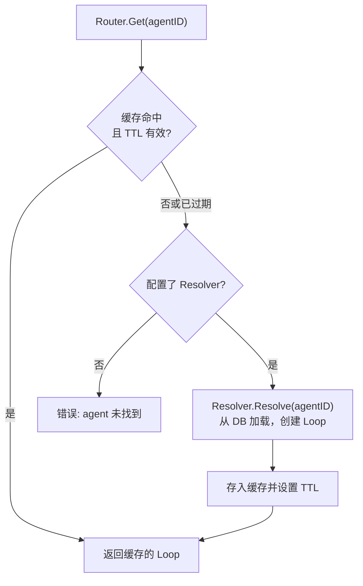
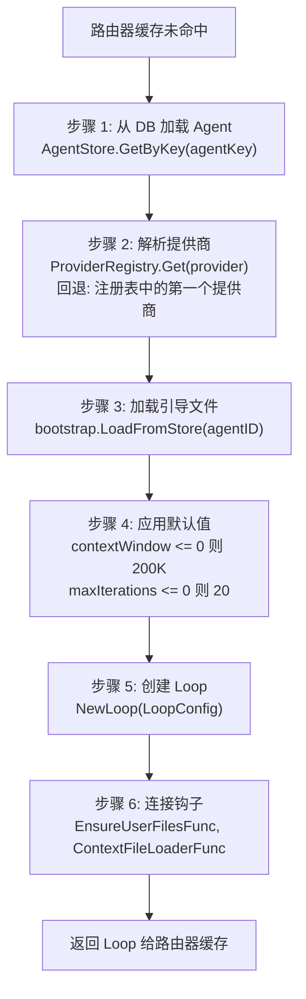
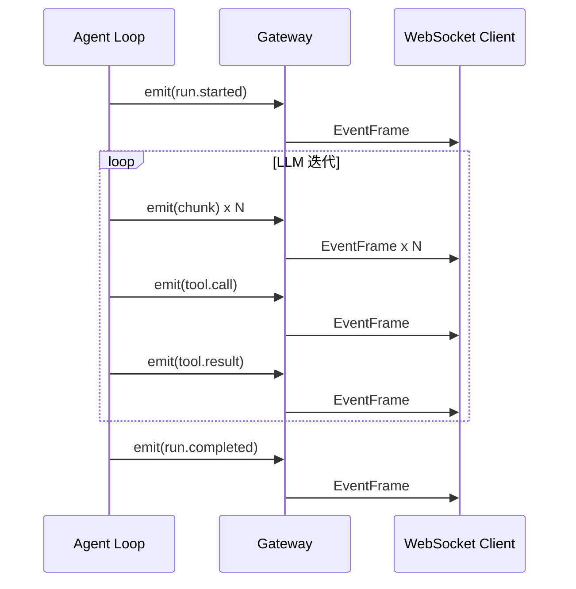
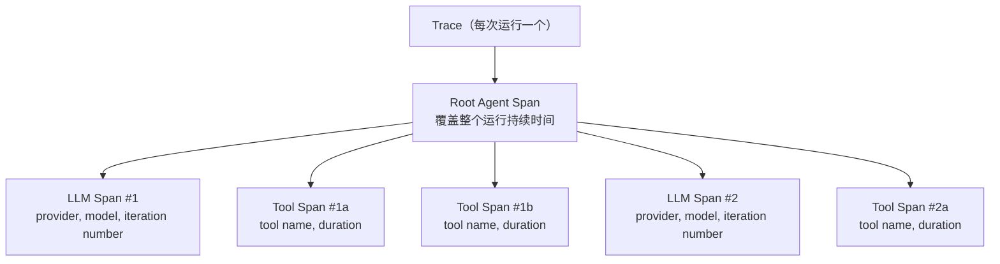

# 01 - Agent 循环

## 概述

Agent 循环实现了 **Think --> Act --> Observe**（思考 → 行动 → 观察）循环。每个 Agent 拥有一个 `Loop` 实例，配置了提供商、模型、工具、工作区和 Agent 类型。用户消息作为 `RunRequest` 进入，经过 `runLoop`，以 `RunResult` 退出。循环最多迭代 20 次：LLM 思考，可选择调用工具，观察结果，重复直到产生最终文本响应。

---

## 1. RunRequest 流程

单次 Agent 运行的完整生命周期分为七个阶段。

### 阶段 1: 设置

- 增加 `activeRuns` 原子计数器（无互斥锁 —— 真正的并发，特别是在 `maxConcurrent = 3` 的群组聊天中）。
- 发送 `run.started` 事件通知已连接的客户端。
- 使用生成的追踪 UUID 创建追踪记录。
- 传播上下文值：`WithAgentID()`、`WithUserID()`、`WithAgentType()`。下游工具和拦截器依赖这些值。
- 计算每用户工作区：`base + "/" + sanitize(userID)`。通过 `WithToolWorkspace(ctx)` 注入，使所有文件系统和 shell 工具使用正确的目录。
- 确保每用户文件存在。`sync.Map` 缓存保证种子函数每个用户最多运行一次。
- 在会话上持久化 agent ID 和 user ID 以供后续引用。

### 阶段 2: 输入验证

- **InputGuard**：根据 6 个正则模式扫描用户消息，检测提示注入尝试。详见第 4 节。
- **消息截断**：如果消息超过 `max_message_chars`（默认 32,768），内容会被截断，LLM 会收到输入被缩短的通知。消息永远不会被直接拒绝。

### 阶段 3: 构建消息

- 构建系统提示（15+ 部分）。上下文文件根据 Agent 类型动态解析。
- 注入对话摘要（如果存在来自之前压缩的摘要）作为前两条消息。
- 运行历史管道（3 个阶段，见第 5 节）。
- 追加当前用户消息。消息在本地缓冲（延迟写入）以避免同一会话上并发运行的竞争条件。

### 阶段 4: LLM 迭代循环

- 通过 PolicyEngine（RBAC）过滤可用工具。
- 调用 LLM。流式调用实时发送 `chunk` 事件；非流式调用返回单个响应。
- 记录 LLM span 用于追踪，包含 token 计数和时间。
- 如果响应不包含工具调用，退出循环。
- 如果存在工具调用，进入阶段 5 然后循环返回。
- 最多 20 次迭代后循环强制退出。

### 阶段 5: 工具执行

- 将 assistant 消息（包含工具调用）追加到消息列表。
- **单个工具调用**：顺序执行（无 goroutine 开销）。
- **多个工具调用**：启动并行 goroutine，收集所有结果，按原始索引排序，然后顺序处理。
- 执行前发送 `tool.call`，执行后发送 `tool.result`。
- 为每次调用记录 tool span。单独跟踪异步工具（spawn、cron）。
- 将工具消息保存到会话。

### 阶段 6: 响应最终化

- 运行 `SanitizeAssistantContent` —— 一个 7 步清理管道（见第 3 节）。
- 在最终内容中检测 `NO_REPLY`。如果存在，抑制消息发送（静默回复）。
- 原子性地将所有缓冲消息刷新到会话（用户消息、工具消息、assistant 消息）。这防止并发运行交错部分历史。
- 更新会话元数据：模型名称、提供商名称、累计 token 计数。

### 阶段 7: 自动摘要

- **触发条件**：历史超过 50 条消息 或 估计 token 计数超过上下文窗口的 75%。
- **每会话 TryLock**：在摘要前获取非阻塞的每会话锁。如果另一个并发运行已经在摘要，则跳过。这防止并发摘要破坏会话历史。
- **先刷新内存**：同步运行，让 Agent 在历史被截断前持久化持久内存。最多 5 次 LLM 迭代，90 秒超时。
- **摘要**：启动后台 goroutine，120 秒超时。LLM 生成除最后 4 条消息外所有消息的摘要。摘要被保存，历史被截断为这 4 条消息。压缩计数器递增。

### 取消处理

当上下文被取消（通过 `/stop` 或 `/stopall`）时，循环立即退出：

- 追踪最终化在 `ctx.Err() != nil` 时使用 `context.Background()` 回退，确保最后的数据库写入成功。
- 追踪状态设置为 `"cancelled"` 而非 `"error"`。
- 空的出站消息触发清理（停止输入指示器、清除反应）。

---

## 2. 系统提示

系统提示由 15+ 部分动态组装。两种模式控制包含的内容量：

- **PromptFull**：用于主 Agent 运行。包含所有部分。
- **PromptMinimal**：用于子 Agent 和 cron 任务。精简版本，仅包含必要上下文。

### 部分

1. **Identity** —— 从引导文件（IDENTITY.md、SOUL.md）加载的 Agent 人格。
2. **First-run bootstrap** —— 仅在首次交互时显示的说明。
3. **Tooling** —— 可用工具的描述和使用指南。
4. **Safety** —— 处理外部内容的防御性前言，用 XML 标签包装。
5. **Skills (inline)** —— 当技能集较小时直接注入技能内容。
6. **Skills (search mode)** —— 当技能集较大时的 BM25 技能搜索工具。
7. **Memory Recall** —— 与当前对话相关的回忆记忆片段。
8. **Workspace** —— 工作目录路径和文件结构上下文。
9. **Sandbox** —— 启用沙箱模式时的 Docker 沙箱说明。
10. **User Identity** —— 当前用户的显示名称和标识符。
11. **Time** —— 当前日期和时间，用于时间感知。
12. **Messaging** —— 特定频道的格式说明（Telegram、Feishu 等）。
13. **Extra context** —— 用 `<extra_context>` XML 标签包装的额外提示文本。
14. **Project Context** —— 从数据库或文件系统加载的上下文文件，用 `<context_file>` XML 标签包装，带有防御性前言。
15. **Silent Replies** —— NO_REPLY 约定的说明。
16. **Sub-Agent Spawning** —— 启动子 Agent 的规则。
18. **Delegation** —— 自动生成的 `DELEGATION.md` 列出可用的委派目标（≤15 个内联，>15 个搜索说明）。
19. **Team** —— 仅为团队负责人注入 `TEAM.md`（团队名称、角色、队友列表）。
20. **Runtime** —— 运行时元数据（agent ID、session key、提供商信息）。

---

## 3. 输出清理

一个 7 步管道在将原始 LLM 输出发送给用户之前进行清理。

### 步骤详情

1. **stripGarbledToolXML** —— 某些模型（DeepSeek、GLM、Minimax）将工具调用 XML 作为纯文本而非正确的结构化工具调用发出。此步骤移除 `<tool_call>`、`<function_call>`、`<tool_use>`、`<minimax:tool_call>` 和 `<parameter name=...>` 等标签。如果整个响应由乱码 XML 组成，返回空字符串。

2. **stripDowngradedToolCallText** —— 移除文本格式的工具调用，如 `[Tool Call: ...]`、`[Tool Result ...]` 和 `[Historical context: ...]` 及其附带的 JSON 参数和输出。使用逐行扫描，因为 Go 正则不支持 lookahead。

3. **stripThinkingTags** —— 移除内部推理标签：`<think>`、`<thinking>`、`<thought>`、`<antThinking>`。不区分大小写，非贪婪匹配。

4. **stripFinalTags** —— 移除 `<final>` 和 `</final>` 包装标签，但保留其中的内容。

5. **stripEchoedSystemMessages** —— 移除 LLM 幻觉或回显的 `[System Message]` 块。逐行扫描，跳过内容直到遇到空行。

6. **collapseConsecutiveDuplicateBlocks** —— 移除连续重复的段落（模型口吃的症状）。按 `\n\n` 分割，将每个修剪后的块与其前一个比较。

7. **stripLeadingBlankLines** —— 移除输出开头的仅空白行，同时保留剩余内容的缩进。

---

## 4. 输入守卫

输入守卫检测用户消息中的提示注入尝试。它是一个检测系统 —— 默认记录警告但不阻止请求。

### 6 种检测模式

|| 模式 | 描述 | 示例 |
||---------|-------------|---------|
|| `ignore_instructions` | 试图覆盖先前的指令 | "Ignore all previous instructions" |
|| `role_override` | 试图重新定义 Agent 的角色 | "You are now a different assistant" |
|| `system_tags` | 注入伪造的系统级标签 | `<\|im_start\|>system`、`[SYSTEM]` |
|| `instruction_injection` | 插入新指令 | "New instructions:"、"override:" |
|| `null_bytes` | 空字节注入 | 消息中的 `\x00` 字符 |
|| `delimiter_escape` | 试图逃逸上下文边界 | "end of system"、`</instructions>` |

### 4 种动作模式

|| 动作 | 行为 |
||--------|----------|
|| `"off"` | 完全禁用扫描 |
|| `"log"` | 在 info 级别记录（`security.injection_detected`），继续处理 |
|| `"warn"`（默认） | 在 warn 级别记录（`security.injection_detected`），继续处理 |
|| `"block"` | 在 warn 级别记录并返回错误，中止请求 |

所有安全事件使用 `slog.Warn("security.injection_detected")` 约定。

---

## 5. 历史管道

历史管道在将对话历史发送给 LLM 之前进行准备。它按三个顺序阶段运行。

### 阶段 1: limitHistoryTurns

获取原始会话历史和 `historyLimit` 参数。仅保留最后 N 个用户轮次及属于这些轮次的所有关联 assistant 和 tool 消息。更早的消息被丢弃。

### 阶段 2: pruneContextMessages

应用第 6 节描述的 2 轮上下文修剪算法。

### 阶段 3: sanitizeHistory

修复可能被截断或压缩破坏的工具消息配对：

1. 跳过历史开头的孤立工具消息（没有前置 assistant 消息）。
2. 对于每个包含工具调用的 assistant 消息，收集预期的 tool_call ID。
3. 验证后续的工具消息是否匹配那些预期的 ID。丢弃不匹配的工具消息。
4. 为缺失的工具结果合成占位文本：`"[Tool result missing -- session was compacted]"`。

---

## 6. 上下文修剪

上下文修剪使用 2 轮算法减少过大的工具结果。仅当估计的 token 与上下文窗口比率超过阈值时激活。

### 默认值

|| 参数 | 默认值 | 描述 |
||-----------|---------|-------------|
|| `keepLastAssistants` | 3 | 受保护不被修剪的最近 assistant 消息数 |
|| `softTrimRatio` | 0.3 | 触发第 1 轮的 token 比率阈值 |
|| `hardClearRatio` | 0.5 | 触发第 2 轮的 token 比率阈值 |
|| `minPrunableToolChars` | 50,000 | 有资格进行硬清除的最小工具结果长度 |

### 保护区域

以下消息永远不会被修剪：

- 系统消息
- 最后 N 条 assistant 消息（默认：3）
- 对话中的第一条用户消息

---

## 7. 自动摘要和压缩

当对话变得过长时，自动摘要系统将较旧的历史压缩为摘要，同时保留最近的上下文。

### 摘要复用

在下一次请求时，保存的摘要作为两条消息注入到消息列表的开头：

1. `{role: "user", content: "[Previous conversation summary]\n{summary}"}`
2. `{role: "assistant", content: "I understand the context..."}`

这为 LLM 提供了连续性，而无需重放完整历史。

---

## 8. 内存刷新

内存在压缩前同步运行，给 Agent 机会持久化重要信息。

- **触发**：token 估计 >= contextWindow - 20,000 - 4,000。
- **去重**：每个压缩周期最多运行一次，由压缩计数器跟踪。
- **机制**：使用 `PromptMinimal` 模式的嵌入式 Agent 轮次，带有刷新提示和最近 10 条消息。默认提示是："Store durable memories now, if nothing to store reply NO_REPLY."
- **可用工具**：`write_file` 和 `read_file`，Agent 可以写入和读取内存文件。
- **时机**：完全同步 —— 阻塞摘要步骤直到刷新完成。

---

## 9. Agent 路由器

Agent 路由器通过缓存层管理 Loop 实例。支持延迟解析、基于 TTL 的过期和运行中止。

### 缓存失效

`InvalidateAgent(agentID)` 从缓存中移除特定 Agent，强制下一次 `Get()` 调用从数据库重新解析。

### 活跃运行跟踪

|| 方法 | 行为 |
||--------|----------|
|| `RegisterRun(runID, sessionKey, agentID, cancel)` | 注册新的活跃运行及其取消函数 |
|| `AbortRun(runID, sessionKey)` | 取消运行（中止前验证 sessionKey 匹配） |
|| `AbortRunsForSession(sessionKey)` | 取消属于某个会话的所有活跃运行 |

---

## 10. 解析器

当路由器遇到缓存未命中时，`ManagedResolver` 从 PostgreSQL 数据延迟创建 Loop 实例。

### 解析的属性

- **Provider**：按名称从提供商注册表查找。如果未找到则回退到第一个注册的提供商。
- **Bootstrap files**：从 `agent_context_files` 表加载（Agent 级别文件如 IDENTITY.md、SOUL.md）。
- **Agent type**：`open`（每用户上下文，7 个模板文件）或 `predefined`（Agent 级别上下文加每用户 USER.md）。
- **每用户种子**：`EnsureUserFilesFunc` 在首次聊天时种子模板文件，幂等（跳过已存在的文件）。在 `GetOrCreateUserProfile` 中使用 PostgreSQL 的 `xmax` 技巧区分 INSERT 和 ON CONFLICT UPDATE，仅对真正的新用户触发种子。
- **动态上下文加载**：`ContextFileLoaderFunc` 根据 Agent 类型解析上下文文件 —— open Agent 的每用户文件，predefined Agent 的 Agent 级别文件。
- **自定义工具**：`DynamicLoader.LoadForAgent()` 克隆全局工具注册表并添加每 Agent 自定义工具，确保每个 Agent 获得自己隔离的动态工具集。

---

## 11. 事件系统

Loop 通过 `onEvent` 回调发布事件。WebSocket 网关将这些作为 `EventFrame` 消息转发给已连接的客户端，用于实时进度跟踪。

### 事件类型

|| 事件 | 时机 | 载荷 |
||-------|------|---------|
|| `run.started` | 运行开始 | -- |
|| `chunk` | 流式：LLM 的每个文本片段 | `{"content": "..."}` |
|| `tool.call` | 工具执行开始 | `{"name": "...", "id": "..."}` |
|| `tool.result` | 工具执行完成 | `{"name": "...", "id": "...", "is_error": bool}` |
|| `run.completed` | 运行成功完成 | -- |
|| `run.failed` | 运行出错完成 | `{"error": "..."}` |
|| `handoff` | 对话转移到另一个 Agent | `{"from": "...", "to": "...", "reason": "..."}` |

### 事件流

---

## 12. 追踪

每次 Agent 运行产生一个追踪，包含 span 层次结构，用于调试、分析和成本跟踪。

### Span 层次结构

### 3 种 Span 类型

|| Span 类型 | 描述 |
||-----------|-------------|
|| **Root Agent Span** | 覆盖完整运行的父 span。包含 agent ID、session key 和最终状态。 |
|| **LLM Call Span** | 每次 LLM 调用一个。记录提供商、模型、token 计数（输入/输出）和持续时间。 |
|| **Tool Call Span** | 每次工具执行一个。记录工具名称、是否出错和持续时间。 |

### 详细模式

通过 `GOCLAW_TRACE_VERBOSE=1` 环境变量启用。

|| 字段 | 普通模式 | 详细模式 |
||-------|-------------|--------------|
|| `OutputPreview` | 前 500 字符 | 前 500 字符 |
|| `InputPreview` | 不记录 | 完整 LLM 输入消息 JSON，在 50,000 字符处截断 |

---

## 13. 文件参考

|| 文件 | 职责 |
||------|---------------|
|| `internal/agent/loop.go` | 核心 Loop 结构、RunRequest/RunResult、LLM 迭代循环、工具执行、事件发送 |
|| `internal/agent/loop_history.go` | 历史管道：limitHistoryTurns、sanitizeHistory、摘要注入 |
|| `internal/agent/pruning.go` | 上下文修剪：2 轮软修剪和硬清除算法 |
|| `internal/agent/systemprompt.go` | 系统提示组装（15+ 部分）、PromptFull 和 PromptMinimal 模式 |
|| `internal/agent/resolver.go` | ManagedResolver：从 PostgreSQL 延迟创建 Loop、提供商解析、引导加载 |
|| `internal/agent/loop_tracing.go` | Trace 和 span 创建、详细模式输入捕获、span 最终化 |
|| `internal/agent/input_guard.go` | 输入守卫：6 个正则模式、4 种动作模式、安全日志 |
|| `internal/agent/sanitize.go` | 7 步输出清理管道 |
|| `internal/agent/memoryflush.go` | 压缩前内存刷新：带 write_file 工具的嵌入式 Agent 轮次 |