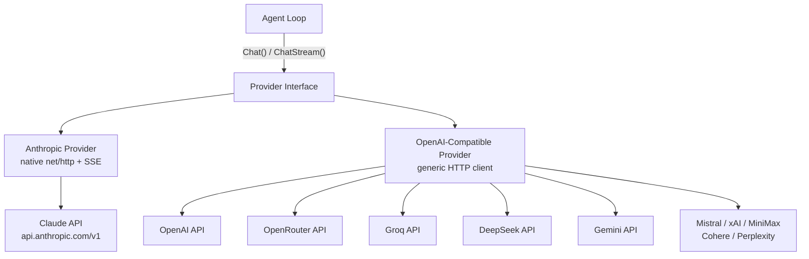
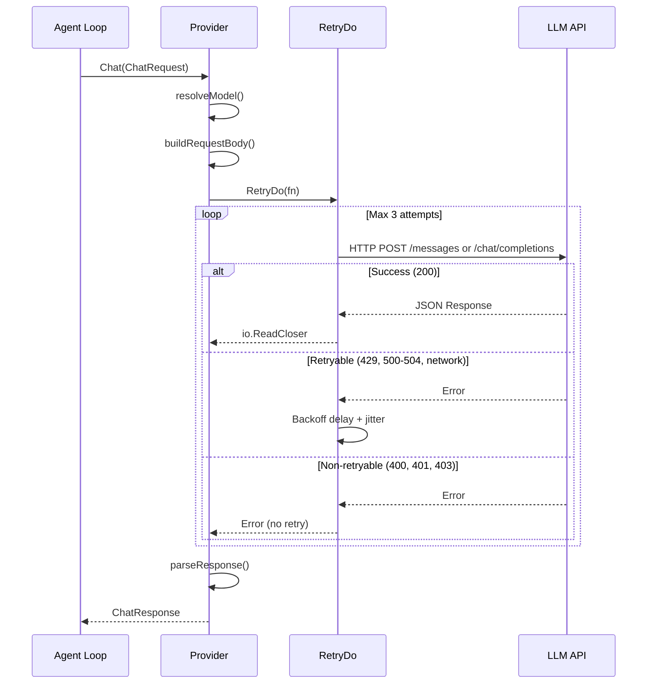
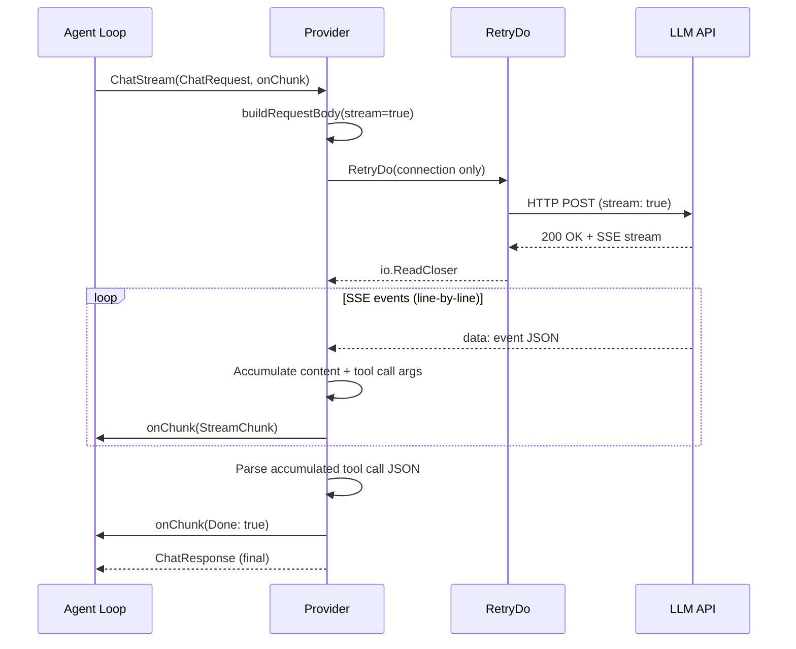
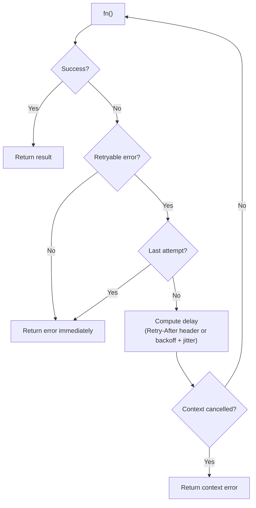
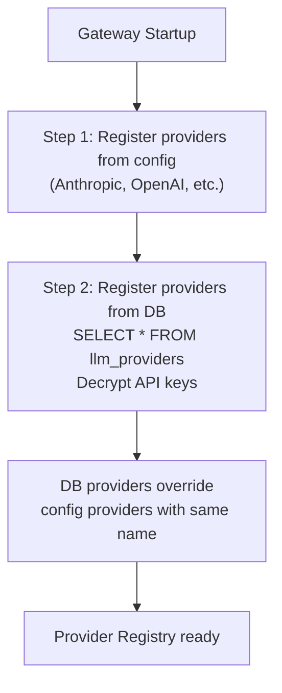
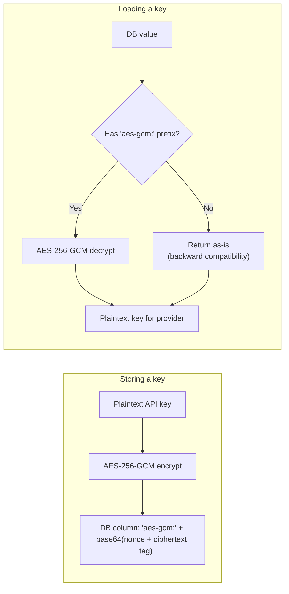
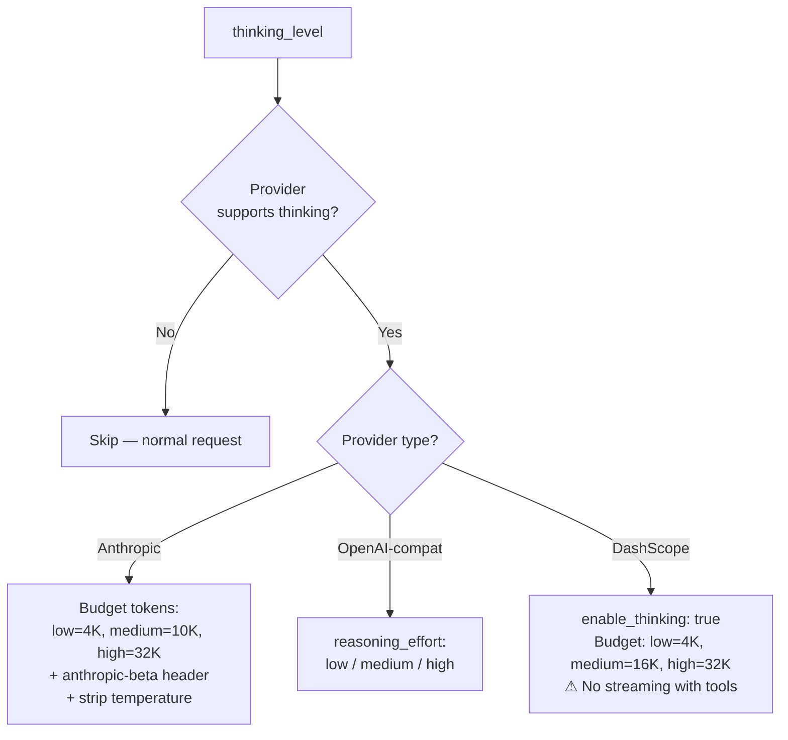

# 02 - LLM 提供商

GoClaw 将 LLM 通信抽象在单一的 `Provider` 接口之后，使 Agent 循环可以在不了解线路格式的情况下与任何后端协作。存在两个具体实现：一个使用原生 `net/http` 和 SSE 流式的 Anthropic 提供商，以及一个覆盖 10+ API 端点的通用 OpenAI 兼容提供商。

---

## 1. 提供商架构

所有提供商实现四个方法：`Chat()`、`ChatStream()`、`Name()` 和 `DefaultModel()`。Agent 循环为非流式请求调用 `Chat()`，为逐 token 流式调用 `ChatStream()`。两者都返回统一的 `ChatResponse`，包含内容、工具调用、结束原因和 token 使用量。



Anthropic 提供商使用 `x-api-key` 头认证和 `anthropic-version: 2023-06-01` 头。OpenAI 兼容提供商使用 `Authorization: Bearer` 令牌，并针对每个提供商的 `/chat/completions` 端点。两个提供商都设置 120 秒的 HTTP 客户端超时。

---

## 2. 支持的提供商

| 提供商 | 类型 | API Base | 默认模型 |
|----------|------|----------|---------------|
| anthropic | 原生 HTTP + SSE | `https://api.anthropic.com/v1` | `claude-sonnet-4-5-20250929` |
| openai | OpenAI 兼容 | `https://api.openai.com/v1` | `gpt-4o` |
| openrouter | OpenAI 兼容 | `https://openrouter.ai/api/v1` | `anthropic/claude-sonnet-4-5-20250929` |
| groq | OpenAI 兼容 | `https://api.groq.com/openai/v1` | `llama-3.3-70b-versatile` |
| deepseek | OpenAI 兼容 | `https://api.deepseek.com/v1` | `deepseek-chat` |
| gemini | OpenAI 兼容 | `https://generativelanguage.googleapis.com/v1beta/openai` | `gemini-2.0-flash` |
| mistral | OpenAI 兼容 | `https://api.mistral.ai/v1` | `mistral-large-latest` |
| xai | OpenAI 兼容 | `https://api.x.ai/v1` | `grok-3-mini` |
| minimax | OpenAI 兼容 | `https://api.minimax.chat/v1` | `MiniMax-M2.5` |
| cohere | OpenAI 兼容 | `https://api.cohere.com/v2` | `command-a` |
| perplexity | OpenAI 兼容 | `https://api.perplexity.ai` | `sonar-pro` |
| dashscope | OpenAI 兼容 | `https://dashscope-intl.aliyuncs.com/compatible-mode/v1` | `qwen3-max` |
| bailian | OpenAI 兼容 | `https://coding-intl.dashscope.aliyuncs.com/v1` | `qwen3.5-plus` |
| zai | OpenAI 兼容 | `https://api.z.ai/api/paas/v4` | `glm-5` |
| zai_coding | OpenAI 兼容 | `https://api.z.ai/api/coding/paas/v4` | `glm-5` |

---

## 3. 调用流程

### 非流式（Chat）



### 流式（ChatStream）



关键区别：非流式将整个请求包装在 `RetryDo` 中。流式仅重试连接阶段 — 一旦 SSE 事件开始流动，流中途不会重试。

---

## 4. Anthropic 与 OpenAI 兼容

| 方面 | Anthropic | OpenAI 兼容 |
|--------|-----------|-------------------|
| Base URL 覆盖 | `WithAnthropicBaseURL()` 选项 | 通过配置 `api_base` 字段 |
| 实现 | 原生 `net/http` | 通用 HTTP 客户端 |
| 系统消息 | 单独的 `system` 字段（文本块数组） | 内联在 `messages` 数组中，`role: "system"` |
| 工具定义 | `name` + `description` + `input_schema` | 标准 OpenAI 函数 schema |
| 工具结果 | `role: "user"` 带有 `tool_result` 内容块 + `tool_use_id` | `role: "tool"` 带有 `tool_call_id` |
| 工具调用参数 | `map[string]interface{}`（已解析的 JSON 对象） | `function.arguments` 中的 JSON 字符串（需手动序列化） |
| 工具调用流式 | `input_json_delta` 事件 | `delta.tool_calls[].function.arguments` 片段 |
| 停止原因映射 | `tool_use` 映射到 `tool_calls`，`max_tokens` 映射到 `length` | 直接传递 `finish_reason` |
| Gemini 兼容性 | 不适用 | 跳过带 tool_calls 的 assistant 消息中的空 `content` 字段 |
| OpenRouter 兼容性 | 不适用 | 模型必须包含 `/`（如 `anthropic/claude-...`）；无前缀则回退到默认值 |

---

## 5. 重试逻辑

### RetryDo[T] 泛型函数

`RetryDo` 是一个泛型函数，用指数退避、抖动和上下文取消支持包装任何提供商调用。

### 配置

| 参数 | 默认值 | 描述 |
|-----------|---------|-------------|
| Attempts | 3 | 总尝试次数（1 = 不重试） |
| MinDelay | 300ms | 首次重试前的初始延迟 |
| MaxDelay | 30s | 延迟上限 |
| Jitter | 0.1 (10%) | 应用于每个延迟的随机变化 |

### 退避公式

```
delay = MinDelay * 2^(attempt - 1)
delay = min(delay, MaxDelay)
delay = delay +/- (delay * jitter * random)

示例：
  Attempt 1: 300ms (+/-30ms)  -> 270ms..330ms
  Attempt 2: 600ms (+/-60ms)  -> 540ms..660ms
  Attempt 3: 1200ms (+/-120ms) -> 1080ms..1320ms
```

如果响应包含 `Retry-After` 头（HTTP 429 或 503），头值完全替换计算的退避时间。头可解析为整数秒或 RFC 1123 日期格式。

### 可重试与不可重试错误

| 类别 | 条件 |
|----------|------------|
| 可重试 | HTTP 429、500、502、503、504；网络错误（`net.Error`）；连接重置；管道断裂；EOF；超时 |
| 不可重试 | HTTP 400、401、403、404；所有其他状态码 |

### 重试流程



---

## 6. Schema 清理

某些提供商拒绝包含不支持的 JSON Schema 字段的工具 schema。`CleanSchemaForProvider()` 从整个 schema 树中递归移除这些字段，包括嵌套的 `properties`、`anyOf`、`oneOf` 和 `allOf`。

| 提供商 | 移除的字段 |
|----------|---------------|
| Gemini | `$ref`、`$defs`、`additionalProperties`、`examples`、`default` |
| Anthropic | `$ref`、`$defs` |
| 所有其他 | 不应用清理 |

Anthropic 提供商在将工具定义转换为 `input_schema` 格式时调用 `CleanSchemaForProvider("anthropic", ...)`。OpenAI 兼容提供商调用 `CleanToolSchemas()`，它根据提供商名称应用相同的逻辑。

---

## 7. 从数据库加载提供商

除配置文件外，提供商还从 `llm_providers` 表加载。数据库提供商会覆盖同名配置提供商。

### 加载流程



### API 密钥加密



`GOCLAW_ENCRYPTION_KEY` 接受三种格式：
- **Hex**：64 个字符（解码后 32 字节）
- **Base64**：44 个字符（解码后 32 字节）
- **Raw**：32 个字符（直接 32 字节）

---

## 8. 扩展思考

扩展思考允许 LLM 在生成响应之前产生内部推理 token，提高复杂任务的质量。GoClaw 通过统一的 `thinking_level` 配置跨多个提供商支持此功能。完整详情请参阅 [12-extended-thinking.md](./12-extended-thinking.md)。

### 提供商映射



### 流式传输

- **Anthropic**：`thinking_delta` 事件累积到 `StreamChunk.Thinking`
- **OpenAI 兼容**：响应 delta 中的 `reasoning_content`
- **DashScope**：存在工具时回退到非流式，合成 chunk 回调

### 工具循环处理

Anthropic 要求在后续工具使用轮次中回显思考块（包括加密签名）。`RawAssistantContent` 保留这些原始块用于 API 回传。其他提供商将推理内容作为独立的每轮元数据处理。

---

## 9. DashScope 和 Bailian 提供商

阿里云 AI 生态系统的两个提供商。

### DashScope（阿里 Qwen）

包装 OpenAI 兼容提供商并带有关键覆盖：当存在工具时，禁用流式传输。提供商回退到单次 `Chat()` 调用并合成 chunk 回调以维持事件流。

- **默认模型**：`qwen3-max`
- **思考支持**：自定义预算映射（low=4,096、medium=16,384、high=32,768）
- **已知限制**：不支持同时流式 + 工具

### Bailian Coding

标准 OpenAI 兼容提供商，针对阿里 Coding API。

- **默认模型**：`qwen3.5-plus`
- **Base URL**：`https://coding-intl.dashscope.aliyuncs.com/v1`

---

## 10. Agent 评估器（Hook 系统）

质量门控 / hook 系统中的 Agent 评估器（见 [03-tools-system.md](./03-tools-system.md)）使用与普通 Agent 运行相同的提供商解析。当质量门控配置了 `"type": "agent"` 时，hook 引擎委派给指定的审查 Agent，该 Agent 通过标准提供商注册表解析自己的提供商。评估器 Agent 不需要单独的提供商配置。

---

## 文件参考

| 文件 | 用途 |
|------|---------|
| `internal/providers/types.go` | Provider 接口、ChatRequest、ChatResponse、Message、ToolCall、Usage 类型 |
| `internal/providers/anthropic.go` | Anthropic 提供商实现（原生 HTTP + SSE 流式） |
| `internal/providers/openai.go` | OpenAI 兼容提供商实现（通用 HTTP） |
| `internal/providers/retry.go` | RetryDo[T] 泛型函数、RetryConfig、IsRetryableError、退避计算 |
| `internal/providers/schema_cleaner.go` | CleanSchemaForProvider、CleanToolSchemas、递归 schema 字段移除 |
| `internal/providers/dashscope.go` | DashScope 提供商：思考预算、工具+流式回退 |
| `cmd/gateway_providers.go` | 网关启动期间从配置和数据库注册提供商 |

---

## 交叉引用

| 文档 | 相关内容 |
|----------|-----------------|
| [12-extended-thinking.md](./12-extended-thinking.md) | 完整扩展思考文档 |
| [01-agent-loop.md](./01-agent-loop.md) | LLM 迭代循环、流式 chunk 处理 |