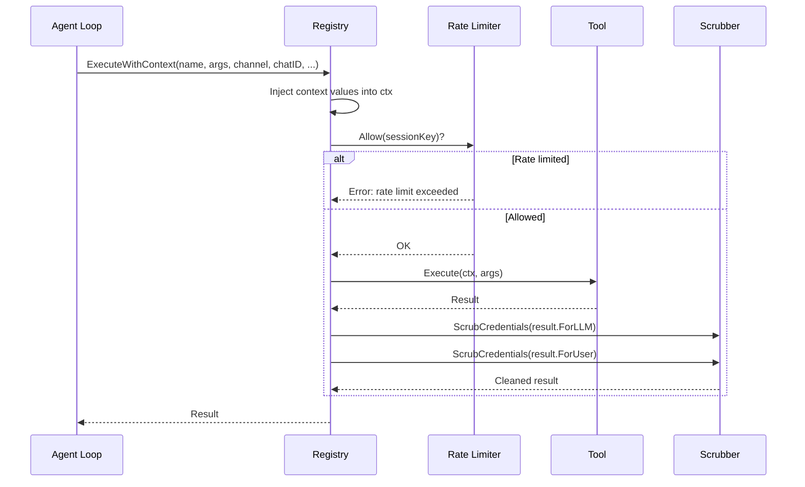
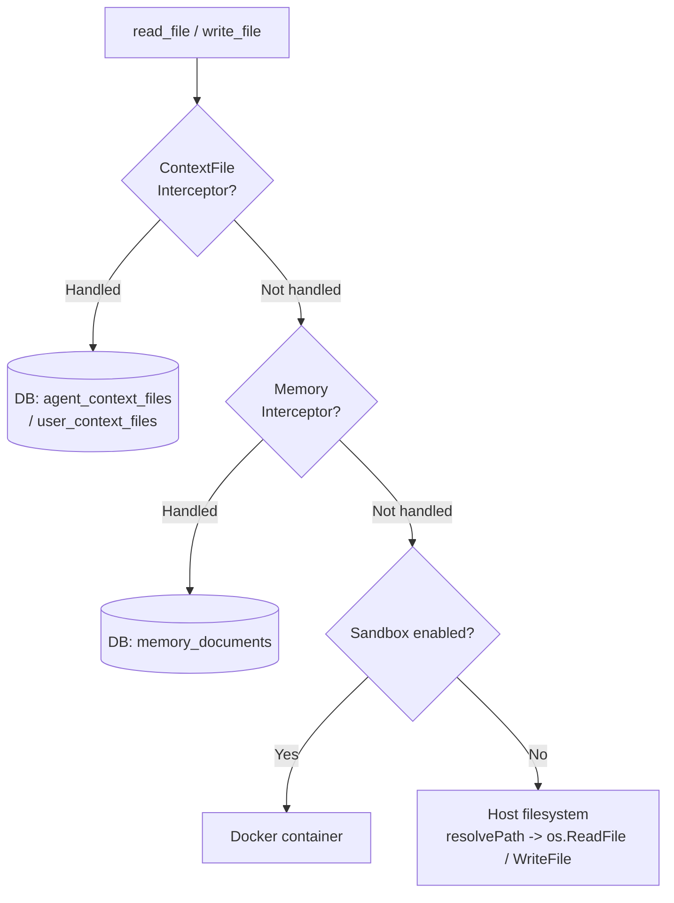
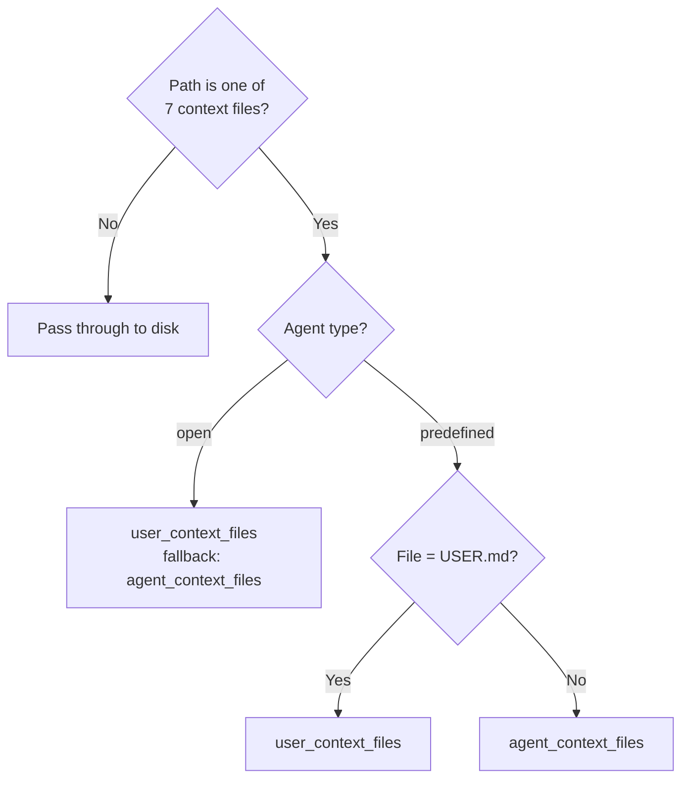
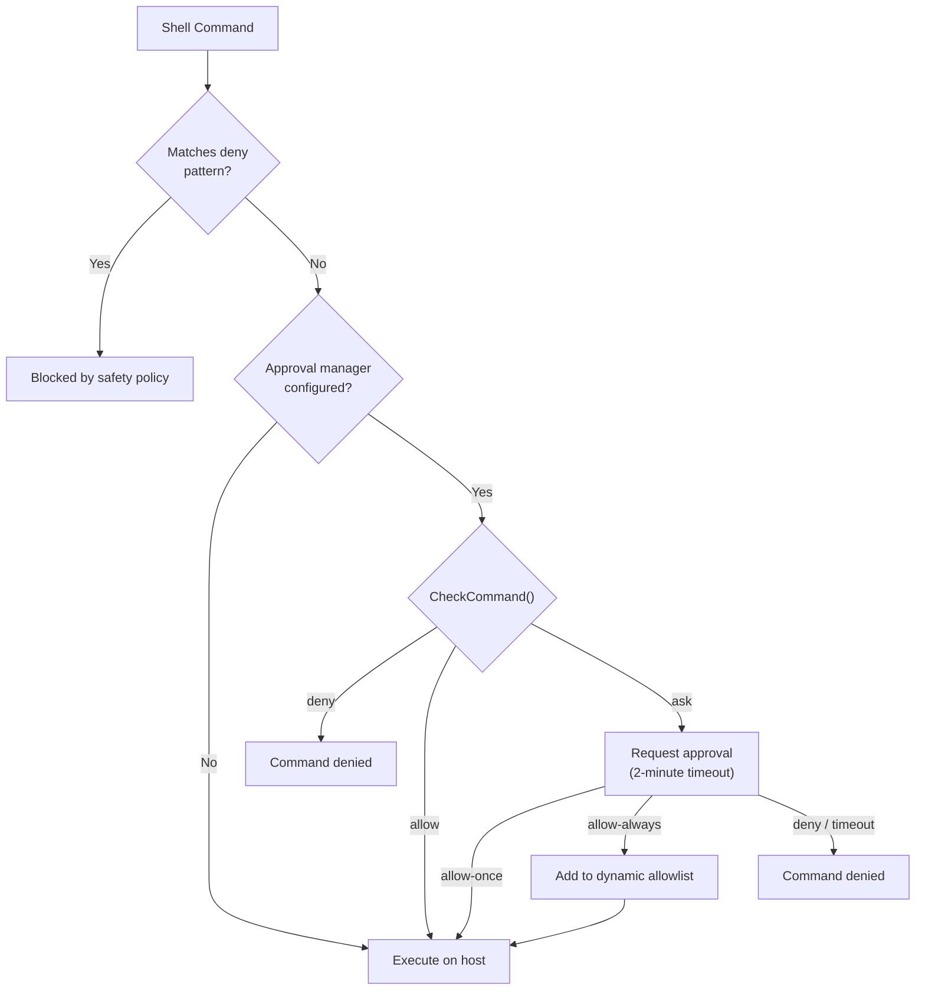
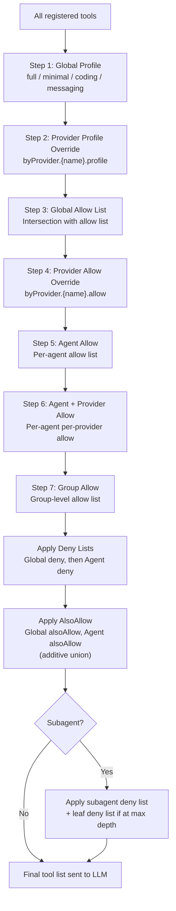
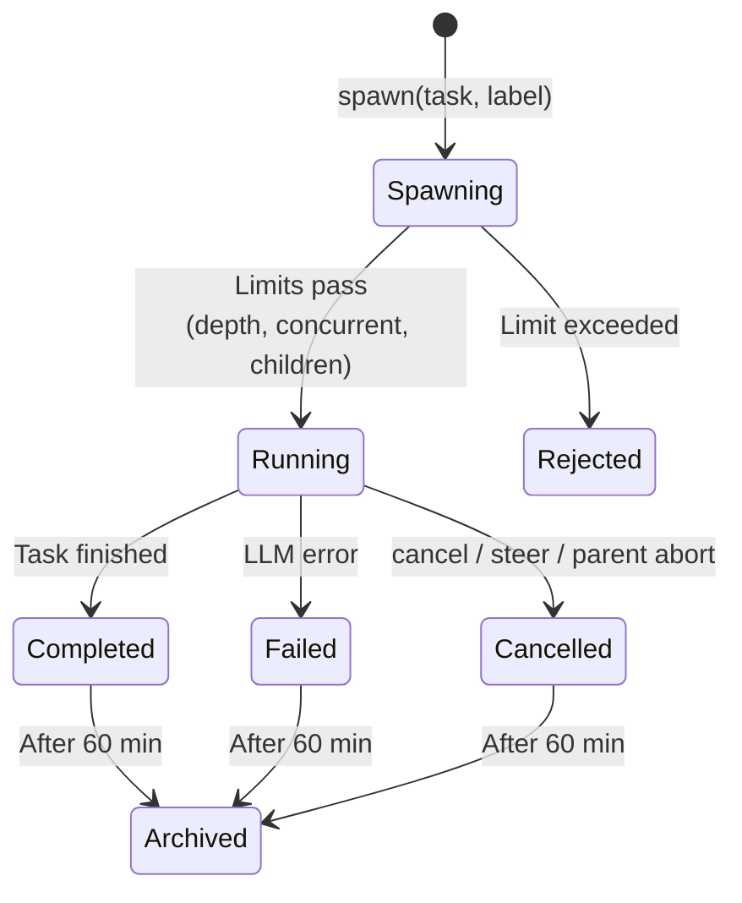
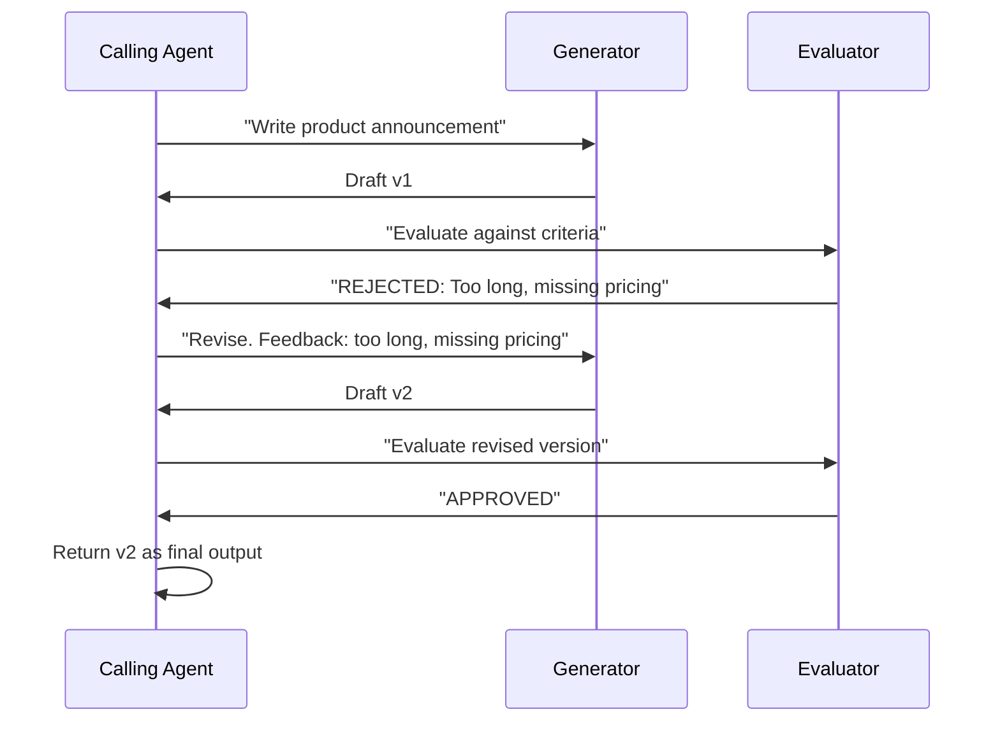
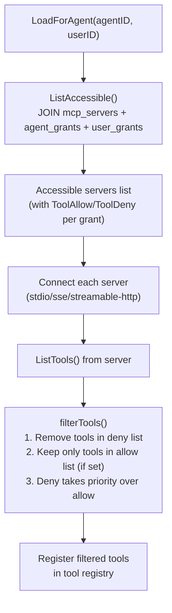
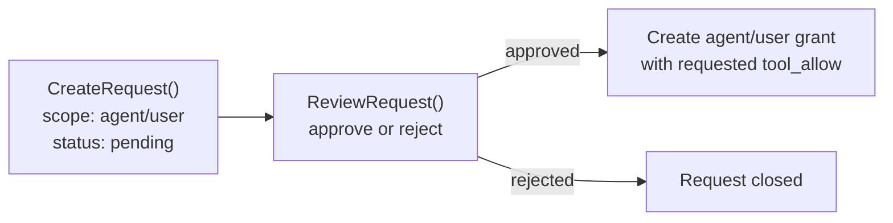
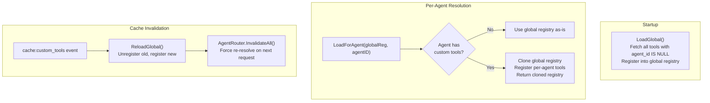

# 03 - 工具系统

工具系统是 Agent 循环与外部环境之间的桥梁。当 LLM 发出工具调用时，Agent 循环将执行委托给工具注册表，后者在返回结果供下一次 LLM 迭代之前处理速率限制、凭证清理、策略执行和虚拟文件系统路由。

---

## 1. 工具执行流程



ExecuteWithContext 执行 8 个步骤：

1. 锁定注册表，按名称查找工具，解锁
2. 注入 `WithToolChannel(ctx, channel)`
3. 注入 `WithToolChatID(ctx, chatID)`
4. 注入 `WithToolPeerKind(ctx, peerKind)`
5. 注入 `WithToolSandboxKey(ctx, sessionKey)`
6. 通过 `rateLimiter.Allow(sessionKey)` 检查速率限制
7. 执行 `tool.Execute(ctx, args)`
8. 清理 `ForLLM` 和 `ForUser` 输出中的凭证，记录持续时间

上下文键确保每次工具调用接收正确的每调用值，无需可变字段，使工具实例可以安全地在并发 goroutine 间共享。

---

## 2. 完整工具清单

### 文件系统（group: `fs`）

| 工具 | 描述 |
|------|-------------|
| `read_file` | 读取文件内容，可选行范围 |
| `write_file` | 写入或创建文件 |
| `edit_file` | 对文件应用定向编辑 |
| `list_files` | 列出目录内容 |
| `search` | 使用正则搜索文件内容 |
| `glob` | 查找匹配 glob 模式的文件 |

### 运行时（group: `runtime`）

| 工具 | 描述 |
|------|-------------|
| `exec` | 执行 shell 命令 |
| `process` | 管理运行中的进程 |

### Web（group: `web`）

| 工具 | 描述 |
|------|-------------|
| `web_search` | 搜索网络 |
| `web_fetch` | 获取并解析 URL |

### 内存（group: `memory`）

| 工具 | 描述 |
|------|-------------|
| `memory_search` | 搜索内存文档 |
| `memory_get` | 获取特定内存文档 |

### 会话（group: `sessions`）

| 工具 | 描述 |
|------|-------------|
| `sessions_list` | 列出活动会话 |
| `sessions_history` | 查看会话消息历史 |
| `sessions_send` | 向会话发送消息 |
| `spawn` | 衍生子 Agent 或委派给其他 Agent |
| `session_status` | 获取当前会话状态 |

### UI（group: `ui`）

| 工具 | 描述 |
|------|-------------|
| `browser` | 通过 Rod + CDP 进行浏览器自动化 |
| `canvas` | 可视化画布操作 |

### 自动化（group: `automation`）

| 工具 | 描述 |
|------|-------------|
| `cron` | 管理定时任务 |
| `gateway` | 网关管理命令 |

### 消息（group: `messaging`）

| 工具 | 描述 |
|------|-------------|
| `message` | 向频道发送消息 |
| `create_forum_topic` | 创建 Telegram 论坛主题 |

### 委派（group: `delegation`）

| 工具 | 描述 |
|------|-------------|
| `delegate` | 将任务委派给其他 Agent（动作：delegate、cancel、list、history） |
| `delegate_search` | 混合 FTS + 语义 Agent 发现，用于委派目标 |
| `evaluate_loop` | 两个 Agent 之间的生成-评估-修订循环（最多 5 轮） |
| `handoff` | 将对话转移给其他 Agent（路由覆盖） |

### 团队（group: `teams`）

| 工具 | 描述 |
|------|-------------|
| `team_tasks` | 任务板：list、create、claim、complete、search |
| `team_message` | 邮箱：send、broadcast、read unread messages |

### 其他工具

| 工具 | 描述 |
|------|-------------|
| `skill_search` | 搜索可用技能（BM25 + 向量） |
| `image` | 生成图像 |
| `read_image` | 读取/分析图像文件 |
| `create_image` | 从描述创建图像 |
| `tts` | 文本转语音合成（OpenAI、ElevenLabs、Edge、MiniMax） |
| `nodes` | 节点图操作 |

---

## 3. 文件系统工具与虚拟 FS 路由

文件系统操作在触及主机磁盘之前被拦截。两个拦截器层将特定路径路由到数据库。



### ContextFileInterceptor — 7 个路由文件

| 文件 | 描述 |
|------|-------------|
| `SOUL.md` | Agent 个性与行为 |
| `IDENTITY.md` | Agent 身份信息 |
| `AGENTS.md` | 子 Agent 定义 |
| `TOOLS.md` | 工具使用指南 |
| `USER.md` | 每用户偏好与上下文 |
| `BOOTSTRAP.md` | 首次运行说明（写入空内容 = 删除行） |

### 按 Agent 类型路由



- **Open Agent**：所有 7 个文件都是每用户的。如果用户文件不存在，返回 Agent 级模板作为回退。
- **Predefined Agent**：只有 `USER.md` 是每用户的。所有其他文件来自 Agent 级存储。

### MemoryInterceptor

路由 `MEMORY.md`、`memory.md` 和 `memory/*` 路径。每用户结果优先，回退到全局作用域。写入 `.md` 文件自动触发 `IndexDocument()`（分块 + 嵌入）。

### PathDenyable 接口

访问文件系统的工具实现 `PathDenyable` 接口，允许在运行时拒绝特定路径前缀：

```go
type PathDenyable interface {
    DenyPaths(...string)
}
```

所有四个文件系统工具（`read_file`、`write_file`、`list_files`、`edit_file`）都实现了它。`list_files` 还会从输出中完全过滤被拒绝的目录 — Agent 甚至不知道该目录存在。用于防止 Agent 访问工作区内的 `.goclaw` 目录。

### 工作区上下文注入

文件系统和 shell 工具从 `ToolWorkspaceFromCtx(ctx)` 读取其工作区，该值由 Agent 循环根据当前用户和 Agent 注入。这实现了每用户工作区隔离，无需更改任何工具代码。向后兼容时回退到结构体字段。

### 路径安全

`resolvePath()` 将相对路径与工作区根目录连接，应用 `filepath.Clean()`，并用 `HasPrefix()` 验证结果。这防止路径遍历攻击（如 `../../../etc/passwd`）。扩展的 `resolvePathWithAllowed()` 允许技能目录的额外前缀。

---

## 4. Shell 执行

`exec` 工具允许 LLM 运行 shell 命令，具有多层防御。

### 拒绝模式

| 类别 | 阻止的模式 |
|----------|------------------|
| 破坏性文件操作 | `rm -rf`、`del /f`、`rmdir /s` |
| 磁盘破坏 | `mkfs`、`dd if=`、`> /dev/sd*` |
| 系统控制 | `shutdown`、`reboot`、`poweroff` |
| Fork 炸弹 | `:(){ ... };:` |
| 远程代码执行 | `curl \| sh`、`wget -O - \| sh` |
| 反向 Shell | `/dev/tcp/`、`nc -e` |
| Eval 注入 | `eval $()`、`base64 -d \| sh` |

### 审批工作流



### 沙箱路由

当配置了沙箱管理器且上下文中存在 `sandboxKey` 时，命令在 Docker 容器内执行。主机工作目录映射到容器内的 `/workspace`。主机超时 60 秒；沙箱超时 300 秒。如果沙箱返回 `ErrSandboxDisabled`，执行回退到主机。

---

## 5. 策略引擎

策略引擎通过 7 步允许管道，然后是拒绝减法和加法 alsoAllow，确定 LLM 可以使用哪些工具。



### 配置文件

| Profile | 包含的工具 |
|---------|---------------|
| `full` | 所有注册工具（无限制） |
| `coding` | `group:fs`、`group:runtime`、`group:sessions`、`group:memory`、`group:web`、`read_image`、`create_image`、`skill_search` |
| `messaging` | `group:messaging`、`group:web`、`group:sessions`、`read_image`、`skill_search` |
| `minimal` | 仅 `session_status` |

### 工具组

| 组 | 成员 |
|-------|---------|
| `fs` | `read_file`、`write_file`、`list_files`、`edit`、`search`、`glob` |
| `runtime` | `exec` |
| `web` | `web_search`、`web_fetch` |
| `memory` | `memory_search`、`memory_get` |
| `sessions` | `sessions_list`、`sessions_history`、`sessions_send`、`spawn`、`session_status` |
| `ui` | `browser` |
| `automation` | `cron` |
| `messaging` | `message`、`create_forum_topic` |
| `delegation` | `handoff`、`delegate_search`、`evaluate_loop` |
| `team` | `team_tasks`、`team_message` |
| `goclaw` | 所有原生工具（复合组） |

组可以在 allow/deny 列表中用 `group:` 前缀引用（如 `group:fs`）。MCP 管理器在运行时动态注册 `mcp` 和 `mcp:{serverName}` 组。

### 每请求工具允许列表

除静态策略管道外，频道可以通过消息元数据注入每请求工具允许列表。例如，Telegram 论坛主题可以限制每个主题的工具（见 [05-channels-messaging.md](./05-channels-messaging.md) 第 5 节）。允许列表在策略管道完成后作为最终交集步骤应用。

---

## 6. 子 Agent 系统

子 Agent 是为处理并行或复杂任务而衍生的子 Agent 实例。它们在后台 goroutine 中运行，具有受限的工具访问权限。

### 生命周期



### 限制

| 约束 | 默认值 | 描述 |
|------------|---------|-------------|
| MaxConcurrent | 8 | 所有父 Agent 的运行中子 Agent 总数 |
| MaxSpawnDepth | 1 | 最大嵌套深度 |
| MaxChildrenPerAgent | 5 | 每个父 Agent 的最大子 Agent 数 |
| ArchiveAfterMinutes | 60 | 自动归档已完成任务 |
| Max iterations | 20 | 每个子 Agent 的 LLM 循环迭代次数 |

### 子 Agent 动作

| 动作 | 行为 |
|--------|----------|
| `spawn`（异步） | 在 goroutine 中启动，立即返回接受消息 |
| `run`（同步） | 阻塞直到子 Agent 完成，直接返回结果 |
| `list` | 列出所有子 Agent 任务及状态 |
| `cancel` | 按特定 ID、`"all"` 或 `"last"` 取消 |
| `steer` | 取消 + 等待 500ms + 用新消息重新衍生 |

### 工具拒绝列表

| 列表 | 拒绝的工具 |
|------|-------------|
| 始终拒绝（所有深度） | `gateway`、`agents_list`、`whatsapp_login`、`session_status`、`cron`、`memory_search`、`memory_get`、`sessions_send` |
| 叶子拒绝（最大深度） | `sessions_list`、`sessions_history`、`sessions_spawn`、`spawn`、`subagent` |

结果通过消息总线回传给父 Agent，可选通过 AnnounceQueue 批量处理并带防抖。

---

## 7. 委派系统

委派允许命名 Agent 将任务委托给其他完全独立的 Agent（每个都有自己的身份、工具、提供商、模型和上下文文件）。与子 Agent（匿名克隆）不同，委派通过显式权限链接跨越 Agent 边界。

### DelegateManager

`internal/tools/delegate.go` 中的 `DelegateManager` 编排所有委派操作：

| 动作 | 模式 | 行为 |
|--------|------|----------|
| `delegate` | `sync` | 调用者等待结果（快速查找、事实核查） |
| `delegate` | `async` | 调用者继续；结果稍后通过消息总线发布（`delegate:{id}`） |
| `cancel` | -- | 按 ID 取消运行中的异步委派 |
| `list` | -- | 列出活动委派 |
| `history` | -- | 从 `delegation_history` 表查询历史委派 |

### 回调模式

`tools` 包不能导入 `agent`（导入循环）。回调函数桥接这个差距：

```go
type AgentRunFunc func(ctx context.Context, agentKey string, req DelegateRunRequest) (*DelegateRunResult, error)
```

`cmd` 层在连接时提供实现。`tools` 包从不知道 `agent` 存在。

### Agent 链接（权限控制）

委派需要在 `agent_links` 表中有显式链接。链接是有向边：

- **outbound**（A→B）：只有 A 可以委派给 B
- **bidirectional**（A↔B）：双方可以互相委派

每个链接有 `max_concurrent` 和每用户 `settings`（JSONB）用于 deny/allow 列表。

### 并发控制

两层防止过载：

| 层 | 配置 | 作用域 |
|-------|--------|-------|
| 每链接 | `agent_links.max_concurrent` | 特定 A→B |
| 每 Agent | `other_config.max_delegation_load` | B 来自所有来源 |

当达到限制时，错误消息为 LLM 推理编写：*"Agent at capacity (5/5). Try a different agent or handle it yourself."*

### DELEGATION.md 自动注入

在 Agent 解析期间，`DELEGATION.md` 自动生成并注入系统提示：

- **≤15 个目标**：完整内联列表，包含 Agent 键、名称和前言
- **>15 个目标**：指向 `delegate_search` 工具的搜索说明（混合 FTS + pgvector 余弦）

### 上下文文件合并（Open Agent）

对于 Open Agent，每用户上下文文件与解析器注入的基础文件合并。每用户文件覆盖同名基础文件，但仅基础文件如 `DELEGATION.md` 被保留：

```
基础文件（解析器）:     DELEGATION.md
每用户文件（DB）:       AGENTS.md, SOUL.md, TOOLS.md, USER.md, ...
合并结果:             AGENTS.md, SOUL.md, TOOLS.md, USER.md, ..., DELEGATION.md ✓
```

---

## 8. Agent 团队

团队在委派之上添加共享协调层：用于并行工作的任务板和用于点对点通信的邮箱。

### 架构

管理员通过仪表板创建团队，分配 **负责人** 和 **成员**。当用户向负责人发送消息时：
1. 负责人在其系统提示中看到 `TEAM.md`（队友列表 + 角色）
2. 负责人向任务板发布任务
3. 队友被激活、认领任务并并行工作
4. 队友相互消息进行协调
5. 负责人综合结果并回复用户

### 任务板（`team_tasks` 工具）

| 动作 | 描述 |
|--------|-------------|
| `list` | 列出任务（过滤：active/completed/all，排序：priority/newest） |
| `create` | 创建任务，包含主题、描述、优先级、blocked_by |
| `claim` | 原子认领待处理任务（通过行级锁保证竞态安全） |
| `complete` | 标记任务完成并附带结果；自动解除依赖任务阻塞 |
| `search` | 任务主题 + 描述的 FTS 搜索 |

### 邮箱（`team_message` 工具）

| 动作 | 描述 |
|--------|-------------|
| `send` | 向特定队友发送直接消息 |
| `broadcast` | 向所有队友发送消息 |
| `read` | 读取未读消息 |

### 以负责人为中心的设计

只有负责人在其系统提示中获得 `TEAM.md`。队友通过工具按需发现上下文 — 不会在空闲 Agent 上浪费 token。当队友消息到达时，消息本身携带上下文（如 *"[Team message from lead]: please claim a task from the board."*）。

### 消息路由

队友结果通过消息总线路由，带有 `"teammate:"` 前缀。消费者发布出站响应，使负责人（最终用户）看到结果。

---

## 9. 评估-优化循环

两个 Agent 之间的结构化修订周期：生成器和评估器。



`evaluate_loop` 工具编排此过程。参数：生成器 Agent、评估器 Agent、通过标准和最大轮数（默认 3，上限 5）。每轮是一对同步委派。如果评估器响应 "APPROVED"（不区分大小写前缀匹配），循环退出。如果是 "REJECTED: feedback"，生成器再获得一次机会。

内部委派使用 `WithSkipHooks(ctx)` 防止质量门控触发递归。

---

## 10. Agent 切换

切换将对话从一个 Agent 转移到另一个。与委派（保持源 Agent 在循环中）不同，切换完全移除它。

| | 委派 | 切换 |
|---|---|---|
| 谁与用户对话？ | 源 Agent（始终） | 目标 Agent（转移后） |
| 源 Agent 参与 | 等待结果，重新表述 | 完全退出 |
| 会话 | 目标在源的上下文中运行 | 目标获得新会话 |
| 持续时间 | 一个任务 | 直到清除或切回 |

### 机制

当 Agent A 调用 `handoff(agent="billing", reason="billing question")` 时：
1. 写入一行到 `handoff_routes`：此频道 + 聊天 ID 现在路由到 billing
2. 广播 `handoff` 事件（WS 客户端可以响应）
3. 通过消息总线向 billing 发布带有对话上下文的初始消息

用户在该频道上的后续消息路由到 billing（消费者在正常路由前检查 `handoff_routes`）。Billing 可以通过 `handoff(action="clear")` 切回。

---

## 11. 质量门控（Hook 系统）

一个通用的 hook 系统，用于在 Agent 输出到达用户之前进行验证。位于 `internal/hooks/`。

### 评估器类型

| 类型 | 工作方式 | 示例 |
|------|-------------|---------|
| **command** | 运行 shell 命令。Exit 0 = 通过。Stderr = 反馈。 | `npm test`、`eslint --stdin` |
| **agent** | 委派给审查 Agent。解析 "APPROVED" 或 "REJECTED: feedback"。 | QA 审查员检查语气/准确性 |

### 配置

质量门控存在于源 Agent 的 `other_config` JSON 中：

```json
{
  "quality_gates": [
    {
      "event": "delegation.completed",
      "type": "agent",
      "agent": "qa-reviewer",
      "block_on_failure": true,
      "max_retries": 2
    }
  ]
}
```

当 `block_on_failure` 为 true 且还有重试次数时，系统将评估器的反馈作为修订提示注入，重新运行目标 Agent。

### 递归防护

带有 Agent 评估器的质量门控可能导致无限递归（门控委派给审查员 → 审查员完成 → 门控再次触发）。修复是上下文标志：`hooks.WithSkipHooks(ctx, true)`。三个地方设置它：
1. **Agent 评估器** — 当委派给审查员时
2. **评估循环** — 用于所有内部生成器/评估器委派
3. **cmd 层中的 Agent eval 回调** — 当 hook 引擎本身触发委派时

`DelegateManager.Delegate()` 在应用门控前检查 `hooks.SkipHooksFromContext(ctx)`。如果设置，跳过门控。

---

## 12. MCP 桥接工具

GoClaw 通过 `internal/mcp/` 与 Model Context Protocol (MCP) 服务器集成。MCP 管理器连接外部工具服务器，并将其工具注册到工具注册表中，带有可配置前缀。

### 传输方式

| 传输 | 描述 |
|-----------|-------------|
| `stdio` | 用命令 + 参数启动进程，通过 stdin/stdout 通信 |
| `sse` | 通过 URL 连接到 SSE 端点 |
| `streamable-http` | 连接到 HTTP 流式端点 |

### 行为

- 每个服务器每 30 秒运行健康检查
- 重连使用指数退避（初始 2s，最大 60s，10 次尝试）
- 工具带前缀注册（如 `mcp_servername_toolname`）
- 动态工具组注册：`mcp` 和 `mcp:{serverName}` 组

### 访问控制

MCP 服务器访问通过存储在 PostgreSQL 中的每 Agent 和每用户授权控制。



**授权类型**：

| 授权 | 表 | 作用域 | 字段 |
|-------|-------|-------|--------|
| Agent 授权 | `mcp_agent_grants` | 每服务器 + Agent | `tool_allow`、`tool_deny`（JSONB 数组）、`config_overrides`、`enabled` |
| 用户授权 | `mcp_user_grants` | 每服务器 + 用户 | `tool_allow`、`tool_deny`（JSONB 数组）、`enabled` |

**访问请求工作流**：用户可以请求访问 MCP 服务器。管理员审核并批准或拒绝。批准时，事务性地创建相应的授权。



---

## 13. 自定义工具

通过 HTTP API 在运行时定义基于 shell 的工具 — 无需重新编译或重启。自定义工具存储在 `custom_tools` PostgreSQL 表中，并动态加载到 Agent 的工具注册表中。

### 生命周期



### 作用域

| 作用域 | `agent_id` | 行为 |
|-------|-----------|----------|
| 全局 | `NULL` | 所有 Agent 可用 |
| 每 Agent | UUID | 仅指定 Agent 可用 |

### 命令执行

1. **模板渲染**：`{{.key}}` 占位符替换为 shell 转义的参数值（单引号包装，内嵌引号转义）
2. **拒绝模式检查**：与 `exec` 工具相同的拒绝模式（阻止 `curl|sh`、反向 shell 等）
3. **执行**：`sh -c <rendered_command>`，可配置超时（默认 60s）和可选工作目录
4. **环境变量**：在数据库中加密存储（AES-256-GCM），运行时解密并注入命令环境

### JSON 配置示例

```json
{
  "name": "dns_lookup",
  "description": "Look up DNS records for a domain",
  "parameters": {
    "type": "object",
    "properties": {
      "domain": { "type": "string", "description": "Domain name" },
      "record_type": { "type": "string", "enum": ["A", "AAAA", "MX", "CNAME", "TXT"] }
    },
    "required": ["domain"]
  },
  "command": "dig +short {{.record_type}} {{.domain}}",
  "timeout_seconds": 10,
  "enabled": true
}
```

---

## 14. 凭证清理

工具输出在返回给 LLM 之前自动清理。默认在注册表中启用。

### 静态模式

| 类型 | 模式 |
|------|---------|
| OpenAI | `sk-[a-zA-Z0-9]{20,}` |
| Anthropic | `sk-ant-[a-zA-Z0-9-]{20,}` |
| GitHub PAT | `ghp_`、`gho_`、`ghu_`、`ghs_`、`ghr_` + 36 个字母数字字符 |
| AWS | `AKIA[A-Z0-9]{16}` |
| 通用键值 | `(api_key\|token\|secret\|password\|bearer\|authorization)[:=]value`（不区分大小写） |
| 连接字符串 | `postgres://`、`mysql://`、`mongodb://`、`redis://` 模式 |
| 环境变量模式 | `KEY=`、`SECRET=`、`CREDENTIAL=`、`DSN=`、`VIRTUAL_*=` 模式 |
| 长十六进制字符串 | 64+ 字符十六进制字符串（潜在加密密钥） |

所有匹配替换为 `[REDACTED]`。

### 动态清理

除静态模式外，值可以在运行时注册以进行清理。这用于服务器 IP 和其他编译时未知的部署特定密钥。`AddDynamicScrubValues()` 函数线程安全地将值添加到清理列表，与静态模式一起检查。

---

## 15. 速率限制器

工具注册表通过 `ToolRateLimiter` 支持每会话速率限制。配置后，每次 `ExecuteWithContext` 调用在工具执行前检查 `rateLimiter.Allow(sessionKey)`。受速率限制的调用收到错误结果，不执行工具。

---

## 文件参考

| 文件 | 用途 |
|------|---------|
| `internal/tools/registry.go` | Registry: Register、Execute、ExecuteWithContext、ProviderDefs |
| `internal/tools/types.go` | Tool 接口、ContextualTool、InterceptorAware 及其他配置接口 |
| `internal/tools/policy.go` | PolicyEngine: 7 步管道、工具组、配置文件、子 Agent 拒绝列表 |
| `internal/tools/filesystem.go` | read_file、write_file、edit_file 带拦截器支持 |
| `internal/tools/filesystem_list.go` | list_files 工具 |
| `internal/tools/filesystem_write.go` | 额外写入操作 |
| `internal/tools/shell.go` | ExecTool: 拒绝模式、审批工作流、沙箱路由 |
| `internal/tools/scrub.go` | ScrubCredentials: 凭证模式匹配和修订 |
| `internal/tools/subagent.go` | SubagentManager: spawn、cancel、steer、run sync、拒绝列表 |
| `internal/tools/delegate.go` | DelegateManager: sync、async、cancel、并发、每用户检查 |
| `internal/tools/delegate_tool.go` | Delegate 工具包装器（动作：delegate/cancel/list/history） |
| `internal/tools/delegate_search_tool.go` | 混合 FTS + 语义 Agent 发现 |
| `internal/tools/evaluate_loop_tool.go` | 生成-评估-修订循环（最多 5 轮） |
| `internal/tools/handoff_tool.go` | 对话转移（路由覆盖 + 上下文携带） |
| `internal/tools/team_tool_manager.go` | 团队工具共享后端 |
| `internal/tools/team_tasks_tool.go` | 任务板：list、create、claim、complete、search |
| `internal/tools/team_message_tool.go` | 邮箱：send、broadcast、read |
| `internal/hooks/engine.go` | Hook 引擎：评估器注册表、EvaluateHooks |
| `internal/hooks/command_evaluator.go` | Shell 命令评估器 |
| `internal/hooks/agent_evaluator.go` | Agent 委派评估器 |
| `internal/hooks/context.go` | WithSkipHooks / SkipHooksFromContext |
| `internal/tools/context_file_interceptor.go` | ContextFileInterceptor: 按 Agent 类型的 7 文件路由 |
| `internal/tools/memory_interceptor.go` | MemoryInterceptor: MEMORY.md 和 memory/* 路由 |
| `internal/tools/skill_search.go` | 技能搜索工具（BM25） |
| `internal/tools/tts.go` | 文本转语音工具（4 个提供商） |
| `internal/mcp/manager.go` | MCP 管理器：服务器连接、健康检查、工具注册 |
| `internal/mcp/bridge_tool.go` | MCP 桥接工具实现 |
| `internal/tools/dynamic_loader.go` | DynamicLoader: LoadGlobal、LoadForAgent、ReloadGlobal |
| `internal/tools/dynamic_tool.go` | DynamicTool: 模板渲染、shell 转义、执行 |
| `internal/store/custom_tool_store.go` | CustomToolStore 接口 |
| `internal/store/pg/custom_tools.go` | PostgreSQL 自定义工具实现 |
| `internal/store/mcp_store.go` | MCPServerStore 接口（授权、访问请求） |
| `internal/store/pg/mcp_servers.go` | PostgreSQL MCP 实现 |