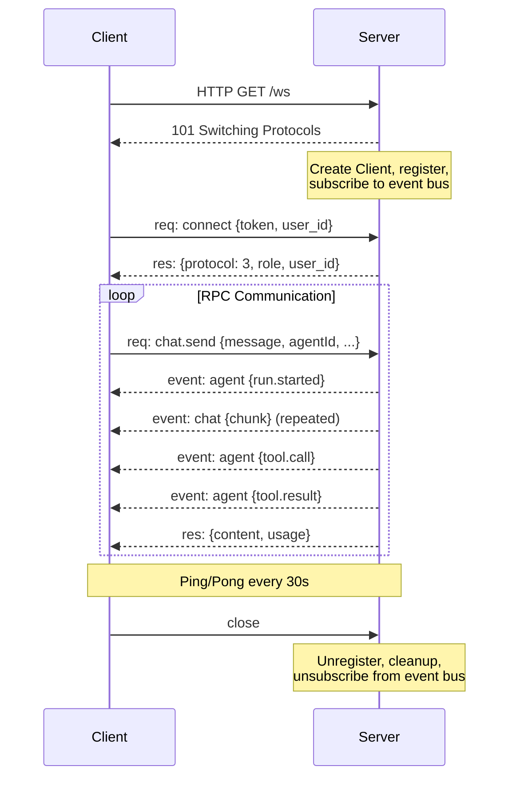
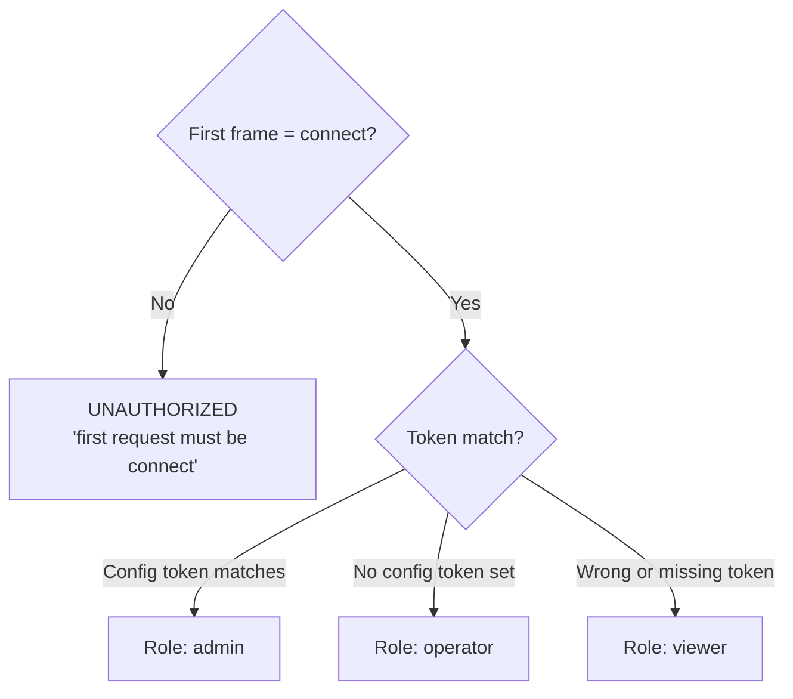
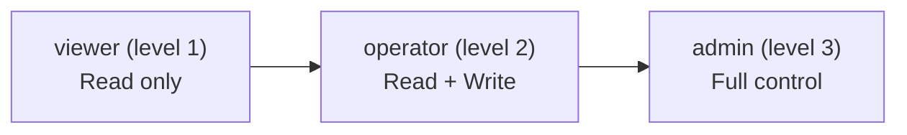
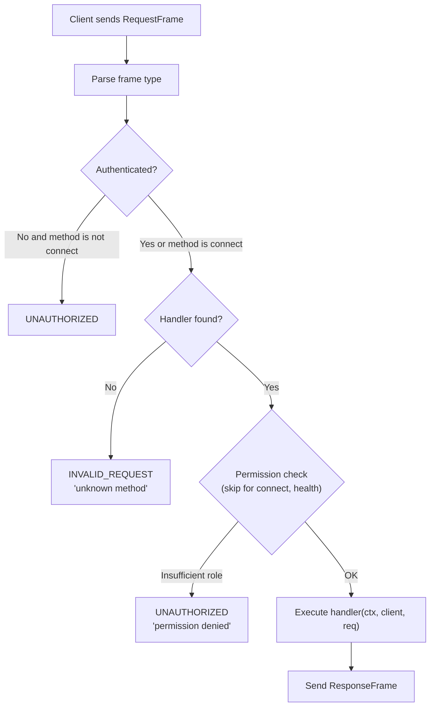
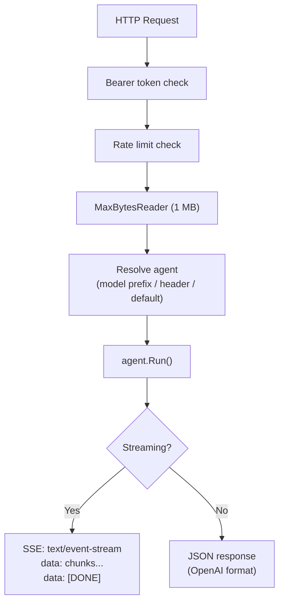
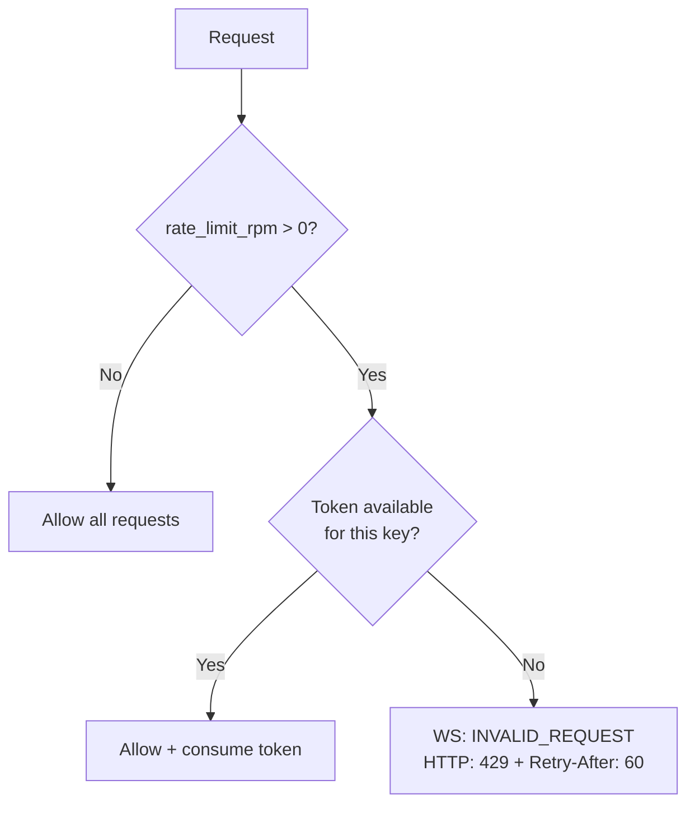

# 04 - 网关与协议

网关是 GoClaw 的核心组件，在单个端口上同时提供 WebSocket RPC（协议 v3）和 HTTP REST API。它处理所有客户端交互的认证、基于角色的访问控制、速率限制和方法分发。

---

## 1. WebSocket 生命周期

### 连接参数

| 参数 | 值 | 描述 |
|-----------|-------|-------------|
| 读取限制 | 512 KB | 超出时自动关闭连接 |
| 发送缓冲 | 256 容量 | 满时丢弃消息 |
| 读取截止 | 60s | 每条消息或 pong 时重置 |
| 写入截止 | 10s | 每次写入超时 |
| Ping 间隔 | 30s | 服务器发起的保活 |

---

## 2. 协议 v3 帧类型

| 类型 | 方向 | 用途 |
|------|-----------|---------|
| `req` | 客户端到服务器 | 调用 RPC 方法 |
| `res` | 服务器到客户端 | 按 `id` 匹配请求的响应 |
| `event` | 服务器到客户端 | 推送事件（流式块、Agent 状态等） |

客户端的第一个请求必须是 `connect`。在认证之前发送任何其他方法会导致 `UNAUTHORIZED` 错误。

### 请求帧结构

- `type`: 始终为 `"req"`
- `id`: 唯一请求 ID（客户端生成）
- `method`: RPC 方法名称
- `params`: 方法特定参数（JSON）

### 响应帧结构

- `type`: 始终为 `"res"`
- `id`: 匹配请求 ID
- `ok`: 布尔成功指示器
- `payload`: 响应数据（当 `ok` 为 true）
- `error`: 错误形状，包含 `code`、`message`、`details`、`retryable`、`retryAfterMs`（当 `ok` 为 false）

### 事件帧结构

- `type`: 始终为 `"event"`
- `event`: 事件名称（如 `chat`、`agent`、`status`、`handoff`）
- `payload`: 事件数据
- `seq`: 排序序列号
- `stateVersion`: 用于乐观状态同步的版本计数器

---

## 3. 认证与 RBAC

### 连接握手

令牌比较使用 `crypto/subtle.ConstantTimeCompare` 防止时序攻击。

connect 参数中的 `user_id` 是每用户会话作用域和上下文文件路由所必需的。GoClaw 使用**身份传播**模式 — 它信任上游服务提供准确的用户身份。`user_id` 是不透明的（VARCHAR 255）；多租户部署使用复合格式 `tenant.{tenantId}.user.{userId}`。详情请参阅 [00-architecture-overview.md 第 5 节](./00-architecture-overview.md)。

### 三种角色

### 方法权限

| 角色 | 可访问方法 |
|------|--------------------|
| viewer | `agents.list`、`config.get`、`sessions.list`、`sessions.preview`、`health`、`status`、`models.list`、`skills.list`、`skills.get`、`channels.list`、`channels.status`、`cron.list`、`cron.status`、`cron.runs`、`usage.get`、`usage.summary` |
| operator | 所有 viewer 方法加上：`chat.send`、`chat.abort`、`chat.history`、`chat.inject`、`sessions.delete`、`sessions.reset`、`sessions.patch`、`cron.create`、`cron.update`、`cron.delete`、`cron.toggle`、`cron.run`、`skills.update`、`send`、`exec.approval.list`、`exec.approval.approve`、`exec.approval.deny`、`device.pair.request`、`device.pair.list` |
| admin | 所有 operator 方法加上：`config.apply`、`config.patch`、`agents.create`、`agents.update`、`agents.delete`、`agents.files.*`、`agents.links.*`、`teams.*`、`channels.toggle`、`device.pair.approve`、`device.pair.revoke` |

---

## 4. 请求处理管道

---

## 5. RPC 方法

### 系统

| 方法 | 描述 |
|--------|-------------|
| `connect` | 认证握手（必须是第一个请求） |
| `health` | 健康检查 |
| `status` | 网关状态（已连接客户端、Agent、频道） |
| `models.list` | 列出所有提供商的可用模型 |

### 聊天

| 方法 | 描述 |
|--------|-------------|
| `chat.send` | 向 Agent 发送消息，接收流式响应 |
| `chat.history` | 获取会话的对话历史 |
| `chat.abort` | 中止运行中的 Agent 循环 |
| `chat.inject` | 向会话注入系统消息 |

### Agent

| 方法 | 描述 |
|--------|-------------|
| `agent` | 获取特定 Agent 的详情 |
| `agent.wait` | 等待 Agent 变为可用 |
| `agent.identity.get` | 获取 Agent 身份（名称、描述） |
| `agents.list` | 列出所有可访问的 Agent |
| `agents.create` | 创建新 Agent |
| `agents.update` | 更新 Agent 配置 |
| `agents.delete` | 软删除 Agent |
| `agents.files.list` | 列出 Agent 上下文文件 |
| `agents.files.get` | 读取上下文文件 |
| `agents.files.set` | 写入上下文文件 |

### 会话

| 方法 | 描述 |
|--------|-------------|
| `sessions.list` | 列出所有会话 |
| `sessions.preview` | 预览会话内容 |
| `sessions.patch` | 更新会话元数据 |
| `sessions.delete` | 删除会话 |
| `sessions.reset` | 重置会话历史 |

### 配置

| 方法 | 描述 |
|--------|-------------|
| `config.get` | 获取当前配置（密钥已修订） |
| `config.apply` | 替换整个配置 |
| `config.patch` | 部分配置更新 |
| `config.schema` | 获取配置 JSON schema |

### 技能

| 方法 | 描述 |
|--------|-------------|
| `skills.list` | 列出所有技能 |
| `skills.get` | 获取技能详情 |
| `skills.update` | 更新技能内容 |

### Cron

| 方法 | 描述 |
|--------|-------------|
| `cron.list` | 列出定时任务 |
| `cron.create` | 创建新的 cron 任务 |
| `cron.update` | 更新 cron 任务 |
| `cron.delete` | 删除 cron 任务 |
| `cron.toggle` | 启用/禁用 cron 任务 |
| `cron.status` | 获取 cron 系统状态 |
| `cron.run` | 手动触发 cron 任务 |
| `cron.runs` | 列出最近的运行日志 |

### 频道

| 方法 | 描述 |
|--------|-------------|
| `channels.list` | 列出已启用的频道 |
| `channels.status` | 获取频道运行状态 |
| `channels.toggle` | 启用/禁用频道（仅管理员） |

### 配对

| 方法 | 描述 |
|--------|-------------|
| `device.pair.request` | 请求配对码 |
| `device.pair.approve` | 批准配对请求 |
| `device.pair.list` | 列出已配对设备 |
| `device.pair.revoke` | 撤销已配对设备 |
| `browser.pairing.status` | 轮询浏览器配对批准状态 |

### Exec 审批

| 方法 | 描述 |
|--------|-------------|
| `exec.approval.list` | 列出待处理的 exec 审批请求 |
| `exec.approval.approve` | 批准 exec 请求 |
| `exec.approval.deny` | 拒绝 exec 请求 |

### 使用量与发送

| 方法 | 描述 |
|--------|-------------|
| `usage.get` | 获取会话的 token 使用量 |
| `usage.summary` | 获取汇总使用摘要 |
| `send` | 向频道发送直接消息 |

### TTS（文本转语音）

| 方法 | 描述 |
|--------|-------------|
| `tts.status` | 获取 TTS 系统状态 |
| `tts.enable` | 启用 TTS |
| `tts.disable` | 禁用 TTS |
| `tts.convert` | 文本转语音 |
| `tts.setProvider` | 设置活动 TTS 提供商 |
| `tts.providers` | 列出可用 TTS 提供商 |

### 浏览器

| 方法 | 描述 |
|--------|-------------|
| `browser.act` | 执行浏览器动作（导航、点击、输入） |
| `browser.snapshot` | 获取 DOM 快照 |
| `browser.screenshot` | 截屏 |

### Agent 链接

| 方法 | 描述 |
|--------|-------------|
| `agents.links.list` | 列出 Agent 链接（按源 Agent） |
| `agents.links.create` | 创建 Agent 链接（出站或双向） |
| `agents.links.update` | 更新链接（max_concurrent、settings、status） |
| `agents.links.delete` | 删除 Agent 链接 |

### 团队

| 方法 | 描述 |
|--------|-------------|
| `teams.list` | 列出 Agent 团队 |
| `teams.create` | 创建团队（负责人 + 成员） |
| `teams.get` | 获取团队详情及成员 |
| `teams.delete` | 删除团队 |
| `teams.tasks.list` | 列出团队任务 |

### 委派

| 方法 | 描述 |
|--------|-------------|
| `delegations.list` | 列出委派历史（结果截断为 500 个 rune） |
| `delegations.get` | 获取委派详情（结果截断为 8000 个 rune） |

### 其他

| 方法 | 描述 |
|--------|-------------|
| `logs.tail` | 追踪网关日志 |

---

## 6. HTTP API

### 认证

- `Authorization: Bearer <token>` — 通过 `crypto/subtle.ConstantTimeCompare` 进行时序安全比较
- 未配置令牌：允许所有请求
- `X-GoClaw-User-Id`: 每用户作用域必需
- `X-GoClaw-Agent-Id`: 指定请求的目标 Agent

### 端点

#### POST /v1/chat/completions（OpenAI 兼容）

Agent 解析优先级：带 `goclaw:` 或 `agent:` 前缀的 `model` 字段，然后是 `X-GoClaw-Agent-Id` 头，然后是 `"default"`。

#### POST /v1/responses（OpenResponses 协议）

相同的 Agent 解析和执行流程，不同的响应格式（`response.started`、`response.delta`、`response.done`）。

#### POST /v1/tools/invoke

无需 Agent 循环的直接工具调用。支持 `dryRun: true` 仅返回工具 schema。

#### GET /health

返回 `{"status":"ok","protocol":3}`。

#### CRUD 端点

所有 CRUD 端点需要 `Authorization: Bearer <token>` 和 `X-GoClaw-User-Id` 头用于每用户作用域。

**Agent**（`/v1/agents`）：

| 方法 | 路径 | 描述 |
|--------|------|-------------|
| GET | `/v1/agents` | 列出可访问的 Agent（按用户共享过滤） |
| POST | `/v1/agents` | 创建新 Agent |
| GET | `/v1/agents/{id}` | 获取 Agent 详情 |
| PUT | `/v1/agents/{id}` | 更新 Agent 配置 |
| DELETE | `/v1/agents/{id}` | 软删除 Agent |

**自定义工具**（`/v1/tools/custom`）：

| 方法 | 路径 | 描述 |
|--------|------|-------------|
| GET | `/v1/tools/custom` | 列出工具（可选 `?agent_id=` 过滤） |
| POST | `/v1/tools/custom` | 创建自定义工具 |
| GET | `/v1/tools/custom/{id}` | 获取工具详情 |
| PUT | `/v1/tools/custom/{id}` | 更新工具 |
| DELETE | `/v1/tools/custom/{id}` | 删除工具 |

**MCP 服务器**（`/v1/mcp`）：

| 方法 | 路径 | 描述 |
|--------|------|-------------|
| GET | `/v1/mcp/servers` | 列出已注册的 MCP 服务器 |
| POST | `/v1/mcp/servers` | 注册新的 MCP 服务器 |
| GET | `/v1/mcp/servers/{id}` | 获取服务器详情 |
| PUT | `/v1/mcp/servers/{id}` | 更新服务器配置 |
| DELETE | `/v1/mcp/servers/{id}` | 移除 MCP 服务器 |
| POST | `/v1/mcp/servers/{id}/grants/agent` | 授予 Agent 访问权限 |
| DELETE | `/v1/mcp/servers/{id}/grants/agent/{agentID}` | 撤销 Agent 访问权限 |
| GET | `/v1/mcp/grants/agent/{agentID}` | 列出 Agent 的 MCP 授权 |
| POST | `/v1/mcp/servers/{id}/grants/user` | 授予用户访问权限 |
| DELETE | `/v1/mcp/servers/{id}/grants/user/{userID}` | 撤销用户访问权限 |
| POST | `/v1/mcp/requests` | 请求访问（用户自助服务） |
| GET | `/v1/mcp/requests` | 列出待处理的访问请求 |
| POST | `/v1/mcp/requests/{id}/review` | 批准或拒绝请求 |

**Agent 共享**（`/v1/agents/{id}/sharing`）：

| 方法 | 路径 | 描述 |
|--------|------|-------------|
| GET | `/v1/agents/{id}/sharing` | 列出 Agent 的共享 |
| POST | `/v1/agents/{id}/sharing` | 与用户共享 Agent |
| DELETE | `/v1/agents/{id}/sharing/{userID}` | 撤销用户访问权限 |

**Agent 链接**（`/v1/agents/{id}/links`）：

| 方法 | 路径 | 描述 |
|--------|------|-------------|
| GET | `/v1/agents/{id}/links` | 列出 Agent 的链接 |
| POST | `/v1/agents/{id}/links` | 创建新链接 |
| PUT | `/v1/agents/{id}/links/{linkID}` | 更新链接 |
| DELETE | `/v1/agents/{id}/links/{linkID}` | 删除链接 |

**委派**（`/v1/delegations`）：

| 方法 | 路径 | 描述 |
|--------|------|-------------|
| GET | `/v1/delegations` | 列出委派历史（完整记录，分页） |
| GET | `/v1/delegations/{id}` | 获取委派详情 |

**技能**（`/v1/skills`）：

| 方法 | 路径 | 描述 |
|--------|------|-------------|
| GET | `/v1/skills` | 列出技能 |
| POST | `/v1/skills/upload` | 上传技能 ZIP（最大 20 MB） |
| DELETE | `/v1/skills/{id}` | 删除技能 |

**追踪**（`/v1/traces`）：

| 方法 | 路径 | 描述 |
|--------|------|-------------|
| GET | `/v1/traces` | 列出追踪（按 agent_id、user_id、status、日期范围过滤） |
| GET | `/v1/traces/{id}` | 获取追踪详情及所有 span |

---

## 7. 速率限制

每用户或 IP 地址的令牌桶速率限制。通过 `gateway.rate_limit_rpm` 配置（0 = 禁用，> 0 = 启用）。

| 方面 | WebSocket | HTTP |
|--------|-----------|------|
| 速率键 | `client.UserID()` 回退 `client.ID()` | `RemoteAddr` 回退 `"token:" + bearer` |
| 限制时 | `INVALID_REQUEST "rate limit exceeded"` | HTTP 429 |
| 突发 | 5 个请求 | 5 个请求 |
| 清理 | 每 5 分钟，不活跃 > 10 分钟的条目 | 相同 |

---

## 8. 错误码

| 代码 | 描述 |
|------|-------------|
| `UNAUTHORIZED` | 认证失败或角色不足 |
| `INVALID_REQUEST` | 请求中缺少或无效的字段 |
| `NOT_FOUND` | 请求的资源不存在 |
| `ALREADY_EXISTS` | 资源已存在（冲突） |
| `UNAVAILABLE` | 服务暂时不可用 |
| `RESOURCE_EXHAUSTED` | 超过速率限制 |
| `FAILED_PRECONDITION` | 操作前提条件未满足 |
| `AGENT_TIMEOUT` | Agent 运行超过时间限制 |
| `INTERNAL` | 意外的服务器错误 |

错误响应包含 `retryable`（布尔值）和 `retryAfterMs`（整数）字段，用于指导客户端重试行为。

---

## 文件参考

| 文件 | 用途 |
|------|---------|
| `internal/gateway/server.go` | Server: WebSocket 升级、HTTP mux、CORS 检查、客户端生命周期 |
| `internal/gateway/client.go` | Client: 连接管理、读/写泵、发送缓冲 |
| `internal/gateway/router.go` | MethodRouter: 处理器注册、权限检查分发 |
| `internal/gateway/ratelimit.go` | RateLimiter: 每键令牌桶、清理循环 |
| `internal/gateway/methods/chat.go` | chat.send、chat.history、chat.abort、chat.inject 处理器 |
| `internal/gateway/methods/agents.go` | agents.list、agents.create/update/delete、agents.files.* 处理器 |
| `internal/gateway/methods/sessions.go` | sessions.list/preview/patch/delete/reset 处理器 |
| `internal/gateway/methods/config.go` | config.get/apply/patch/schema 处理器 |
| `internal/gateway/methods/skills.go` | skills.list/get/update 处理器 |
| `internal/gateway/methods/cron.go` | cron.list/create/update/delete/toggle/run/runs 处理器 |
| `internal/gateway/methods/agent_links.go` | agents.links.* 处理器 + Agent 路由器缓存失效 |
| `internal/gateway/methods/teams.go` | teams.* 处理器 + 自动链接队友 |
| `internal/gateway/methods/delegations.go` | delegations.list/get 处理器 |
| `internal/gateway/methods/channels.go` | channels.list/status 处理器 |
| `internal/gateway/methods/pairing.go` | device.pair.* 处理器 |
| `internal/gateway/methods/exec_approval.go` | exec.approval.* 处理器 |
| `internal/gateway/methods/usage.go` | usage.get/summary 处理器 |
| `internal/gateway/methods/send.go` | send 处理器（直接消息到频道） |
| `internal/http/chat_completions.go` | POST /v1/chat/completions（OpenAI 兼容） |
| `internal/http/responses.go` | POST /v1/responses（OpenResponses 协议） |
| `internal/http/tools_invoke.go` | POST /v1/tools/invoke（直接工具执行） |
| `internal/http/agents.go` | Agent CRUD HTTP 处理器 |
| `internal/http/skills.go` | Skills HTTP 处理器 |
| `internal/http/traces.go` | Traces HTTP 处理器 |
| `internal/http/delegations.go` | 委派历史 HTTP 处理器 |
| `internal/http/summoner.go` | LLM 驱动的 Agent 设置（XML 解析、上下文文件生成） |
| `internal/http/auth.go` | Bearer 令牌认证、时序安全比较 |
| `internal/permissions/policy.go` | PolicyEngine: 角色层次、方法到角色映射 |
| `pkg/protocol/frames.go` | 帧类型：RequestFrame、ResponseFrame、EventFrame、ErrorShape |