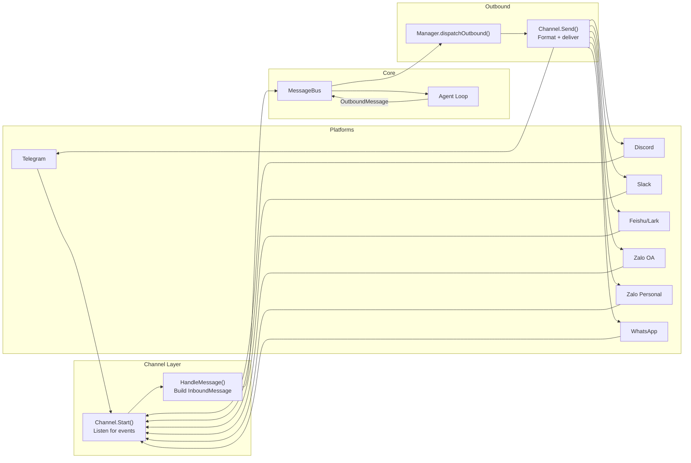
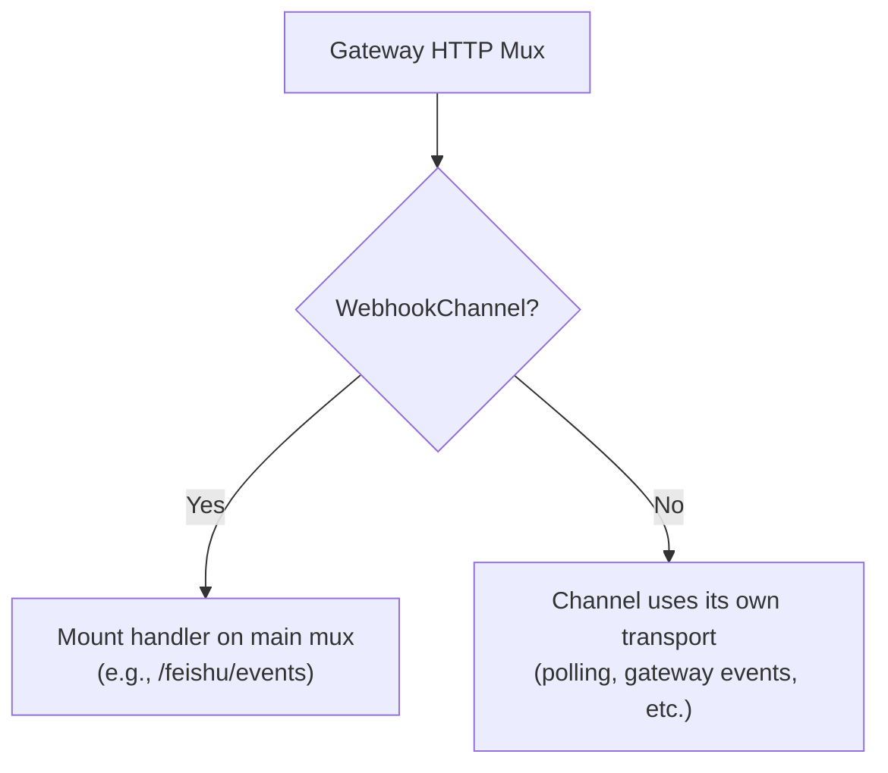
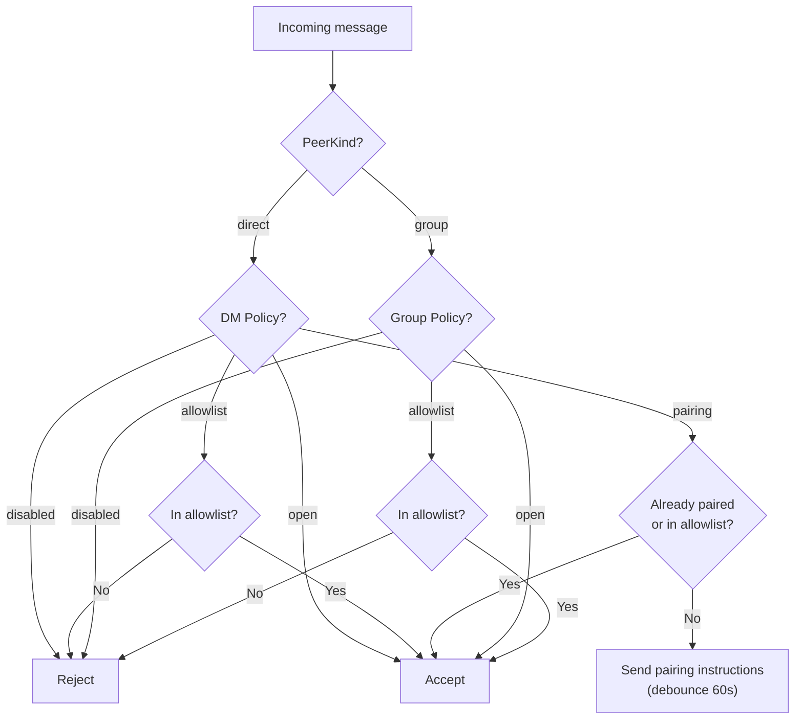
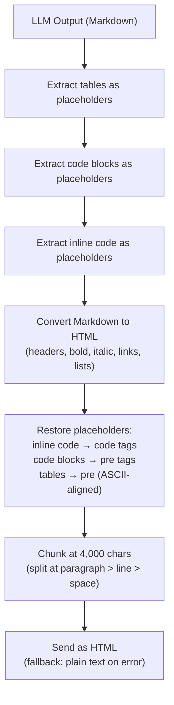
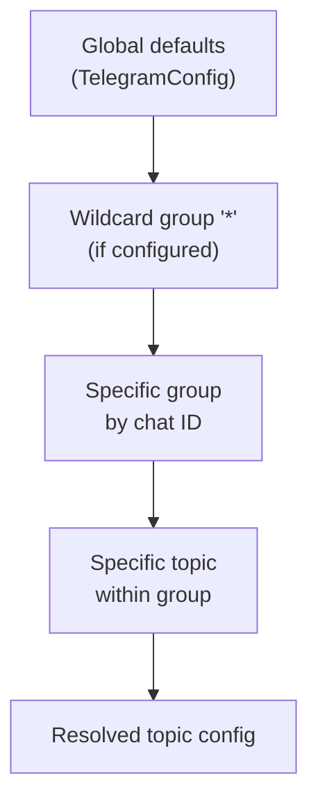
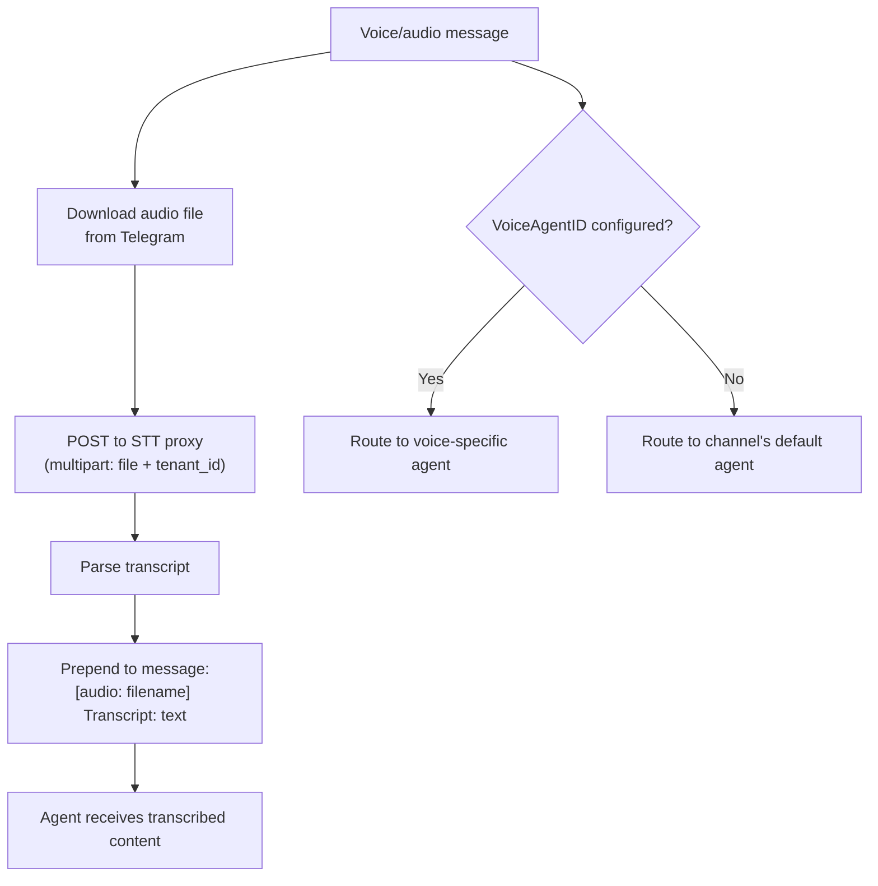
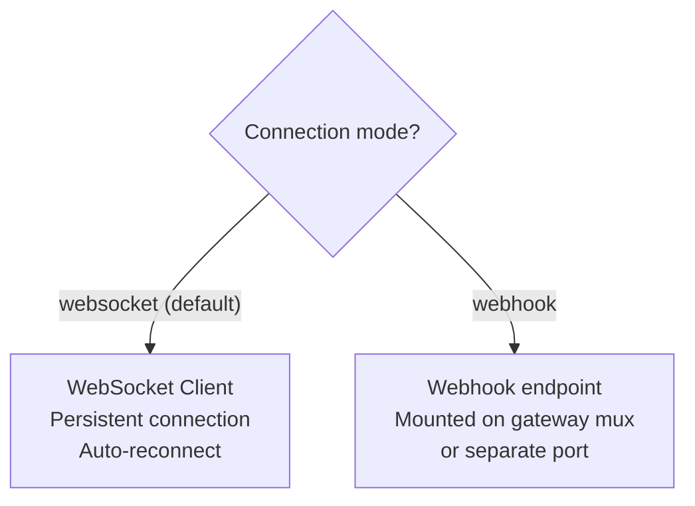
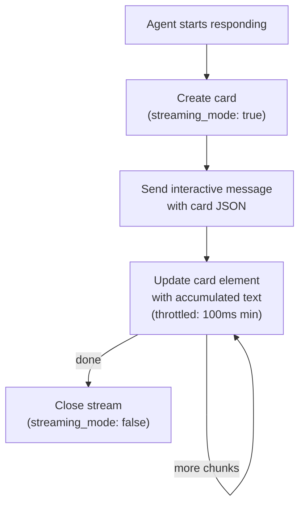
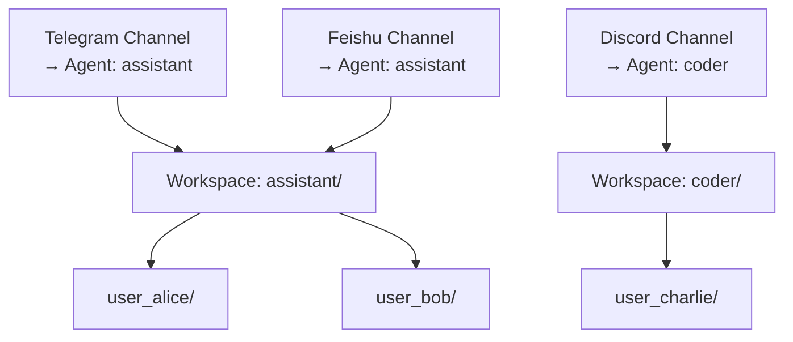
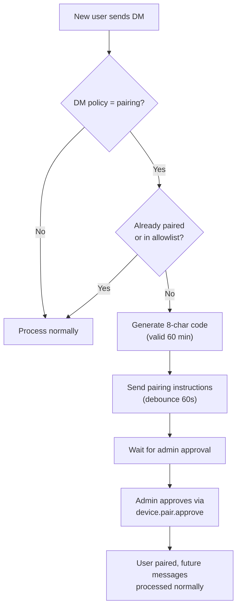

# 05 - 频道与消息传递

频道通过共享消息总线将外部消息平台连接到 GoClaw Agent 运行时。每个频道实现将平台特定事件转换为统一的 `InboundMessage`，并将 Agent 响应转换为适合平台的出站消息。

---

## 1. 消息流



内部频道（`cli`、`system`、`subagent`）会被出站调度器静默跳过，永远不会转发到外部平台。

### 移交路由

在正常的 Agent 路由之前，消费者会检查 `handoff_routes` 表中是否有活动的路由覆盖。如果存在传入频道 + 聊天 ID 的移交路由，消息将被重定向到目标 Agent，而不是原始 Agent。

### 消息路由前缀

消费者根据发送者 ID 前缀路由系统消息：

| 前缀 | 路由 | 调度器通道 |
|------|------|:----------:|
| `subagent:` | 父会话队列 | subagent |
| `delegate:` | 父 Agent 的原始会话 | delegate |
| `teammate:` | 目标 Agent 会话 | delegate |
| `handoff:` | 通过 delegate 通道到达目标 Agent | delegate |

---

## 2. 频道接口

每个频道必须实现基础接口：

| 方法 | 描述 |
|------|------|
| `Name()` | 频道标识符（如 `"telegram"`、`"discord"`） |
| `Start(ctx)` | 开始监听消息（非阻塞） |
| `Stop(ctx)` | 优雅关闭 |
| `Send(ctx, msg)` | 将出站消息投递到平台 |
| `IsRunning()` | 频道是否正在主动处理 |
| `IsAllowed(senderID)` | 检查发送者是否通过白名单验证 |

### 扩展接口

| 接口 | 用途 | 实现者 |
|------|------|--------|
| `StreamingChannel` | 实时流式更新 | Telegram, Feishu |
| `WebhookChannel` | Webhook HTTP 处理器挂载 | Feishu |
| `ReactionChannel` | 消息状态反应 | Telegram, Feishu |

`BaseChannel` 提供所有频道嵌入的共享实现：白名单匹配、`HandleMessage()`、`CheckPolicy()` 和用户 ID 提取。

### Webhook 挂载

实现 `WebhookChannel` 的频道暴露一个 HTTP 处理器，可以挂载到网关的主 HTTP mux 上。这支持单端口操作——不需要单独的 webhook 服务器。



---

## 3. 频道策略

### 私聊策略

| 策略 | 行为 |
|------|------|
| `pairing` | 新发送者需要配对码 |
| `allowlist` | 只接受白名单发送者 |
| `open` | 接受所有私聊 |
| `disabled` | 拒绝所有私聊 |

### 群聊策略

| 策略 | 行为 |
|------|------|
| `open` | 接受所有群消息 |
| `allowlist` | 只接受白名单群组 |
| `disabled` | 不处理群消息 |

### 策略评估



---

## 4. 频道对比

| 功能 | Telegram | Feishu/Lark | Discord | Slack | WhatsApp | Zalo OA | Zalo Personal |
|------|----------|-------------|---------|-------|----------|---------|---------------|
| 连接方式 | 长轮询 | WS（默认）/ Webhook | Gateway events | Socket Mode | 外部 WS 桥接 | 长轮询 | 内部协议 |
| 私聊支持 | 是 | 是 | 是 | 是 | 是 | 是（仅私聊） | 是 |
| 群聊支持 | 是（需要 @提及） | 是 | 是 | 是（需要 @提及 + 线程缓存） | 是 | 否 | 是 |
| 论坛/话题 | 是（按话题配置） | 是（话题会话模式） | -- | -- | -- | -- | -- |
| 消息限制 | 4,096 字符 | 可配置（默认 4,000） | 2,000 字符 | 4,000 字符 | N/A（桥接） | 2,000 字符 | 2,000 字符 |
| 流式输出 | 输入指示器 | 流式消息卡片 | 编辑 "Thinking..." | 编辑 "Thinking..."（限流 1s） | 否 | 否 | 否 |
| 媒体 | 图片、语音、文件 | 图片、文件（30 MB） | 文件、嵌入 | 文件（下载带 SSRF 保护） | JSON 消息 | 图片（5 MB） | -- |
| 语音转文字 | 是（STT 代理） | -- | -- | -- | -- | -- | -- |
| 语音路由 | 是（VoiceAgentID） | -- | -- | -- | -- | -- | -- |
| 富文本格式 | Markdown → HTML | 卡片消息 | Markdown | Markdown → mrkdwn | 纯文本 | 纯文本 | 纯文本 |
| Bot 命令 | 10+ 命令 | -- | -- | -- | -- | -- | -- |
| 工具白名单 | 按话题 | -- | -- | -- | -- | -- | -- |
| 配对支持 | 是 | 是 | 是 | 是 | 是 | 是 | 是 |
| 状态反应 | 是 | 是 | -- | 是 | -- | -- | -- |

---

## 5. Telegram

Telegram 频道通过 `telego` 库（Telegram Bot API）使用长轮询。

### 核心行为

- **群聊 @提及要求**：默认情况下，机器人在群聊中必须被 @提及（`requireMention: true`）。未提及的消息存储在历史缓冲区（默认 50 条消息），当机器人最终被提及时作为上下文包含。
- **输入指示器**：Agent 处理时发送"正在输入"动作。
- **代理支持**：可选通过频道配置的 HTTP 代理。
- **取消命令**：`/stop` 和 `/stopall` 在 800ms 防抖器之前被拦截。详见 [08-scheduling-cron.md](./08-scheduling-cron.md)。
- **并发群聊支持**：群会话支持最多 3 个并发 Agent 运行。
- **回复 Bot 等同提及**：在群聊中回复 Bot 消息算作提及 Bot。

### 格式化流水线



表格渲染为 `<pre>` 标签内的 ASCII 对齐文本。CJK 和 emoji 字符按 2 列宽度计算以实现正确对齐。

### 论坛话题

Telegram 论坛话题（超级群线程）获得按话题配置，采用分层合并。



**每个话题可配置：**

| 字段 | 描述 |
|------|------|
| `groupPolicy` | open, allowlist, pairing, disabled |
| `requireMention` | 覆盖此话题的 @提及要求 |
| `allowFrom` | 此话题的用户/ID 白名单 |
| `enabled` | 启用/禁用此特定话题 |
| `skills` | 覆盖可用技能（nil=继承, []=无, ["x","y"]=白名单） |
| `tools` | 覆盖可用工具（支持 `group:xxx` 语法） |
| `systemPrompt` | 附加系统提示（在话题级别拼接） |

**会话键格式：**

| 上下文 | 键格式 |
|--------|--------|
| 普通聊天 | `"-12345"` |
| 论坛话题 | `"-12345:topic:99"` |
| 私聊线程 | `"-12345:thread:55"` |

通用话题（ID=1）在发送时被剥离——Telegram API 对通用话题不需要线程 ID。已删除的话题通过错误消息匹配检测，并在线程 ID 重试时去掉。

### 工具白名单（按话题）

每个话题可以限制 Agent 可使用的工具。`tools` 字段接受工具名称和组引用：

- `nil` = 继承所有工具（无限制）
- `[]` = 此话题无工具
- `["web_search", "group:fs"]` = 仅 web 搜索和文件系统工具

工具白名单通过消息元数据传递，在 LLM 看到工具定义之前由策略引擎应用。

### 语音转文字

语音和音频消息可以通过外部 STT 代理服务转写。



**配置**：STT 代理 URL、超时（默认 30s）、可选租户 ID 和 API 密钥。如果转写失败，媒体占位符保留——不显示错误。

**语音路由**：当配置了 `VoiceAgentID` 时，音频/语音消息被路由到不同的 Agent（如语音专用 Agent），而不是频道的默认 Agent。

### Bot 命令

命令在用回复/转发上下文丰富内容之前处理（以防止解析问题）。

| 命令 | 描述 | 群聊限制 |
|------|------|:--------:|
| `/help` | 显示命令列表 | -- |
| `/start` | 传递给 Agent | -- |
| `/stop` | 取消当前运行 | -- |
| `/stopall` | 取消所有运行 | -- |
| `/reset` | 清除会话历史 | 仅限写入者 |
| `/status` | Bot 状态 + 用户名 | -- |
| `/tasks` | 团队任务列表 | -- |
| `/task_detail <id>` | 查看任务详情 | -- |
| `/addwriter` | 添加群文件写入者（回复目标用户） | 仅限写入者 |
| `/removewriter` | 移除群文件写入者 | 仅限写入者 |
| `/writers` | 列出群文件写入者 | -- |

### 群文件写入者限制

在群聊中，写入敏感操作（文件写入、`/reset`）仅限指定的写入者。群 ID 格式为 `group:telegram:{chatID}`。

- 权限检查查询数据库：`IsGroupFileWriter(agentID, groupID, senderID)`
- 数据库错误时开放失败（安全日志记录为 `security.reset_writer_check_failed`）
- 写入者通过 `/addwriter` 和 `/removewriter` 命令管理

---

## 6. Feishu/Lark

Feishu/Lark 频道通过原生 HTTP 连接，支持两种传输模式。

### 传输模式



当使用 webhook 模式且 port=0 时，处理器直接挂载到网关的主 HTTP mux（见第 2 节的 webhook 挂载）。如果配置了单独端口，则启动专用服务器。

### 配置

| 字段 | 默认值 | 描述 |
|------|--------|------|
| `ConnectionMode` | `"websocket"` | `"websocket"` 或 `"webhook"` |
| `WebhookPort` | 0 | 0 = 挂载到网关 mux；>0 = 单独服务器 |
| `WebhookPath` | `"/feishu/events"` | Webhook 端点路径 |
| `RenderMode` | `"auto"` | `"auto"`（检测代码/表格）、`"card"` 或默认文本 |
| `TextChunkLimit` | 4,000 | 每条文本消息最大字符数 |
| `MediaMaxMB` | 30 | 媒体文件最大大小（MB） |
| `TopicSessionMode` | disabled | `"enabled"` 启用按话题会话隔离 |
| `RequireMention` | true | 群聊需要 @提及 Bot |
| `GroupAllowFrom` | -- | 群级别白名单（与私聊分开） |
| `ReactionLevel` | -- | `"off"`、`"minimal"`（仅终端）或完整 |

### 流式消息卡片

响应以交互式卡片消息形式投递，具有实时流式更新。



每次更新递增序列号用于排序。更新限制在最小 100ms 间隔以避免 API 限流。流式卡片以打字机动画效果显示内容（50ms 频率，2 字符步进）。

### 媒体处理

**接收（入站）**：图片、文件、音频、视频和贴纸从飞书 API 下载，具有可配置大小限制（默认 30 MB）。超大文件被静默跳过。

| 媒体类型 | 保存为 |
|----------|--------|
| 图片 | `.png` |
| 文件 | 原始扩展名 |
| 音频 | `.opus` |
| 视频 | `.mp4` |
| 贴纸 | `.png` |

**发送（出站）**：文件上传到飞书，自动检测类型（opus, mp4, pdf, doc, xls, ppt 或通用流）。

### 提及解析

飞书发送带有占位符令牌（如 `@_user_1`）的内容表示被提及的用户。GoClaw 处理这些：

- **Bot 提及**：完全剥离（只是触发器，不是有意义的内容）
- **用户提及**：从提及列表替换为 `@DisplayName`
- Bot ID 未知时的后备检测

### 话题会话模式

启用时，每个线程获得隔离的会话：
- 会话键包含线程根消息 ID：`"{chatID}:topic:{rootID}"`
- 同一群组内的不同线程维护独立的对话历史
- 默认禁用

---

## 7. Discord

Discord 频道使用 `discordgo` 库通过 Discord Gateway 连接。

### 核心行为

- **Gateway intents**：请求 `GuildMessages`、`DirectMessages` 和 `MessageContent` intents
- **消息限制**：2,000 字符限制，自动在换行符处分割
- **占位符编辑**：发送 "Thinking..." → 编辑为实际响应
- **@提及要求**：`requireMention` 默认 true；Bot 提及从内容中剥离
- **Bot 身份**：启动时获取 `@me` 以检测并忽略自己的消息
- **输入指示器**：Agent 处理时 9 秒保活
- **群聊历史**：被提及时的待处理消息缓冲区作为上下文

---

## 8. Slack

Slack 频道使用 `slack-go/slack` 库通过 Socket Mode（WebSocket）连接。

### 核心行为

- **Socket Mode**：使用 `xapp-` App-Level Token 进行 WebSocket 连接（不需要公开 URL）
- **三种令牌类型**：`xoxb-`（Bot Token，必需）、`xapp-`（App-Level Token，必需）、`xoxp-`（User Token，可选用于自定义身份）
- **令牌前缀验证**：启动时验证令牌（`xoxb-`、`xapp-`、`xoxp-` 前缀）
- **消息限制**：4,000 字符限制，自动在换行符边界分割
- **占位符编辑**：发送 "Thinking..." → 编辑为实际响应（与 Discord 相同）
- **@提及要求**：`requireMention` 默认 true；`<@botUserID>` 从内容中剥离
- **线程参与缓存**：Bot 在线程中回复后，该线程中的后续消息自动触发响应而无需 @提及（24h TTL）
- **消息去重**：`channel+ts` 键防止 Socket Mode 重连时的重复处理
- **消息防抖**：快速消息按线程批处理（默认 300ms，可配置）
- **死亡 Socket 分类**：不可重试的认证错误（invalid_auth, token_revoked）快速失败而非无限重连
- **流式输出**：通过 `chat.update` 原地编辑，1000ms 限流（Slack Tier 3 速率限制）
- **反应**：用户消息上的状态 emoji（thinking_face, hammer_and_wrench, white_check_mark, x, hourglass）
- **SSRF 保护**：文件下载主机名白名单（*.slack.com, *.slack-edge.com, *.slack-files.com），重定向时剥离认证令牌
- **健康探测**：`auth.test()` 带 2.5s 超时用于监控集成

### 格式化流水线

```
LLM markdown → htmlTagsToMarkdown() → extractSlackTokens() → escapeHTMLEntities()
→ extractCodeBlocks() → convertTablesToCodeBlocks() → bold/strike/header/link conversion
→ restore tokens/code blocks → Slack mrkdwn
```

关键转换：`**bold**` → `*bold*`，`~~strike~~` → `~strike~`，`[text](url)` → `<url|text>`，`# Header` → `*Header*`，表格 → 代码块。

### 环境变量

```
GOCLAW_SLACK_BOT_TOKEN   → channels.slack.bot_token
GOCLAW_SLACK_APP_TOKEN   → channels.slack.app_token
GOCLAW_SLACK_USER_TOKEN  → channels.slack.user_token (可选)
```

当 bot_token 和 app_token 都设置时自动启用。

---

## 9. WhatsApp

WhatsApp 频道通过外部 WebSocket 桥接（如基于 whatsapp-web.js）通信。GoClaw 不直接实现 WhatsApp 协议。

### 核心行为

- **桥接连接**：通过 WebSocket 连接到可配置的 `bridge_url`
- **JSON 格式**：消息以 JSON 对象发送/接收
- **自动重连**：指数退避（1s → 最大 30s）
- **私聊和群聊支持**：通过聊天 ID 中的 `@g.us` 后缀检测群组
- **媒体处理**：来自桥接协议的文件路径数组

---

## 10. Zalo OA

Zalo OA（官方账号）频道连接到 Zalo OA Bot API。

### 核心行为

- **仅私聊**：不支持群组。只处理直接消息
- **文本限制**：每条消息最多 2,000 字符
- **长轮询**：默认 30 秒超时，错误时 5 秒退避
- **媒体**：图片支持，默认限制 5 MB
- **默认私聊策略**：`"pairing"`（需要配对码）
- **配对防抖**：配对说明 60 秒防抖

---

## 11. Zalo Personal

Zalo Personal 频道使用逆向工程协议访问个人 Zalo 账号。这是非官方集成。

### 与 Zalo OA 的主要区别

| 方面 | Zalo OA | Zalo Personal |
|------|---------|---------------|
| 协议 | 官方 Bot API | 逆向工程（zcago, MIT） |
| 私聊支持 | 是 | 是 |
| 群聊支持 | 否 | 是 |
| 默认私聊策略 | `pairing` | `allowlist`（严格） |
| 默认群聊策略 | N/A | `allowlist`（严格） |
| 认证 | API 凭证 | 预加载凭证或 QR 扫码 |
| 风险 | 无 | 账号可能被锁定/封禁 |

### 安全警告

Zalo Personal 使用非官方的逆向工程协议。使用的账号可能随时被 Zalo 锁定或封禁。启动时会记录安全警告：`security.unofficial_api`。

### 弹性

- 最多 10 次重启尝试
- 指数退避最多 60 秒
- 错误码 3000 特殊处理：60 秒初始延迟
- 每线程输入控制器

---

## 12. 频道隔离工作空间

每个频道实例可以指向特定 Agent，提供跨频道的工作空间隔离。



频道实例从数据库加载，带有其分配的 Agent ID。Agent 键被解析并通过消息管道传播，确保所有文件系统工具、上下文文件和内存操作使用正确的工作空间。

---

## 13. 本地键传播

线程/话题上下文通过消息元数据中的 `local_key` 在整个消息管道中保留。这确保子 Agent、委派和团队消息结果落在正确的线程中——而不是根聊天。

| 平台 | 本地键格式 |
|------|-----------|
| Telegram（聊天） | `"-12345"` |
| Telegram（话题） | `"-12345:topic:99"` |
| Telegram（线程） | `"-12345:thread:55"` |
| Feishu（聊天） | `"oc_xyz"` |
| Feishu（话题） | `"oc_xyz:topic:{root_msg_id}"` |

所有频道状态——占位符、流、反应、输入控制器、线程 ID——都以这个复合 `local_key` 为键。当委派或团队消息完成时，原始消息中的 `local_key` 在元数据中保留，并用于将响应路由回正确的位置。

---

## 14. 按用户隔离

频道通过复合发送者 ID 和上下文传播提供按用户隔离：

- **用户作用域**：每个频道构建复合发送者 ID（如 `telegram:123456`），映射到 `user_id`。会话键格式 `agent:{agentId}:{channel}:direct:{peerId}` 确保每个用户对每个 Agent 有隔离的对话历史。
- **上下文传播**：`HandleMessage()` 将 `AgentID`、`UserID` 和 `AgentType` 注入上下文。这些流向 ContextFileInterceptor、MemoryInterceptor 和按用户文件种子。
- **配对存储**：PostgreSQL（`pairing_requests` 和 `paired_devices` 表）。
- **会话持久化**：PostgreSQL `sessions` 表，带写后缓存。

---

## 15. 配对系统

配对系统为使用 `pairing` 私聊策略的频道提供私聊认证流程。



### 配对码规格

| 方面 | 值 |
|------|-----|
| 长度 | 8 字符 |
| 字母表 | `ABCDEFGHJKLMNPQRSTUVWXYZ23456789`（排除易混淆：0, O, 1, I, L） |
| TTL | 60 分钟 |
| 每账号最大待处理 | 3 |
| 回复防抖 | 每发送者 60 秒 |

---

## 文件参考

| 文件 | 用途 |
|------|------|
| `internal/channels/channel.go` | 频道接口、BaseChannel、扩展接口、HandleMessage |
| `internal/channels/manager.go` | Manager：注册、StartAll、StopAll、出站分发、webhook 收集 |
| `internal/channels/instance_loader.go` | 基于数据库的频道实例加载 |
| `internal/channels/telegram/channel.go` | Telegram 核心：长轮询、@提及要求、输入指示器 |
| `internal/channels/telegram/handlers.go` | 消息处理、媒体处理、论坛话题检测 |
| `internal/channels/telegram/topic_config.go` | 按话题配置分层和解析 |
| `internal/channels/telegram/commands.go` | Bot 命令：/stop, /reset, /tasks, /addwriter 等 |
| `internal/channels/telegram/stt.go` | 语音转文字代理集成、语音 Agent 路由 |
| `internal/channels/telegram/stream.go` | 流式占位符管理 |
| `internal/channels/telegram/reactions.go` | 消息上的状态反应 |
| `internal/channels/telegram/format.go` | Markdown → Telegram HTML 流水线、表格渲染 |
| `internal/channels/feishu/feishu.go` | 飞书核心：WS/Webhook 模式、配置 |
| `internal/channels/feishu/streaming.go` | 流式卡片创建/更新/关闭 |
| `internal/channels/feishu/media.go` | 媒体上传/下载、类型检测 |
| `internal/channels/feishu/bot_parse.go` | 提及解析、消息事件解析 |
| `internal/channels/feishu/bot.go` | Bot 消息处理器 |
| `internal/channels/feishu/bot_policy.go` | 策略评估 |
| `internal/channels/discord/discord.go` | Discord：Gateway events、占位符编辑 |
| `internal/channels/slack/slack.go` | Slack：Socket Mode、@提及要求、线程缓存 |
| `internal/channels/slack/format.go` | Markdown → Slack mrkdwn 流水线 |
| `internal/channels/slack/reactions.go` | 消息上的状态 emoji 反应 |
| `internal/channels/whatsapp/whatsapp.go` | WhatsApp：外部 WS 桥接 |
| `internal/channels/zalo/zalo.go` | Zalo OA：Bot API、长轮询 |
| `internal/channels/zalo/personal/channel.go` | Zalo Personal：逆向工程协议 |
| `internal/store/pg/pairing.go` | 配对：码生成、审批、持久化（数据库支持） |
| `cmd/gateway_consumer.go` | 消息路由：前缀、移交、取消拦截 |

---

## 交叉引用

| 文档 | 相关内容 |
|------|----------|
| [00-architecture-overview.md](./00-architecture-overview.md) | 网关序列中的频道启动 |
| [03-tools-system.md](./03-tools-system.md) | 工具策略引擎、按请求工具白名单 |
| [08-scheduling-cron.md](./08-scheduling-cron.md) | /stop 和 /stopall 命令、调度器通道、cron |
| [09-security.md](./09-security.md) | 群文件写入者限制、安全日志 |
| [11-agent-teams.md](./11-agent-teams.md) | 团队消息路由、委派结果投递 |