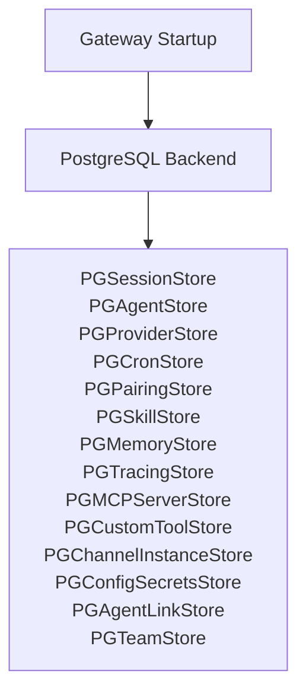
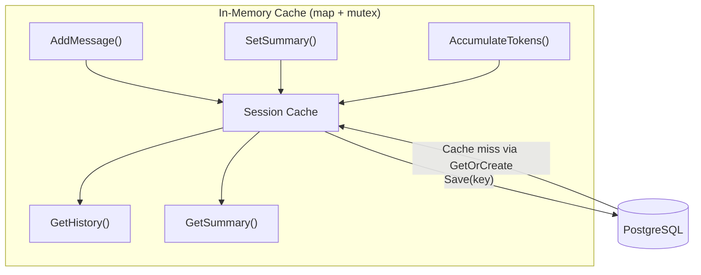
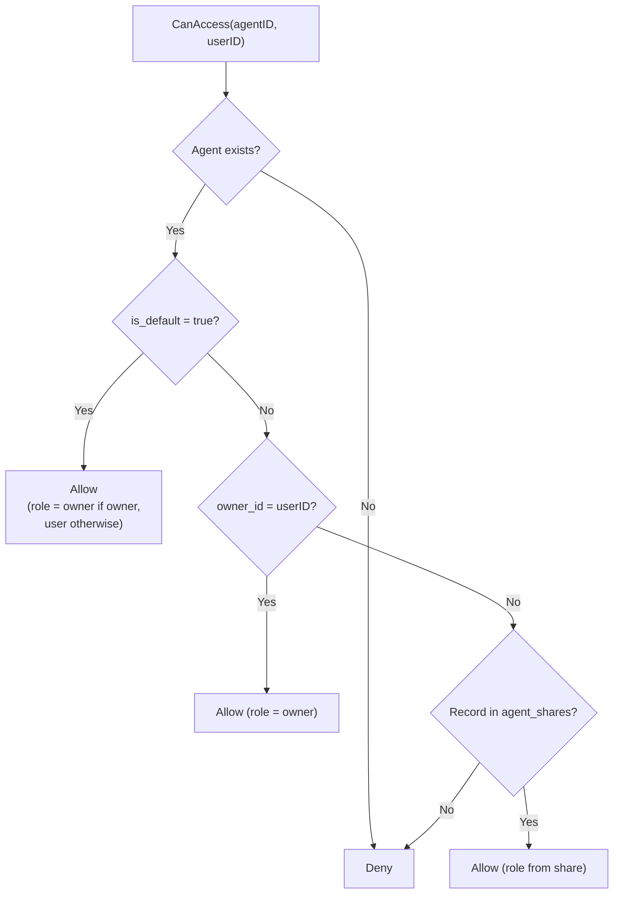
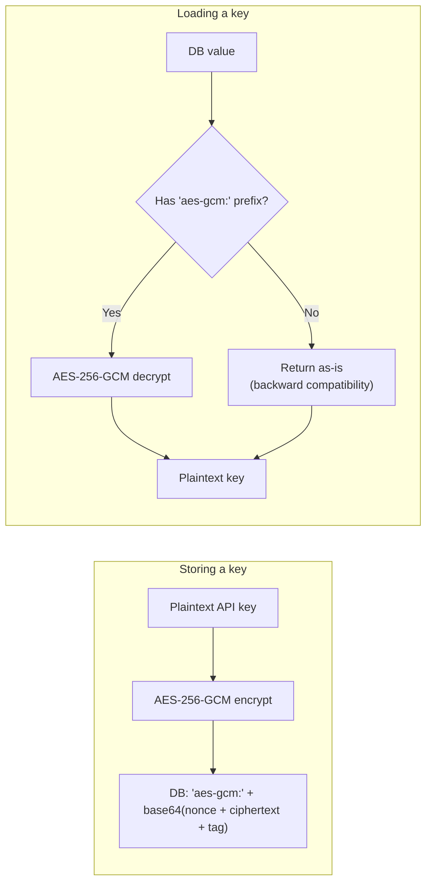
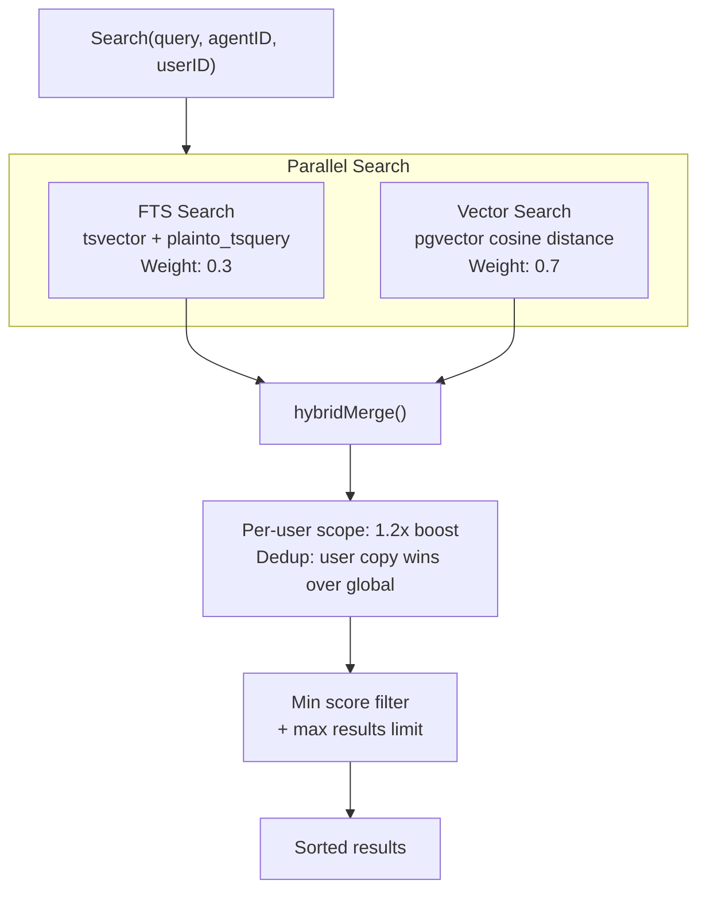
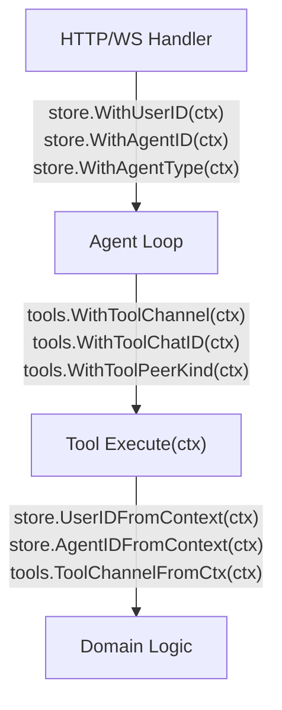

# 06 - 存储层与数据模型

存储层将所有持久化抽象在 Go 接口之后，由 PostgreSQL 支持。每个存储接口在启动时连接 PostgreSQL 实现。

---

## 1. 存储层



---

## 2. 存储接口映射

`Stores` 结构体是顶层容器，持有所有 PostgreSQL 支持的存储实现。

| 接口 | 实现 |
|------|------|
| SessionStore | `PGSessionStore` |
| MemoryStore | `PGMemoryStore`（tsvector + pgvector） |
| CronStore | `PGCronStore` |
| PairingStore | `PGPairingStore` |
| SkillStore | `PGSkillStore` |
| AgentStore | `PGAgentStore` |
| ProviderStore | `PGProviderStore` |
| TracingStore | `PGTracingStore` |
| MCPServerStore | `PGMCPServerStore` |
| CustomToolStore | `PGCustomToolStore` |
| ChannelInstanceStore | `PGChannelInstanceStore` |
| ConfigSecretsStore | `PGConfigSecretsStore` |
| AgentLinkStore | `PGAgentLinkStore` |
| TeamStore | `PGTeamStore` |

---

## 3. 会话缓存

会话存储使用内存写后缓存来最小化 Agent 工具循环期间的数据库 I/O。所有读写都在内存中发生；数据仅在运行结束时调用 `Save()` 时刷新到持久化后端。



### 生命周期

1. **GetOrCreate(key)**：检查缓存；未命中时从数据库加载到缓存；返回会话数据。
2. **AddMessage/SetSummary/AccumulateTokens**：仅更新内存缓存（无数据库写入）。
3. **Save(key)**：在读锁下快照数据，通过 UPDATE 刷新到数据库。
4. **Delete(key)**：从缓存和数据库中删除。`List()` 始终直接从数据库读取。

### 会话键格式

| 类型 | 格式 | 示例 |
|------|------|------|
| 私聊 | `agent:{agentId}:{channel}:direct:{peerId}` | `agent:default:telegram:direct:386246614` |
| 群聊 | `agent:{agentId}:{channel}:group:{groupId}` | `agent:default:telegram:group:-100123456` |
| 子 Agent | `agent:{agentId}:subagent:{label}` | `agent:default:subagent:my-task` |
| Cron | `agent:{agentId}:cron:{jobId}:run:{runId}` | `agent:default:cron:reminder:run:abc123` |
| 主会话 | `agent:{agentId}:{mainKey}` | `agent:default:main` |

---

## 4. Agent 访问控制

Agent 访问通过 4 步管道检查。



`agent_shares` 表存储 `UNIQUE(agent_id, user_id)`，角色包括：`user`、`admin`、`operator`。

`ListAccessible(userID)` 查询：`owner_id = ? OR is_default = true OR id IN (SELECT agent_id FROM agent_shares WHERE user_id = ?)`。

---

## 5. API 密钥加密

`llm_providers` 和 `mcp_servers` 表中的 API 密钥在存储前使用 AES-256-GCM 加密。



`GOCLAW_ENCRYPTION_KEY` 接受三种格式：
- **Hex**：64 字符（解码为 32 字节）
- **Base64**：44 字符（解码为 32 字节）
- **Raw**：32 字符（直接 32 字节）

---

## 6. 混合内存搜索

内存搜索结合全文搜索（FTS）和向量相似度，进行加权合并。



### 合并规则

1. 将 FTS 分数归一化到 [0, 1]（除以最高分）
2. 向量分数已经在 [0, 1]（余弦相似度）
3. 组合分数：`vec_score * 0.7 + fts_score * 0.3`（对于两边都找到的块）
4. 当只有一个通道返回结果时，其权重自动调整为 1.0
5. 按用户结果获得 1.2x 加成
6. 去重：如果块同时存在于全局和按用户作用域，按用户版本优先

### 后备

当 FTS 无结果时（如跨语言查询），`likeSearch()` 后备使用 ILIKE 查询，最多 5 个关键词（每个最少 3 字符），限定在 Agent 的索引范围内。

### 搜索实现

| 方面 | 详情 |
|------|------|
| FTS 引擎 | PostgreSQL tsvector |
| 向量 | pgvector 扩展 |
| 搜索函数 | `plainto_tsquery('simple', ...)` |
| 距离操作符 | `<=>`（余弦） |

---

## 7. 上下文文件路由

上下文文件存储在两个表中，根据 Agent 类型路由。

### 表

| 表 | 作用域 | 唯一键 |
|------|------|--------|
| `agent_context_files` | Agent 级别 | `(agent_id, file_name)` |
| `user_context_files` | 按用户 | `(agent_id, user_id, file_name)` |

### 按 Agent 类型路由

| Agent 类型 | Agent 级别文件 | 按用户文件 |
|------------|----------------|------------|
| `open` | 仅模板后备 | 所有文件（SOUL, IDENTITY, AGENTS, TOOLS, BOOTSTRAP, USER） |
| `predefined` | Agent 级别文件（SOUL, IDENTITY, AGENTS, TOOLS, BOOTSTRAP） | 仅 USER.md |

`ContextFileInterceptor` 从上下文检查 Agent 类型，并相应路由读/写操作。对于 open Agent，按用户文件优先，Agent 级别作为后备。

---

## 8. MCP 服务器存储

MCP 服务器存储管理外部工具服务器配置和访问授权。

### 表

| 表 | 用途 |
|------|------|
| `mcp_servers` | 服务器配置（名称、传输、命令/URL、加密 API 密钥） |
| `mcp_agent_grants` | 按 Agent 访问授权，带工具允许/拒绝列表 |
| `mcp_user_grants` | 按用户访问授权，带工具允许/拒绝列表 |
| `mcp_access_requests` | 待处理/已批准/已拒绝的访问请求 |

### 传输类型

| 传输 | 使用的字段 |
|------|-----------|
| `stdio` | `command`、`args`（JSONB）、`env`（JSONB） |
| `sse` | `url`、`headers`（JSONB） |
| `streamable-http` | `url`、`headers`（JSONB） |

`ListAccessible(agentID, userID)` 返回给定 Agent+用户组合可访问的所有 MCP 服务器，以及从 Agent 和用户授权合并的有效工具允许/拒绝列表。

---

## 9. 自定义工具存储

动态工具定义存储在 PostgreSQL 中。每个工具定义一个 shell 命令模板，LLM 可以在运行时调用。

### 表：`custom_tools`

| 列 | 类型 | 描述 |
|------|------|------|
| `id` | UUID v7 | 主键 |
| `name` | VARCHAR | 唯一工具名称 |
| `description` | TEXT | 给 LLM 的工具描述 |
| `parameters` | JSONB | 工具参数的 JSON Schema |
| `command` | TEXT | 带 `{{.key}}` 占位符的 shell 命令模板 |
| `working_dir` | VARCHAR | 可选工作目录 |
| `timeout_seconds` | INT | 执行超时（默认 60） |
| `env` | BYTEA | 加密的环境变量（AES-256-GCM） |
| `agent_id` | UUID | `NULL` = 全局工具，UUID = 按 Agent 工具 |
| `enabled` | BOOLEAN | 软启用/禁用 |
| `created_by` | VARCHAR | 审计跟踪 |

**作用域**：全局工具（`agent_id IS NULL`）在启动时加载到全局注册表。按 Agent 工具在 Agent 解析时按需加载，使用克隆的注册表以避免污染全局注册表。

---

## 10. Agent 链接存储

Agent 链接存储管理 Agent 间委派权限——控制哪些 Agent 可以委派给哪些其他 Agent 的有向边。

### 表：`agent_links`

| 列 | 类型 | 描述 |
|------|------|------|
| `id` | UUID v7 | 主键 |
| `source_agent_id` | UUID | 可委派的 Agent（FK → agents） |
| `target_agent_id` | UUID | 被委派到的 Agent（FK → agents） |
| `direction` | VARCHAR(20) | `outbound`（仅 A→B）、`bidirectional`（A↔B） |
| `team_id` | UUID | 非空 = 由团队设置自动创建（FK → agent_teams，删除时 SET NULL） |
| `description` | TEXT | 链接描述 |
| `max_concurrent` | INT | 每链接并发上限（默认 3） |
| `settings` | JSONB | 按用户拒绝/允许列表，用于细粒度访问控制 |
| `status` | VARCHAR(20) | `active` 或 `disabled` |
| `created_by` | VARCHAR | 审计跟踪 |

**约束**：`UNIQUE(source_agent_id, target_agent_id)`、`CHECK (source_agent_id != target_agent_id)`

### Agent 搜索列（迁移 000002）

`agents` 表增加三列用于委派时的 Agent 发现：

| 列 | 类型 | 用途 |
|------|------|------|
| `frontmatter` | TEXT | 短专业知识摘要（区别于 `other_config.description`，后者是召唤提示） |
| `tsv` | TSVECTOR | 从 `display_name + frontmatter` 自动生成，GIN 索引 |
| `embedding` | VECTOR(1536) | 用于余弦相似度搜索，HNSW 索引 |

### AgentLinkStore 接口（12 个方法）

- **CRUD**：`CreateLink`、`DeleteLink`、`UpdateLink`、`GetLink`
- **查询**：`ListLinksFrom(agentID)`、`ListLinksTo(agentID)`
- **权限**：`CanDelegate(from, to)`、`GetLinkBetween(from, to)`（返回完整链接及 Settings 用于按用户检查）
- **发现**：`DelegateTargets(agentID)`（所有目标及连接的 agent_key + display_name，用于 DELEGATION.md）、`SearchDelegateTargets`（FTS）、`SearchDelegateTargetsByEmbedding`（向量余弦）

### 表：`delegation_history`

| 列 | 类型 | 描述 |
|------|------|------|
| `id` | UUID v7 | 主键 |
| `source_agent_id` | UUID | 委派 Agent |
| `target_agent_id` | UUID | 目标 Agent |
| `team_id` | UUID | 团队上下文（可空） |
| `team_task_id` | UUID | 相关团队任务（可空） |
| `user_id` | VARCHAR | 触发委派的用户 |
| `task` | TEXT | 发送给目标的任务描述 |
| `mode` | VARCHAR(10) | `sync` 或 `async` |
| `status` | VARCHAR(20) | `completed`、`failed`、`cancelled` |
| `result` | TEXT | 目标 Agent 的响应 |
| `error` | TEXT | 失败时的错误消息 |
| `iterations` | INT | LLM 迭代次数 |
| `trace_id` | UUID | 关联的追踪用于可观测性 |
| `duration_ms` | INT | 墙钟时长 |
| `completed_at` | TIMESTAMPTZ | 完成时间戳 |

每次同步和异步委派都会通过 `SaveDelegationHistory()` 自动持久化。结果为 WS 传输截断（列表 500 字符，详情 8000 字符）。

---

## 11. 团队存储

团队存储管理协作多 Agent 团队，具有共享任务板、点对点邮箱和移交路由。

### 表

| 表 | 用途 | 关键列 |
|------|------|--------|
| `agent_teams` | 团队定义 | `name`、`lead_agent_id`（FK → agents）、`status`、`settings`（JSONB） |
| `agent_team_members` | 团队成员 | PK `(team_id, agent_id)`、`role`（lead/member） |
| `team_tasks` | 共享任务板 | `subject`、`status`（pending/in_progress/completed/blocked）、`owner_agent_id`、`blocked_by`（UUID[]）、`priority`、`result`、`tsv`（FTS） |
| `team_messages` | 点对点邮箱 | `from_agent_id`、`to_agent_id`（NULL = 广播）、`content`、`message_type`（chat/broadcast）、`read` |
| `handoff_routes` | 活动路由覆盖 | UNIQUE `(channel, chat_id)`、`from_agent_key`、`to_agent_key`、`reason` |

### TeamStore 接口（22 个方法）

**团队 CRUD**：`CreateTeam`、`GetTeam`、`DeleteTeam`、`ListTeams`

**成员**：`AddMember`、`RemoveMember`、`ListMembers`、`GetTeamForAgent`（按 Agent 查找团队）

**任务**：`CreateTask`、`UpdateTask`、`ListTasks`（orderBy: priority/newest，statusFilter: active/completed/all）、`GetTask`、`SearchTasks`（FTS on subject+description）、`ClaimTask`、`CompleteTask`

**委派历史**：`SaveDelegationHistory`、`ListDelegationHistory`（带过滤选项）、`GetDelegationHistory`

**移交路由**：`SetHandoffRoute`、`GetHandoffRoute`、`ClearHandoffRoute`

**消息**：`SendMessage`、`GetUnread`、`MarkRead`

### 原子任务认领

两个 Agent 抢占同一任务在数据库层面被阻止：

```sql
UPDATE team_tasks
SET status = 'in_progress', owner_agent_id = $1
WHERE id = $2 AND status = 'pending' AND owner_agent_id IS NULL
```

更新一行 = 已认领。零行 = 被他人抢占。行级锁定，无需分布式互斥锁。

### 任务依赖

任务可以声明 `blocked_by`（UUID 数组）指向前置任务。当任务通过 `CompleteTask` 完成时，所有依赖任务（其阻塞项现已全部完成）会自动解除阻塞（状态从 `blocked` 转换为 `pending`）。

---

## 12. 数据库模式

所有表使用 UUID v7（时间有序）作为主键，通过 `GenNewID()` 生成。

```mermaid
flowchart TD
    subgraph Providers
        LP["llm_providers"] --> LM["llm_models"]
    end

    subgraph Agents
        AG["agents"] --> AS["agent_shares"]
        AG --> ACF["agent_context_files"]
        AG --> UCF["user_context_files"]
        AG --> UAP["user_agent_profiles"]
    end

    subgraph "Agent Links"
        AG --> AL["agent_links"]
        AL --> DH["delegation_history"]
    end

    subgraph Teams
        AT["agent_teams"] --> ATM["agent_team_members"]
        AT --> TT["team_tasks"]
        AT --> TM["team_messages"]
    end

    subgraph Handoff
        HR["handoff_routes"]
    end

    subgraph Sessions
        SE["sessions"]
    end

    subgraph Memory
        MD["memory_documents"] --> MC["memory_chunks"]
    end

    subgraph Cron
        CJ["cron_jobs"] --> CRL["cron_run_logs"]
    end

    subgraph Pairing
        PR["pairing_requests"]
        PD["paired_devices"]
    end

    subgraph Skills
        SK["skills"] --> SAG["skill_agent_grants"]
        SK --> SUG["skill_user_grants"]
    end

    subgraph Tracing
        TR["traces"] --> SP["spans"]
    end

    subgraph MCP
        MS["mcp_servers"] --> MAG["mcp_agent_grants"]
        MS --> MUG["mcp_user_grants"]
        MS --> MAR["mcp_access_requests"]
    end

    subgraph "Custom Tools"
        CT["custom_tools"]
    end
```



### 关键表

| 表 | 用途 | 关键列 |
|------|------|--------|
| `agents` | Agent 定义 | `agent_key`（UNIQUE）、`owner_id`、`agent_type`（open/predefined）、`is_default`、`frontmatter`、`tsv`、`embedding`，通过 `deleted_at` 软删除 |
| `agent_shares` | Agent RBAC 共享 | UNIQUE(agent_id, user_id)、`role`（user/admin/operator） |
| `agent_context_files` | Agent 级别上下文 | UNIQUE(agent_id, file_name) |
| `user_context_files` | 按用户上下文 | UNIQUE(agent_id, user_id, file_name) |
| `user_agent_profiles` | 用户跟踪 | `first_seen_at`、`last_seen_at`、`workspace` |
| `agent_links` | Agent 间委派权限 | UNIQUE(source, target)、`direction`、`max_concurrent`、`settings`（JSONB） |
| `agent_teams` | 团队定义 | `name`、`lead_agent_id`、`status`、`settings`（JSONB） |
| `agent_team_members` | 团队成员 | PK(team_id, agent_id)、`role`（lead/member） |
| `team_tasks` | 共享任务板 | `subject`、`status`、`owner_agent_id`、`blocked_by`（UUID[]）、`tsv`（FTS） |
| `team_messages` | 点对点邮箱 | `from_agent_id`、`to_agent_id`、`message_type`、`read` |
| `delegation_history` | 持久化委派记录 | `source_agent_id`、`target_agent_id`、`mode`、`status`、`result`、`trace_id` |
| `handoff_routes` | 活动路由覆盖 | UNIQUE(channel, chat_id)、`from_agent_key`、`to_agent_key` |
| `sessions` | 对话历史 | `session_key`（UNIQUE）、`messages`（JSONB）、`summary`、token 计数 |
| `memory_documents` | 内存文档 | UNIQUE(agent_id, COALESCE(user_id, ''), path) |
| `memory_chunks` | 分块 + 嵌入文本 | `embedding`（VECTOR）、`tsv`（TSVECTOR） |
| `llm_providers` | 提供商配置 | `api_key`（AES-256-GCM 加密） |
| `traces` | LLM 调用追踪 | `agent_id`、`user_id`、`status`、`parent_trace_id`、聚合 token 计数 |
| `spans` | 单个操作 | `span_type`（llm_call, tool_call, agent, embedding）、`parent_span_id` |
| `skills` | 技能定义 | 内容、元数据、授权 |
| `cron_jobs` | 定时任务 | `schedule_kind`（at/every/cron）、`payload`（JSONB） |
| `mcp_servers` | MCP 服务器配置 | `transport`、`api_key`（加密）、`tool_prefix` |
| `custom_tools` | 动态工具定义 | `command`（模板）、`agent_id`（NULL = 全局）、`env`（加密） |

### 迁移

| 迁移 | 用途 |
|------|------|
| `000001_init_schema` | 核心表（agents, sessions, providers, memory, cron, pairing, skills, traces, MCP, custom tools） |
| `000002_agent_links` | `agent_links` 表 + agents 上的 `frontmatter`、`tsv`、`embedding` + traces 上的 `parent_trace_id` |
| `000003_agent_teams` | `agent_teams`、`agent_team_members`、`team_tasks`、`team_messages` + agent_links 上的 `team_id` |
| `000004_teams_v2` | `team_tasks` 上的 FTS（tsv 列）+ `delegation_history` 表 |
| `000005_phase4` | `handoff_routes` 表 |

### 所需 PostgreSQL 扩展

- **pgvector**：内存嵌入的向量相似度搜索
- **pgcrypto**：UUID 生成函数

---

## 13. 上下文传播

元数据通过 `context.Context` 流动而非可变状态，确保跨并发 Agent 运行的线程安全。



### 存储上下文键

| 键 | 类型 | 用途 |
|------|------|------|
| `goclaw_user_id` | string | 外部用户 ID（如 Telegram 用户 ID） |
| `goclaw_agent_id` | uuid.UUID | Agent UUID |
| `goclaw_agent_type` | string | Agent 类型：`"open"` 或 `"predefined"` |
| `goclaw_sender_id` | string | 原始个人发送者 ID（在群聊中，`user_id` 是群作用域的，但 `sender_id` 保留实际人员） |

### 工具上下文键

| 键 | 用途 |
|------|------|
| `tool_channel` | 当前频道（telegram, discord 等） |
| `tool_chat_id` | 聊天/对话标识符 |
| `tool_peer_kind` | 对端类型：`"direct"` 或 `"group"` |
| `tool_sandbox_key` | Docker 沙箱作用域键 |
| `tool_async_cb` | 异步工具执行回调 |
| `tool_workspace` | 按用户工作空间目录（由 Agent 循环注入，由文件系统/shell 工具读取） |

---

## 14. 关键 PostgreSQL 模式

### 数据库驱动

所有 PG 存储使用 `database/sql` 配合 `pgx/v5/stdlib` 驱动。不使用 ORM——所有查询都是带位置参数（`$1`、`$2`...）的原始 SQL。

### 可空列

可空列通过 Go 指针处理：`*string`、`*int`、`*time.Time`、`*uuid.UUID`。辅助函数 `nilStr()`、`nilInt()`、`nilUUID()`、`nilTime()` 将零值转换为 `nil` 用于干净的 SQL 插入。

### 动态更新

`execMapUpdate()` 从 `map[string]any` 的列-值对动态构建 UPDATE 语句。这避免了为每种可更新字段组合编写单独的 UPDATE 查询。

### Upsert 模式

所有"创建或更新"操作使用 `INSERT ... ON CONFLICT DO UPDATE`，确保幂等性：

| 操作 | 冲突键 |
|------|--------|
| `SetAgentContextFile` | `(agent_id, file_name)` |
| `SetUserContextFile` | `(agent_id, user_id, file_name)` |
| `ShareAgent` | `(agent_id, user_id)` |
| `PutDocument`（内存） | `(agent_id, COALESCE(user_id, ''), path)` |
| `GrantToAgent`（技能） | `(skill_id, agent_id)` |

### 用户档案检测

`GetOrCreateUserProfile` 使用 PostgreSQL `xmax` 技巧：
- `xmax = 0` 在 RETURNING 后意味着发生了真正的 INSERT（新用户）——触发上下文文件种子
- `xmax != 0` 意味着冲突时 UPDATE（现有用户）——不需要种子

### 批量 Span 插入

`BatchCreateSpans` 以 100 为批次插入 span。如果批次失败，会回退到逐个插入每个 span 以防止数据丢失。

---

## 文件参考

| 文件 | 用途 |
|------|------|
| `internal/store/stores.go` | `Stores` 容器结构体（所有 14 个存储接口） |
| `internal/store/types.go` | `BaseModel`、`StoreConfig`、`GenNewID()` |
| `internal/store/context.go` | 上下文传播：`WithUserID`、`WithAgentID`、`WithAgentType`、`WithSenderID` |
| `internal/store/session_store.go` | `SessionStore` 接口、`SessionData`、`SessionInfo` |
| `internal/store/memory_store.go` | `MemoryStore` 接口、`MemorySearchResult`、`EmbeddingProvider` |
| `internal/store/skill_store.go` | `SkillStore` 接口 |
| `internal/store/agent_store.go` | `AgentStore` 接口 |
| `internal/store/agent_link_store.go` | `AgentLinkStore` 接口、`AgentLinkData`、链接常量 |
| `internal/store/team_store.go` | `TeamStore` 接口、`TeamData`、`TeamTaskData`、`DelegationHistoryData`、`HandoffRouteData`、`TeamMessageData` |
| `internal/store/provider_store.go` | `ProviderStore` 接口 |
| `internal/store/tracing_store.go` | `TracingStore` 接口、`TraceData`、`SpanData` |
| `internal/store/mcp_store.go` | `MCPServerStore` 接口、授权类型、访问请求类型 |
| `internal/store/channel_instance_store.go` | `ChannelInstanceStore` 接口 |
| `internal/store/config_secrets_store.go` | `ConfigSecretsStore` 接口 |
| `internal/store/pairing_store.go` | `PairingStore` 接口 |
| `internal/store/cron_store.go` | `CronStore` 接口 |
| `internal/store/custom_tool_store.go` | `CustomToolStore` 接口 |
| `internal/store/pg/factory.go` | PG 存储工厂：从连接池创建所有 PG 存储实例 |
| `internal/store/pg/sessions.go` | `PGSessionStore`：会话缓存、Save、GetOrCreate |
| `internal/store/pg/agents.go` | `PGAgentStore`：CRUD、软删除、访问控制 |
| `internal/store/pg/agents_context.go` | Agent 和用户上下文文件操作 |
| `internal/store/pg/agent_links.go` | `PGAgentLinkStore`：链接 CRUD、权限、FTS + 向量搜索 |
| `internal/store/pg/teams.go` | `PGTeamStore`：团队、任务（原子认领）、消息、委派历史、移交路由 |
| `internal/store/pg/memory_docs.go` | `PGMemoryStore`：文档 CRUD、索引、分块 |
| `internal/store/pg/memory_search.go` | 混合搜索：FTS、向量、ILIKE 后备、合并 |
| `internal/store/pg/skills.go` | `PGSkillStore`：技能 CRUD 和授权 |
| `internal/store/pg/skills_grants.go` | 技能 Agent 和用户授权 |
| `internal/store/pg/mcp_servers.go` | `PGMCPServerStore`：服务器 CRUD、授权、访问请求 |
| `internal/store/pg/channel_instances.go` | `PGChannelInstanceStore`：频道实例 CRUD |
| `internal/store/pg/config_secrets.go` | `PGConfigSecretsStore`：加密配置密钥 |
| `internal/store/pg/custom_tools.go` | `PGCustomToolStore`：带加密 env 的自定义工具 CRUD |
| `internal/store/pg/providers.go` | `PGProviderStore`：带加密密钥的提供商 CRUD |
| `internal/store/pg/tracing.go` | `PGTracingStore`：追踪和 span，带批量插入 |
| `internal/store/pg/pool.go` | 连接池管理 |
| `internal/store/pg/helpers.go` | 可空辅助函数、JSON 辅助函数、`execMapUpdate()` |
| `internal/store/validate.go` | 输入验证工具 |
| `internal/tools/context_keys.go` | 工具上下文键，包括 `WithToolWorkspace` |