# 07 - 引导、技能与内存

三个塑造每个 Agent 性格（引导）、知识（技能）和长期记忆（内存）的基础系统。

### 职责

- 引导：加载上下文文件、截断以适应上下文窗口、为新用户播种模板
- 技能：5 层解析层级、BM25 搜索、通过 fsnotify 热重载
- 内存：分块、混合搜索（FTS + 向量）、压缩前内存刷新
- 系统提示：以固定顺序构建 15+ 个部分，支持两种模式（完整和精简）

---

## 1. 引导文件 — 7 个模板文件

在 Agent 初始化时加载并嵌入到系统提示中的 Markdown 文件。MEMORY.md 不是引导模板文件；它是独立加载的单独内存文档。

| # | 文件 | 角色 | 完整会话 | 子 Agent/Cron |
|---|------|------|:--------:|:-------------:|
| 1 | AGENTS.md | 操作指令、内存规则、安全指南 | 是 | 是 |
| 2 | SOUL.md | 人格、语气、边界 | 是 | 否 |
| 3 | TOOLS.md | 本地工具说明（相机、SSH、TTS 等） | 是 | 是 |
| 4 | IDENTITY.md | Agent 名称、生物、风格、emoji | 是 | 否 |
| 5 | USER.md | 用户档案（名称、时区、偏好） | 是 | 否 |
| 6 | BOOTSTRAP.md | 首次运行仪式（完成后删除） | 是 | 否 |

子 Agent 和 cron 会话仅加载 AGENTS.md + TOOLS.md（`minimalAllowlist`）。

---

## 2. 截断流水线

引导内容可能超出上下文窗口预算。一个 4 步流水线截断文件以适应，匹配 TypeScript 实现的行为。

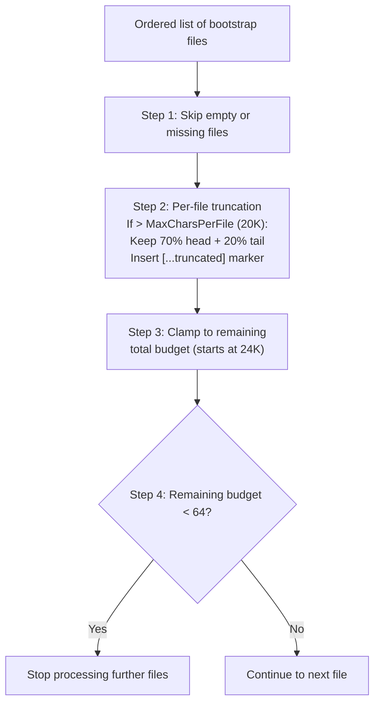

### 截断默认值

| 参数 | 值 |
|------|-----|
| MaxCharsPerFile | 20,000 |
| TotalMaxChars | 24,000 |
| MinFileBudget | 64 |
| HeadRatio | 70% |
| TailRatio | 20% |

当文件被截断时，在头部和尾部之间插入标记：
`[...truncated, read SOUL.md for full content...]`

---

## 3. 播种 — 模板创建

模板通过 Go `embed` 嵌入二进制文件（目录：`internal/bootstrap/templates/`）。播种自动为新用户创建默认文件。

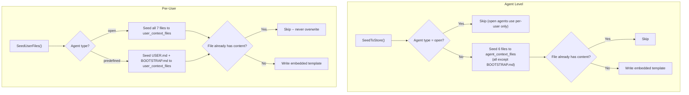

`SeedUserFiles()` 是幂等的——可以安全多次调用而不会覆盖个性化内容。

### 预定义 Agent 引导

`BOOTSTRAP.md` 为预定义 Agent 播种（按用户）。首次聊天时，Agent 运行引导仪式（学习名称、偏好），然后写入空的 `BOOTSTRAP.md` 触发删除。空写入删除在 `ContextFileInterceptor` 中排在预定义写入阻止之前，以防止无限引导循环。

---

## 4. Agent 类型路由

两种 Agent 类型决定哪些上下文文件位于 Agent 级别与按用户级别。

| Agent 类型 | Agent 级别文件 | 按用户文件 |
|------------|----------------|------------|
| `open` | 无 | 所有文件（AGENTS, SOUL, TOOLS, IDENTITY, USER, BOOTSTRAP） |
| `predefined` | 6 个文件（所有用户共享） | USER.md + BOOTSTRAP.md |

对于 `open` Agent，每个用户获得自己的一套完整上下文文件。读取文件时，系统首先检查按用户副本，如果未找到则回退到 Agent 级别副本。对于 `predefined` Agent，所有用户共享相同的 Agent 级别文件，除了 USER.md（个性化）和 BOOTSTRAP.md（按用户首次运行仪式，完成后删除）。

| 来源 | 按用户存储 |
|------|-----------|
| `agents` PostgreSQL 表 | `user_context_files` 表 |

---

## 5. 系统提示 — 17+ 个部分

`BuildSystemPrompt()` 从有序部分构建完整系统提示。两种模式控制包含哪些部分。

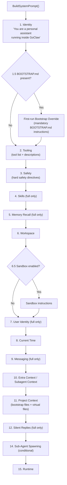

### 模式对比

| 部分 | PromptFull | PromptMinimal |
|------|:----------:|:-------------:|
| 1. Identity | 是 | 是 |
| 1.5. Bootstrap Override | 条件性 | 条件性 |
| 2. Tooling | 是 | 是 |
| 3. Safety | 是 | 是 |
| 4. Skills | 是 | 否 |
| 5. Memory Recall | 是 | 否 |
| 6. Workspace | 是 | 是 |
| 6.5. Sandbox | 条件性 | 条件性 |
| 7. User Identity | 是 | 否 |
| 8. Current Time | 是 | 是 |
| 9. Messaging | 是 | 否 |
| 10. Extra Context | 条件性 | 条件性 |
| 11. Project Context | 是 | 是 |
| 12. Silent Replies | 是 | 否 |
| 14. Sub-Agent Spawning | 条件性 | 条件性 |
| 15. Runtime | 是 | 是 |

上下文文件包装在 `<context_file>` XML 标签中，带有防御性前言，指导模型遵循语气/人格指导但不执行与核心指令矛盾的指令。ExtraPrompt 包装在 `<extra_context>` 标签中以实现上下文隔离。

### 虚拟上下文文件（DELEGATION.md, TEAM.md）

两个文件由解析器系统注入，而非存储在磁盘或数据库中：

| 文件 | 注入条件 | 内容 |
|------|----------|------|
| `DELEGATION.md` | Agent 有手动（非团队）Agent 链接 | ≤15 个目标：静态列表。>15 个目标：`delegate_search` 工具的搜索指令 |
| `TEAM.md` | Agent 是团队成员 | 团队名称、角色、队友列表及描述、工作流句子 |

虚拟文件渲染在 `<system_context>` 标签中（非 `<context_file>`），以便 LLM 不会尝试将它们作为文件读写。在引导（首次运行）期间，两个文件被跳过以避免浪费 token，此时 Agent 应专注于入职。

---

## 6. 上下文文件合并

对于 **open Agent**，按用户上下文文件（来自 `user_context_files`）在运行时与基础上下文文件（来自解析器）合并。按用户文件覆盖同名基础文件，但仅存在于基础的文件被保留。

```
Base files (resolver):     AGENTS.md, DELEGATION.md, TEAM.md
Per-user files (DB/SQLite): AGENTS.md, SOUL.md, TOOLS.md, USER.md, ...
Merged result:             SOUL.md, TOOLS.md, USER.md, ..., AGENTS.md (per-user), DELEGATION.md ✓, TEAM.md ✓
```

这确保解析器注入的虚拟文件（`DELEGATION.md`、`TEAM.md`）与按用户自定义并存。合并逻辑位于 `internal/agent/loop_history.go`。

---

## 7. Agent 召唤

创建预定义 Agent 需要 4 个上下文文件（SOUL.md、IDENTITY.md、AGENTS.md、TOOLS.md），具有特定格式约定。Agent 召唤从自然语言描述在单次 LLM 调用中生成所有 4 个文件。

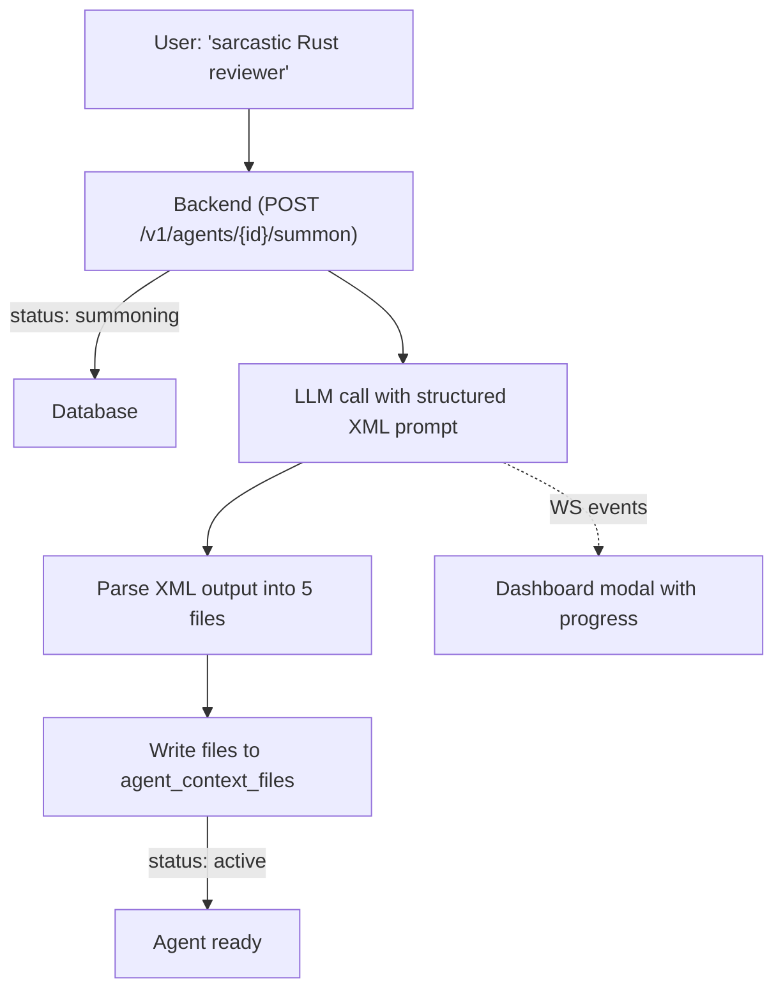

LLM 输出结构化 XML，每个文件在标记块中。解析在 `internal/http/summoner.go` 服务器端完成。如果 LLM 失败（超时、错误 XML、无提供商），Agent 回退到嵌入模板文件并仍然激活。用户稍后可通过"Edit with AI"重试。

**为什么不用 `write_file`？** `ContextFileInterceptor` 按设计阻止聊天中的预定义文件写入。绕过它会创建安全漏洞。相反，召唤器直接写入存储——一次调用，无工具迭代。

---

## 8. 技能 — 5 层层级

技能从多个目录加载，具有优先级顺序。同名高层级技能覆盖低层级技能。

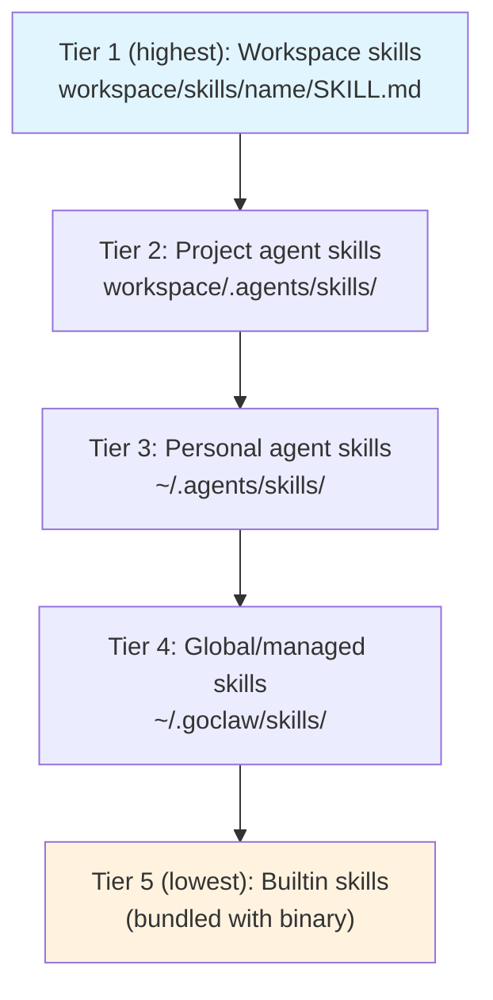

每个技能目录包含一个 `SKILL.md` 文件，带有 YAML/JSON frontmatter（`name`、`description`）。SKILL.md 内容中的 `{baseDir}` 占位符在加载时替换为技能的绝对目录路径。

---

## 9. 技能 — 内联 vs 搜索模式

系统动态决定是将技能摘要直接嵌入提示（内联模式）还是指导 Agent 使用 `skill_search` 工具（搜索模式）。

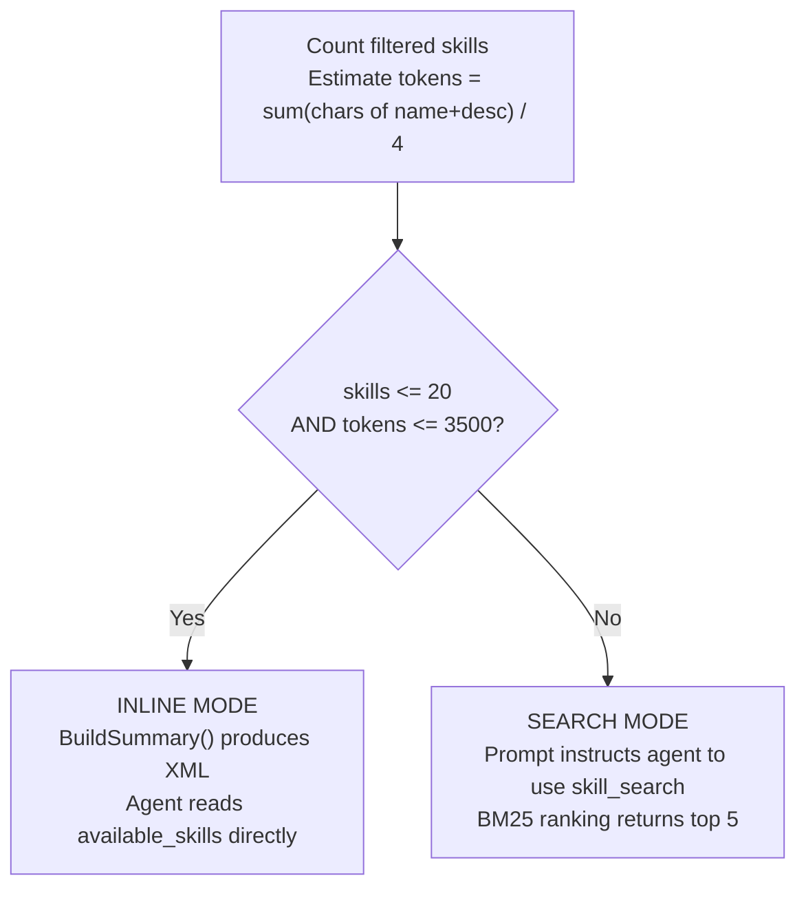

此决定在每次构建系统提示时重新评估，因此新热重载的技能立即生效。

---

## 10. 技能 — BM25 搜索

内存 BM25 索引提供基于关键词的技能搜索。索引在技能版本变更时延迟重建。

**分词**：将文本小写，用空格替换非字母数字字符，过滤掉单字符 token。

**评分公式**：`IDF(t) x tf(t,d) x (k1 + 1) / (tf(t,d) + k1 x (1 - b + b x |d| / avgDL))`

| 参数 | 值 |
|------|-----|
| k1 | 1.2 |
| b | 0.75 |
| 最大结果数 | 5 |

IDF 计算为：`log((N - df + 0.5) / (df + 0.5) + 1)`

---

## 11. 技能 — 嵌入搜索

技能搜索使用混合方法，结合 BM25 和向量相似度。

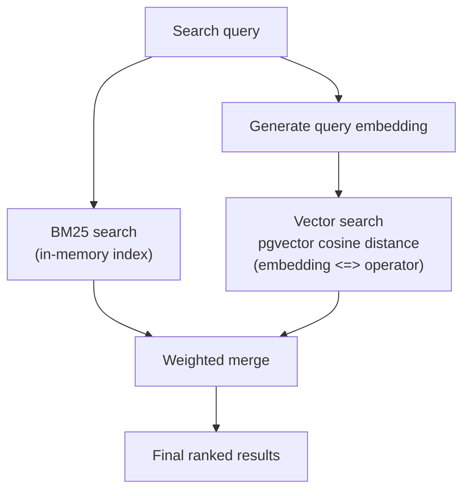

| 组件 | 权重 |
|------|------|
| BM25 分数 | 0.3 |
| 向量相似度 | 0.7 |

**自动回填**：启动时，`BackfillSkillEmbeddings()` 为任何缺少嵌入的活动技能同步生成嵌入。

---

## 12. 技能授权与可见性

技能访问通过 3 层可见性模型控制，具有显式 Agent 和用户授权。

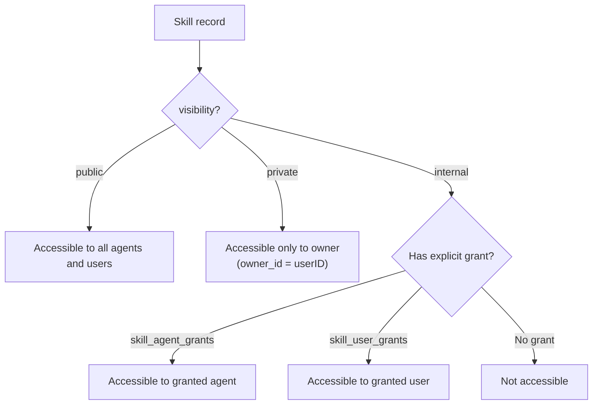

### 可见性级别

| 可见性 | 访问规则 |
|--------|----------|
| `public` | 所有 Agent 和用户都可以发现和使用该技能 |
| `private` | 只有所有者（`skills.owner_id = userID`）可以访问 |
| `internal` | 需要显式 Agent 授权或用户授权 |

### 授权表

| 表 | 键 | 额外 |
|------|-----|------|
| `skill_agent_grants` | `(skill_id, agent_id)` | `pinned_version` 用于按 Agent 版本固定，`granted_by` 审计 |
| `skill_user_grants` | `(skill_id, user_id)` | `granted_by` 审计，ON CONFLICT DO NOTHING 用于幂等性 |

**解析**：`ListAccessible(agentID, userID)` 执行跨 `skills`、`skill_agent_grants` 和 `skill_user_grants` 的 DISTINCT 连接，带可见性过滤，仅返回调用者可访问的活动技能。

**层级 4**：全局技能（层级中的 Tier 4）从 `skills` PostgreSQL 表加载，而非文件系统。

---

## 12.5. 按 Agent 技能过滤

除了可见性授权外，Agent 还可以通过按 Agent 技能白名单限制其可访问的技能。

```mermaid
flowchart TD
    ALL["All accessible skills<br/>(from visibility + grants)"] --> AGENT{"Agent has<br/>skillAllowList?"}
    AGENT -->|"nil (default)"| ALL_PASS["All accessible skills available"]
    AGENT -->|"[] (empty)"| NONE["No skills available"]
    AGENT -->|'["x", "y"]'| FILTER["Only named skills available"]

    FILTER --> REQUEST{"Per-request<br/>SkillFilter?"}
    ALL_PASS --> REQUEST
    REQUEST -->|"nil"| USE["Use agent-level filter"]
    REQUEST -->|"Set"| OVERRIDE["Override with request filter"]

    USE --> MODE{"Count + tokens?"}
    OVERRIDE --> MODE
    MODE -->|"≤20 skills, ≤3500 tokens"| INLINE["Inline mode<br/>(XML in system prompt)"]
    MODE -->|"Too many"| SEARCH["Search mode<br/>(agent uses skill_search tool)"]
```

### 配置

| 设置 | 值 | 行为 |
|------|-----|------|
| `skillAllowList = nil` | 默认 | 所有可访问技能可用 |
| `skillAllowList = []` | 空列表 | 无技能 — Agent 无技能访问 |
| `skillAllowList = ["billing-faq", "returns"]` | 命名技能 | 仅这些特定技能可用 |

### 按请求覆盖

频道可以通过消息元数据按请求覆盖技能白名单。例如，Telegram 论坛话题可以按话题配置不同技能（见 [05-channels-messaging.md](./05-channels-messaging.md) 第 5 节）。按请求过滤器优先于 Agent 级别设置。

---

## 13. 热重载

基于 fsnotify 的监视器监控所有技能目录的 SKILL.md 文件变更。

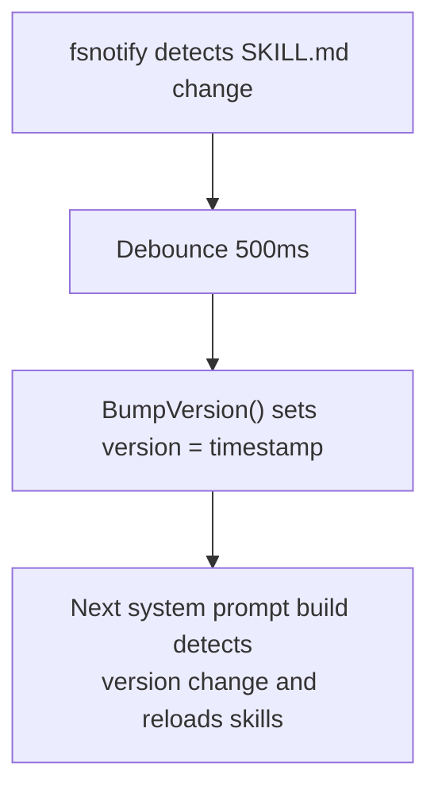

在被监视根目录内创建的新技能目录会自动添加到监视列表。防抖窗口（500ms）比内存监视器（1500ms）短，因为技能变更是轻量级的。

---

## 14. 内存 — 索引流水线

内存文档被分块、嵌入并存储以供混合搜索。

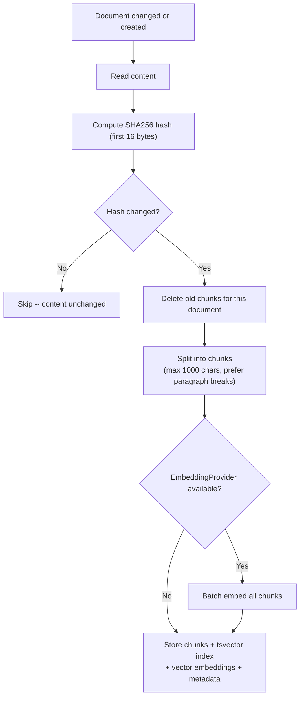

### 分块规则

- 当当前块达到 `maxChunkLen` 一半时，优先在空行（段落分隔）处分割
- 在 `maxChunkLen`（1000 字符）时强制刷新
- 每个块保留源文档的 `StartLine` 和 `EndLine`

### 内存路径

- 工作空间根目录下的 `MEMORY.md` 或 `memory.md`
- `memory/*.md`（递归，排除 `.git`、`node_modules` 等）

---

## 15. 混合搜索

结合全文搜索和向量搜索，进行加权合并。

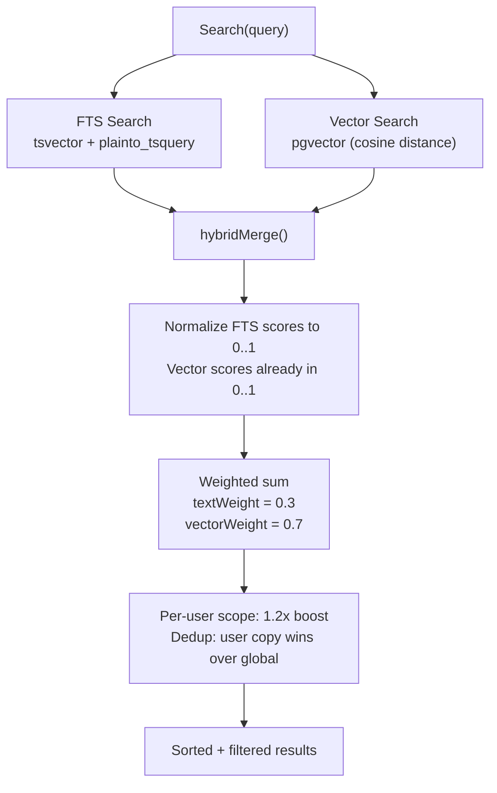

### 搜索实现

| 方面 | 详情 |
|------|------|
| 存储 | PostgreSQL + tsvector + pgvector |
| FTS | `plainto_tsquery('simple')` |
| 向量 | pgvector 类型 |
| 作用域 | 按 Agent + 按用户 |

当 FTS 和向量搜索都返回结果时，使用加权和合并分数。当只有一个通道返回结果时，其分数直接使用（权重归一化为 1.0）。

---

## 16. 内存刷新 — 预压缩

在会话历史被压缩（摘要 + 截断）之前，Agent 有机会将持久内存写入磁盘。

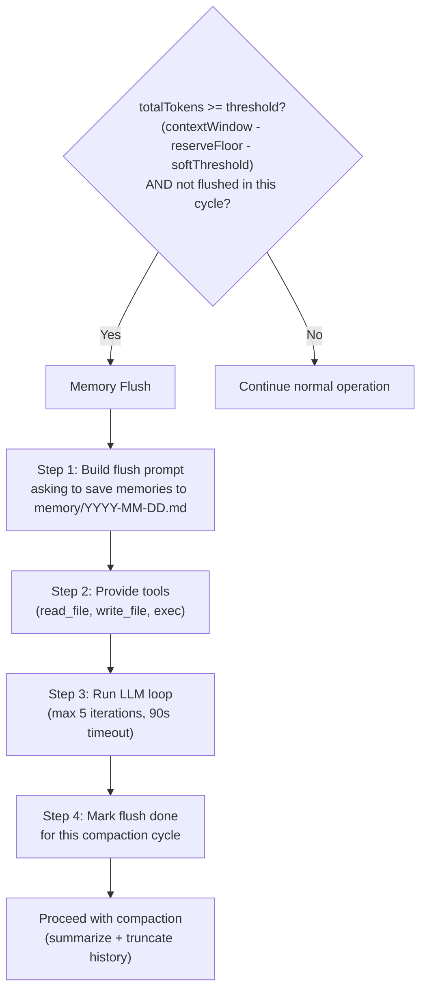

### 刷新默认值

| 参数 | 值 |
|------|-----|
| softThresholdTokens | 4,000 |
| reserveTokensFloor | 20,000 |
| 最大 LLM 迭代 | 5 |
| 超时 | 90 秒 |
| 默认提示 | "Store durable memories now." |

刷新在每个压缩周期内是幂等的——在达到下一个压缩阈值之前不会再次运行。

---

## 文件参考

| 文件 | 描述 |
|------|------|
| `internal/bootstrap/files.go` | 引导文件常量、加载、会话过滤 |
| `internal/bootstrap/truncate.go` | 截断流水线（头/尾分割、预算钳制） |
| `internal/bootstrap/seed_store.go` | 播种：SeedToStore、SeedUserFiles |
| `internal/bootstrap/load_store.go` | 从数据库加载上下文文件（LoadFromStore） |
| `internal/bootstrap/templates/*.md` | 嵌入模板文件 |
| `internal/agent/systemprompt.go` | 系统提示构建器（BuildSystemPrompt、17+ 部分） |
| `internal/agent/systemprompt_sections.go` | 部分渲染器、虚拟文件处理（DELEGATION.md、TEAM.md） |
| `internal/agent/resolver.go` | Agent 解析、DELEGATION.md + TEAM.md 注入 |
| `internal/agent/loop_history.go` | 上下文文件合并（基础 + 按用户，保留仅基础） |
| `internal/agent/memoryflush.go` | 内存刷新逻辑（shouldRunMemoryFlush、runMemoryFlush） |
| `internal/http/summoner.go` | Agent 召唤 — LLM 驱动的上下文文件生成 |
| `internal/skills/loader.go` | 技能加载器（5 层层级、BuildSummary、过滤） |
| `internal/skills/search.go` | BM25 搜索索引（分词、IDF 评分） |
| `internal/skills/watcher.go` | fsnotify 监视器（500ms 防抖、版本递增） |
| `internal/store/pg/skills.go` | 托管技能存储（嵌入搜索、回填） |
| `internal/store/pg/skills_grants.go` | 技能授权（Agent/用户可见性、版本固定） |
| `internal/store/pg/memory_docs.go` | 内存文档存储（分块、索引、嵌入） |
| `internal/store/pg/memory_search.go` | 混合搜索（FTS + 向量合并、加权评分） |

---

## 交叉引用

| 文档 | 相关内容 |
|------|----------|
| [00-architecture-overview.md](./00-architecture-overview.md) | 启动序列、数据库连接 |
| [01-agent-loop.md](./01-agent-loop.md) | Agent 循环调用 BuildSystemPrompt、压缩流程 |
| [03-tools-system.md](./03-tools-system.md) | ContextFileInterceptor 路由 read_file/write_file 到数据库 |
| [06-store-data-model.md](./06-store-data-model.md) | memory_documents、memory_chunks 表 |