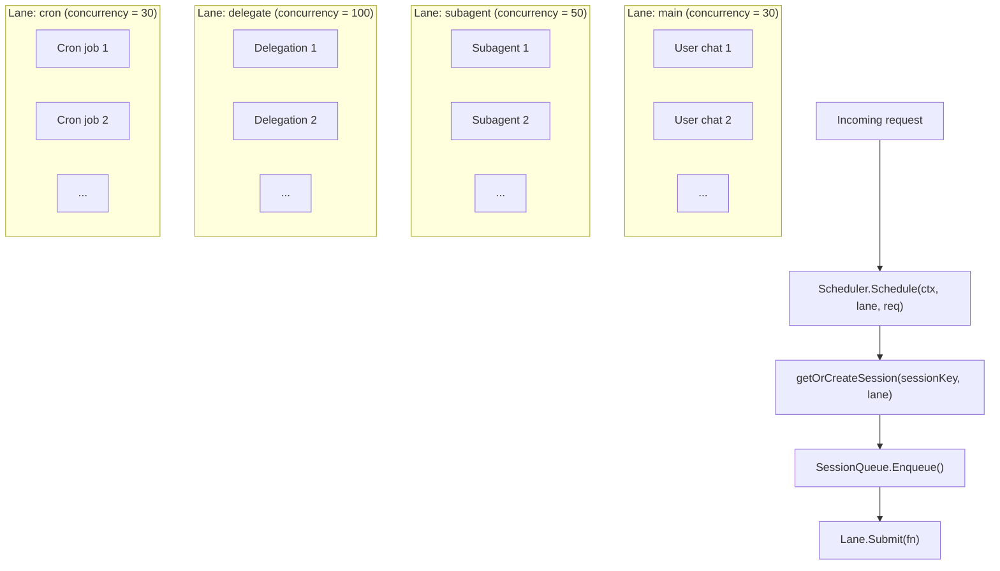
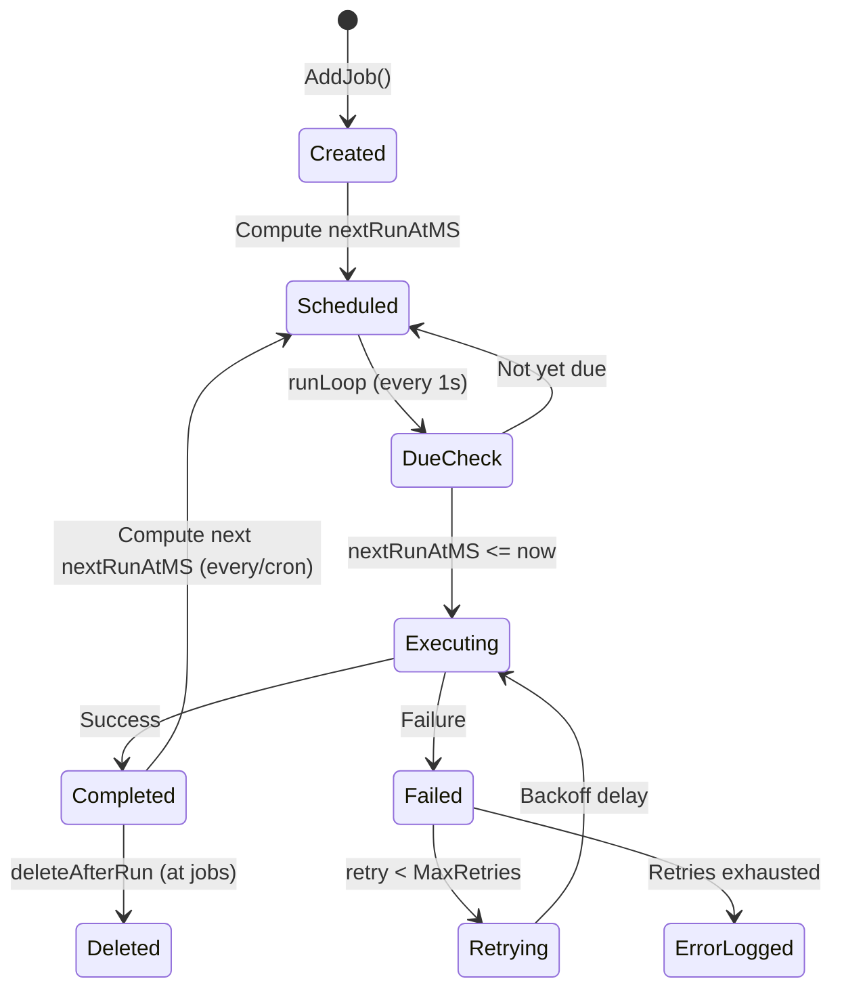

# 08 - 调度与 Cron

并发控制和周期性任务执行。调度器提供基于通道的隔离和按会话序列化。Cron 通过时间触发行为扩展 Agent 循环。

> Cron 任务和运行日志存储在 `cron_jobs` 和 `cron_run_logs` PostgreSQL 表中。缓存失效通过消息总线上的 `cache:cron` 事件传播。

### 职责

- 调度器：基于通道的并发控制、按会话消息队列序列化
- Cron：三种调度类型（at/every/cron）、运行日志、指数退避重试

---

## 1. 调度器通道

基于信号量的命名工作池，具有可配置的并发限制。每个通道独立处理请求。未知通道名称回退到 `main` 通道。

### 通道默认值

| 通道 | 并发数 | 环境变量覆盖 | 用途 |
|------|:------:|--------------|------|
| `main` | 30 | `GOCLAW_LANE_MAIN` | 主要用户聊天会话 |
| `subagent` | 50 | `GOCLAW_LANE_SUBAGENT` | 主 Agent 生成的子 Agent |
| `delegate` | 100 | `GOCLAW_LANE_DELEGATE` | Agent 委派执行 |
| `cron` | 30 | `GOCLAW_LANE_CRON` | 定时 cron 任务（按会话序列化防止同任务竞争） |

`GetOrCreate()` 允许按需创建具有自定义并发数的新通道。所有通道并发值都可通过环境变量配置。

---

## 2. 会话队列

每个会话键获得一个专用队列管理 Agent 运行。队列支持可配置的每会话并发运行数。

### 并发运行

| 上下文 | `maxConcurrent` | 理由 |
|--------|:---------------:|------|
| 私聊 | 1 | 每用户单线程（无交错） |
| 群聊 | 3 | 多用户可并行获得响应 |

**自适应节流**：当会话历史超过上下文窗口的 60% 时，并发数降至 1 以防止上下文窗口溢出。

### 队列模式

| 模式 | 行为 |
|------|------|
| `queue`（默认） | FIFO —— 消息等待直到有运行槽位可用 |
| `followup` | 与 `queue` 相同 —— 消息作为后续排队 |
| `interrupt` | 取消当前运行、排空队列、立即开始新消息 |

### 丢弃策略

当队列达到容量时，应用两种丢弃策略之一。

| 策略 | 队列满时 | 返回错误 |
|------|----------|----------|
| `old`（默认） | 丢弃最旧的排队消息，添加新消息 | `ErrQueueDropped` |
| `new` | 拒绝传入消息 | `ErrQueueFull` |

### 队列配置默认值

| 参数 | 默认值 | 描述 |
|------|--------|------|
| `mode` | `queue` | 队列模式（queue, followup, interrupt） |
| `cap` | 10 | 队列中最大消息数 |
| `drop` | `old` | 满时丢弃策略（old 或 new） |
| `debounce_ms` | 800 | 在此窗口内合并快速消息 |

---

## 3. /stop 和 /stopall 命令

Telegram 和其他频道的取消命令。

| 命令 | 行为 |
|------|------|
| `/stop` | 取消最旧的运行任务；其他继续 |
| `/stopall` | 取消所有运行任务 + 排空队列 |

### 实现细节

- **防抖器绕过**：`/stop` 和 `/stopall` 在 800ms 防抖器之前被拦截，避免与下一条用户消息合并
- **取消机制**：`SessionQueue.Cancel()` 暴露调度器的 `CancelFunc`。上下文取消传播到 Agent 循环
- **空出站**：取消时，发布空出站消息触发清理（停止输入指示器、清除反应）
- **追踪终结**：当 `ctx.Err() != nil` 时，追踪终结回退到 `context.Background()` 进行最终数据库写入。状态设为 `"cancelled"`
- **上下文存活**：上下文值（traceID, collector）在取消后存活——只有 Done 通道触发

---

## 4. Cron 生命周期

自动运行 Agent 轮次的定时任务。运行循环每秒检查到期任务。

### 调度类型

| 类型 | 参数 | 示例 |
|------|------|------|
| `at` | `atMs`（纪元毫秒） | 明天下午 3 点提醒，执行后自动删除 |
| `every` | `everyMs` | 每 30 分钟（1,800,000 ms） |
| `cron` | `expr`（5 字段） | `"0 9 * * 1-5"`（工作日上午 9 点） |

### 任务状态

任务可以是 `active` 或 `paused`。暂停的任务在到期检查时跳过执行。运行结果记录到 `cron_run_logs` 表。缓存失效通过消息总线传播。

### 重试 — 带抖动的指数退避

| 参数 | 默认值 |
|------|--------|
| MaxRetries | 3 |
| BaseDelay | 2 秒 |
| MaxDelay | 30 秒 |

**公式**：`delay = min(base x 2^attempt, max) +/- 25% jitter`

---

## 文件参考

| 文件 | 描述 |
|------|------|
| `internal/scheduler/lanes.go` | Lane 和 LaneManager（基于信号量的工作池） |
| `internal/scheduler/queue.go` | SessionQueue、Scheduler、丢弃策略、防抖 |
| `internal/cron/service.go` | Cron 运行循环、调度解析、任务生命周期 |
| `internal/cron/retry.go` | 带指数退避 + 抖动的重试 |
| `internal/store/cron_store.go` | CronStore 接口（任务 + 运行日志） |
| `internal/store/pg/cron.go` | PostgreSQL cron 实现 |
| `internal/store/pg/cron_scheduler.go` | PG 任务缓存、到期任务检测、执行 |
| `cmd/gateway_cron.go` | makeCronJobHandler（将 cron 执行路由到调度器） |
| `cmd/gateway_agents.go` | Agent 初始化 |
| `internal/gateway/methods/cron.go` | RPC 方法处理器（list, create, update, delete, toggle, run, runs） |

---

## 交叉引用

| 文档 | 相关内容 |
|------|----------|
| [00-architecture-overview.md](./00-architecture-overview.md) | 启动序列中的调度器通道 |
| [01-agent-loop.md](./01-agent-loop.md) | 调度器触发的 Agent 循环 |
| [06-store-data-model.md](./06-store-data-model.md) | cron_jobs、cron_run_logs 表 |