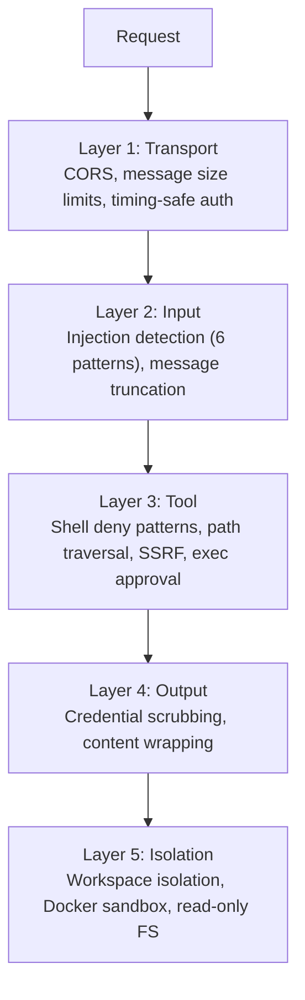
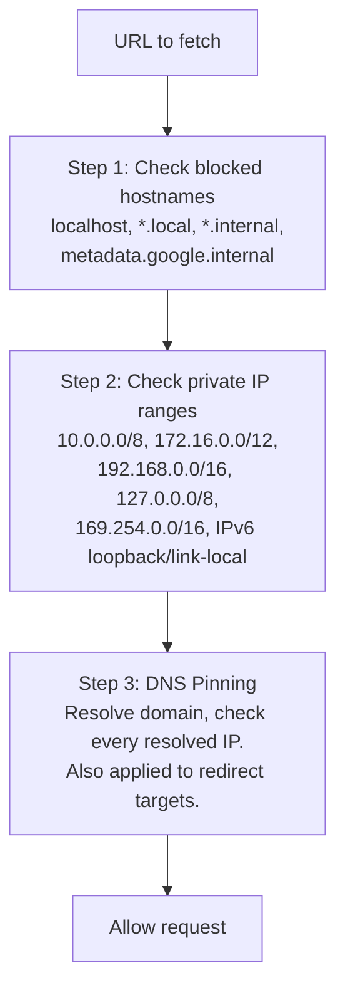
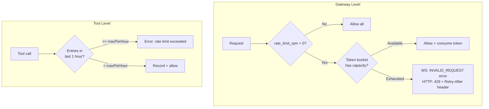
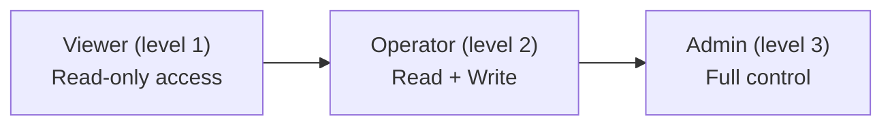
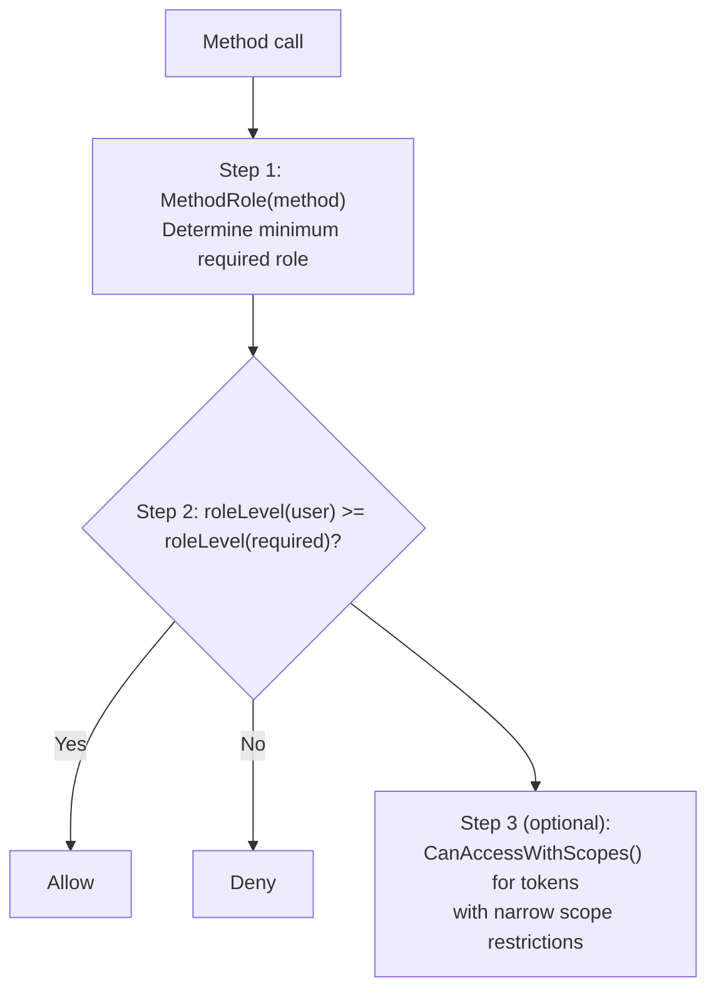
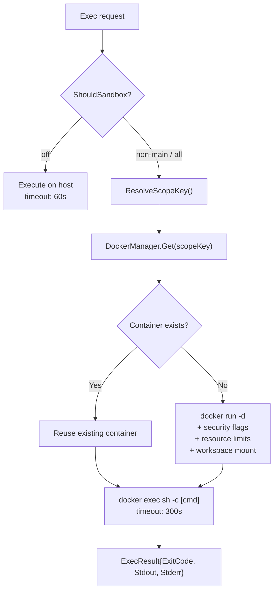
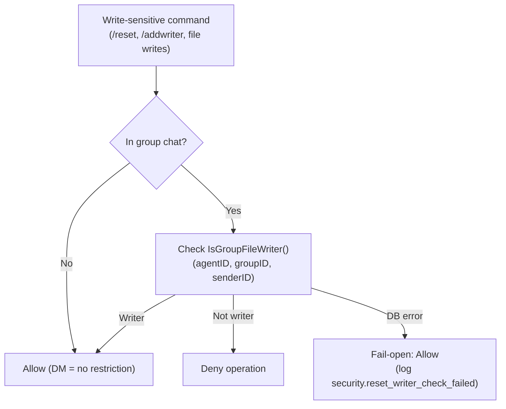

# 09 - 安全

五层独立防御，从传输到隔离。每层独立运作——即使一层被绕过，其余层仍继续保护系统。

> AES-256-GCM 加密保护存储在 PostgreSQL 中的密钥（LLM 提供商 API 密钥、MCP 服务器 API 密钥、自定义工具环境变量）。Agent 级别访问控制使用 4 步 `CanAccess` 流水线（见 [06-store-data-model.md](./06-store-data-model.md)）。

---

## 1. 五层防御



### 第 1 层：传输安全

| 机制 | 详情 |
|------|------|
| CORS（WebSocket） | `checkOrigin()` 根据 `allowed_origins` 验证（空 = 允许所有以向后兼容） |
| WS 消息限制 | `SetReadLimit(512KB)` —— 超出时 gorilla 自动关闭连接 |
| HTTP 请求体限制 | `MaxBytesReader(1MB)` —— JSON 解码前返回错误 |
| Token 认证 | `crypto/subtle.ConstantTimeCompare`（时序安全） |
| 速率限制 | 每用户/IP 的令牌桶，通过 `rate_limit_rpm` 配置 |

### 第 2 层：输入 — 注入检测

输入守卫扫描 6 种注入模式。

| 模式 | 检测目标 |
|------|----------|
| `ignore_instructions` | "ignore all previous instructions" |
| `role_override` | "you are now...", "pretend you are..." |
| `system_tags` | `<system>`, `[SYSTEM]`, `[INST]`, `<<SYS>>` |
| `instruction_injection` | "new instructions:", "override:", "system prompt:" |
| `null_bytes` | 空字符 `\x00`（混淆尝试） |
| `delimiter_escape` | "end of system", `</instructions>`, `</prompt>` |

**可配置操作**（`gateway.injection_action`）：

| 值 | 行为 |
|------|------|
| `"log"` | 记录 info 级别，继续处理 |
| `"warn"`（默认） | 记录 warning 级别，继续处理 |
| `"block"` | 记录 warning，返回错误，停止处理 |
| `"off"` | 完全禁用检测 |

**消息截断**：超过 `max_message_chars`（默认 32K）的消息被截断（非拒绝），并通知 LLM 截断情况。

### 第 3 层：工具安全

**Shell 拒绝模式** — 7 类阻止命令：

| 类别 | 示例 |
|------|------|
| 破坏性文件操作 | `rm -rf`, `del /f`, `rmdir /s` |
| 破坏性磁盘操作 | `mkfs`, `dd if=`, `> /dev/sd*` |
| 系统命令 | `shutdown`, `reboot`, `poweroff` |
| Fork 炸弹 | `:(){ ... };:` |
| 远程代码执行 | `curl \| sh`, `wget -O - \| sh` |
| 反向 Shell | `/dev/tcp/`, `nc -e` |
| Eval 注入 | `eval $()`, `base64 -d \| sh` |

**SSRF 保护** — 3 步验证：



**路径遍历**：`resolvePath()` 应用 `filepath.Clean()` 然后 `HasPrefix()` 确保所有路径保持在工作空间内。当 `restrict = true` 时，任何工作空间外的路径都被阻止。

**PathDenyable** — 让文件系统工具拒绝特定路径前缀的接口：

```go
type PathDenyable interface {
    DenyPaths(...string)
}
```

所有四个文件系统工具（`read_file`、`write_file`、`list_files`、`edit`）实现 `PathDenyable`。Agent 循环在启动时调用 `DenyPaths(".goclaw")` 防止 Agent 访问内部数据目录。`list_files` 额外从输出中完全过滤被拒绝目录——Agent 在目录列表中看不到被拒绝路径。

### 第 4 层：输出安全

| 机制 | 详情 |
|------|------|
| 凭证清洗 | 静态正则检测：OpenAI（`sk-...`）、Anthropic（`sk-ant-...`）、GitHub（`ghp_/gho_/ghu_/ghs_/ghr_`）、AWS（`AKIA...`）、通用键值模式、连接字符串（`postgres://`、`mysql://`）、环境变量模式（`KEY=`、`SECRET=`、`DSN=`）、长十六进制字符串（64+ 字符）。全部替换为 `[REDACTED]`。 |
| 动态凭证清洗 | 运行时注册值（如服务器 IP）通过 `AddDynamicScrubValues()` 与静态模式一起清洗 |
| Web 内容包装 | 获取的内容包装在 `<<<EXTERNAL_UNTRUSTED_CONTENT>>>` 标签中，带安全警告 |

### 第 5 层：隔离

**按用户工作空间隔离** — 两个级别防止跨用户文件访问：

| 级别 | 作用域 | 目录模式 |
|------|--------|----------|
| 按 Agent | 每个 Agent 获得自己的基础目录 | `~/.goclaw/{agent-key}-workspace/` |
| 按用户 | 每个用户在 Agent 工作空间内获得子目录 | `{agent-workspace}/user_{sanitized_id}/` |

工作空间通过 `WithToolWorkspace(ctx)` 上下文注入到工具中。工具在执行时从上下文读取工作空间（向后兼容回退到结构体字段）。用户 ID 被清理：`[a-zA-Z0-9_-]` 之外的字符变为下划线（`group:telegram:-1001234` → `group_telegram_-1001234`）。

**Docker 沙箱** — 基于容器的 shell 命令执行隔离：

| 加固 | 配置 |
|------|------|
| 只读根文件系统 | `--read-only` |
| 删除所有能力 | `--cap-drop ALL` |
| 禁止新权限 | `--security-opt no-new-privileges` |
| 内存限制 | 512 MB |
| CPU 限制 | 1.0 |
| PID 限制 | 启用 |
| 禁用网络 | `--network none` |
| Tmpfs 挂载 | `/tmp`, `/var/tmp`, `/run` |
| 输出限制 | 1 MB |
| 超时 | 300 秒 |

---

## 2. 加密

AES-256-GCM 加密用于存储在 PostgreSQL 中的密钥。密钥通过 `GOCLAW_ENCRYPTION_KEY` 环境变量提供。

| 加密内容 | 表 | 列 |
|----------|------|------|
| LLM 提供商 API 密钥 | `llm_providers` | `api_key` |
| MCP 服务器 API 密钥 | `mcp_servers` | `api_key` |
| 自定义工具环境变量 | `custom_tools` | `env` |

**格式**：`"aes-gcm:" + base64(12 字节 nonce + 密文 + GCM tag)`

向后兼容：没有 `aes-gcm:` 前缀的值作为明文返回（用于从未加密数据迁移）。

---

## 3. 速率限制 — 网关 + 工具

两个级别的保护：网关级别（每用户/IP）和工具级别（每会话）。



| 级别 | 算法 | 键 | 突发 | 清理 |
|------|------|-----|:----:|------|
| 网关 | 令牌桶 | user/IP | 5 | 每 5 分钟（不活跃 > 10 分钟） |
| 工具 | 滑动窗口 | `agent:userID` | N/A | 手动 `Cleanup()` |

网关速率限制应用于 WebSocket（`chat.send`）和 HTTP（`/v1/chat/completions`）聊天端点。配置：`gateway.rate_limit_rpm`（0 = 禁用，任何正值 = 启用）。

---

## 4. RBAC — 3 种角色

WebSocket RPC 方法和 HTTP API 端点的基于角色的访问控制。角色分层：更高级别包含更低级别的所有权限。



| 角色 | 关键权限 |
|------|----------|
| Viewer | agents.list, config.get, sessions.list, health, status, skills.list |
| Operator | + chat.send, chat.abort, sessions.delete/reset, cron.*, skills.update |
| Admin | + config.apply/patch, agents.create/update/delete, channels.toggle, device.pair.approve/revoke |

### 访问检查流程



基于 Token 的角色分配在 WebSocket `connect` 握手期间发生。作用域包括：`operator.admin`、`operator.read`、`operator.write`、`operator.approvals`、`operator.pairing`。

---

## 5. 沙箱 — 容器生命周期

基于 Docker 的代码隔离，用于 shell 命令执行。



### 沙箱模式

| 模式 | 行为 |
|------|------|
| `off`（默认） | 直接在主机上执行 |
| `non-main` | 沙箱所有 Agent，除了 main/default |
| `all` | 沙箱每个 Agent |

### 容器作用域

| 作用域 | 重用级别 | 作用域键 |
|--------|----------|----------|
| `session`（默认） | 每会话一个容器 | sessionKey |
| `agent` | 同 Agent 跨会话共享 | `"agent:" + agentID` |
| `shared` | 所有 Agent 共用一个容器 | `"shared"` |

### 工作空间访问

| 模式 | 挂载 |
|------|------|
| `none` | 无工作空间访问 |
| `ro` | 只读挂载 |
| `rw` | 读写挂载 |

### 自动清理

| 参数 | 默认值 | 操作 |
|------|--------|------|
| `idle_hours` | 24 | 移除空闲超过 24 小时的容器 |
| `max_age_days` | 7 | 移除超过 7 天的容器 |
| `prune_interval_min` | 5 | 每 5 分钟检查 |

### FsBridge — 沙箱内文件操作

| 操作 | Docker 命令 |
|------|-------------|
| ReadFile | `docker exec [id] cat -- [path]` |
| WriteFile | `docker exec -i [id] sh -c 'cat > [path]'` |
| ListDir | `docker exec [id] ls -la -- [path]` |
| Stat | `docker exec [id] stat -- [path]` |

---

## 6. 安全日志约定

所有安全事件使用 `slog.Warn` 并带 `security.*` 前缀，用于一致的过滤和告警。

| 事件 | 含义 |
|------|------|
| `security.injection_detected` | 检测到提示注入模式 |
| `security.injection_blocked` | 因注入阻止消息（当 action = block） |
| `security.rate_limited` | 因速率限制拒绝请求 |
| `security.cors_rejected` | 因 CORS 策略拒绝 WebSocket 连接 |
| `security.message_truncated` | 消息因超出大小限制被截断 |

通过在日志输出中 grep `security.` 前缀过滤所有安全事件。

---

## 7. Hook 递归防止

Hook 系统（质量门）可能触发无限递归：Agent 评估器委派给审查者 → 委派完成 → 触发质量门 → 再次委派给审查者 → 无限循环。

上下文标志 `hooks.WithSkipHooks(ctx, true)` 防止这种情况。三个注入点设置标志：

| 注入点 | 原因 |
|--------|------|
| Agent 评估器 | 为质量检查委派给审查者时不得重新触发门 |
| 评估-优化循环 | 所有内部生成器/评估器委派跳过门 |
| Agent 评估回调（cmd 层） | 当 Hook 引擎本身触发委派时 |

`DelegateManager.Delegate()` 在应用质量门之前检查 `hooks.SkipHooksFromContext(ctx)`。如果设置了标志，完全跳过门。

---

## 8. 群文件写入者限制

在群聊（Telegram）中，写入敏感操作仅限指定的写入者。这防止未授权用户在共享群组中修改 Agent 文件或重置会话。



### 群 ID 格式

`group:{channel}:{chatID}` — 例如 `group:telegram:-1001234567`。

### 管理命令

| 命令 | 限制 |
|------|------|
| `/reset` | 群内仅限写入者 |
| `/addwriter` | 仅限写入者（回复目标用户添加） |
| `/removewriter` | 仅限写入者 |
| `/writers` | 无限制（信息性） |
| 文件写入（exec） | 群内仅限写入者 |

写入者通过 `/addwriter`（回复用户消息）和 `/removewriter` 命令管理。写入者列表按 Agent 按群存储在 Agent 存储中。

---

## 9. 委派安全

Agent 委派通过 `agent_links` 表使用有向权限。

| 控制 | 作用域 | 描述 |
|------|--------|------|
| 有向链接 | A → B | 单行 `(A→B, outbound)` 意味着 A 可以委派给 B，反之不行 |
| 按用户拒绝/允许 | 每链接 | 每个链接上的 `settings` JSONB 保存按用户限制（仅高级用户、被封账号） |
| 每链接并发 | A → B | `agent_links.max_concurrent` 限制从 A 到 B 的同时委派 |
| 按 Agent 负载上限 | B（所有来源） | `other_config.max_delegation_load` 限制目标为 B 的总并发委派 |

当达到并发限制时，错误消息为 LLM 推理编写：*"Agent at capacity (5/5). Try a different agent or handle it yourself."*

---

## 文件参考

| 文件 | 描述 |
|------|------|
| `internal/agent/input_guard.go` | 注入模式检测（6 种模式） |
| `internal/tools/scrub.go` | 凭证清洗（基于正则的修订） |
| `internal/tools/shell.go` | Shell 拒绝模式、命令验证 |
| `internal/tools/web_fetch.go` | Web 内容包装、SSRF 保护 |
| `internal/permissions/policy.go` | RBAC（3 种角色、基于作用域访问） |
| `internal/gateway/ratelimit.go` | 网关级令牌桶速率限制器 |
| `internal/sandbox/` | Docker 沙箱管理器、FsBridge |
| `internal/crypto/aes.go` | AES-256-GCM 加密/解密 |
| `internal/tools/types.go` | PathDenyable 接口定义 |
| `internal/tools/filesystem.go` | 被拒绝路径检查（`checkDeniedPath` 辅助函数） |
| `internal/tools/filesystem_list.go` | 被拒绝路径支持 + 目录过滤 |
| `internal/hooks/context.go` | WithSkipHooks / SkipHooksFromContext（递归防止） |
| `internal/hooks/engine.go` | Hook 引擎、评估器注册表 |

---

## 交叉引用

| 文档 | 相关内容 |
|------|----------|
| [03-tools-system.md](./03-tools-system.md) | Shell 拒绝模式、exec 审批、PathDenyable、委派系统、质量门 |
| [04-gateway-protocol.md](./04-gateway-protocol.md) | WebSocket 认证、RBAC、速率限制 |
| [06-store-data-model.md](./06-store-data-model.md) | API 密钥加密、Agent 访问控制流水线、agent_links 表 |
| [07-bootstrap-skills-memory.md](./07-bootstrap-skills-memory.md) | 上下文文件合并、虚拟文件 |
| [08-scheduling-cron.md](./08-scheduling-cron.md) | 调度器通道、cron 生命周期、/stop 和 /stopall |
| [10-tracing-observability.md](./10-tracing-observability.md) | 追踪和 OTel 导出 |