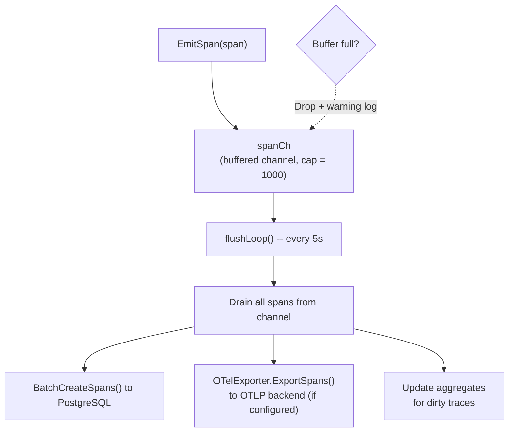
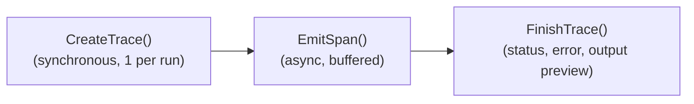
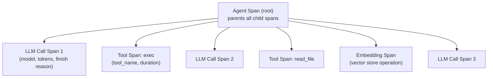
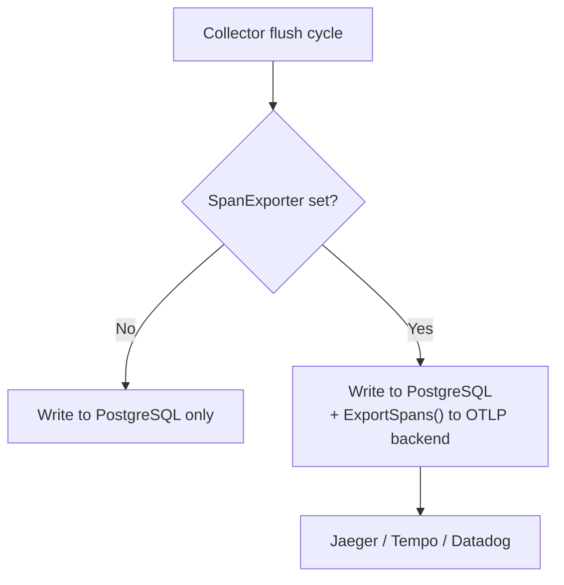

# 10 - 追踪与可观测性

异步记录 Agent 运行活动。Span 在内存中缓冲并批量刷新到 TracingStore，同时可选择导出到外部 OpenTelemetry 后端。

> 追踪系统使用 PostgreSQL。`traces` 和 `spans` 表存储所有追踪数据。可选的 OTel 导出会将 span 发送到外部后端（Jaeger、Grafana Tempo、Datadog），作为 PostgreSQL 的补充。

---

## 1. Collector -- 缓冲刷新架构

### Trace 生命周期

### 取消处理

当运行通过 `/stop` 或 `/stopall` 被取消时，运行上下文会被取消，但追踪完成仍需持久化。`FinishTrace()` 检测到 `ctx.Err() != nil` 后会切换到 `context.Background()` 进行最终的数据库写入。追踪状态会被设置为 `"cancelled"` 而非 `"error"`。

上下文值（traceID、collector）在取消后仍然存活——只有 `ctx.Done()` 和 `ctx.Err()` 会改变。这使得追踪完成可以用新的上下文找到所需的一切来进行数据库调用。

---

## 2. Span 类型与层级

| 类型 | 描述 | OTel Kind |
|------|-------------|-----------|
| `llm_call` | LLM 提供商调用 | Client |
| `tool_call` | 工具执行 | Internal |
| `agent` | 根 Agent span（作为所有子 span 的父级） | Internal |
| `embedding` | 向量生成（向量存储操作） | Internal |
| `event` | 离散事件标记（无持续时间） | Internal |

### Token 聚合

Token 计数**仅从 `llm_call` span 聚合**（而非 `agent` span），以避免重复计数。`BatchUpdateTraceAggregates()` 方法对 `span_type = 'llm_call'` 的 span 求和 `input_tokens` 和 `output_tokens`，并将总计写入父追踪记录。

---

## 3. 详细模式

| 模式 | InputPreview | OutputPreview |
|------|:---:|:---:|
| 普通 | 不记录 | 最多 500 字符 |
| 详细 (`GOCLAW_TRACE_VERBOSE=1`) | 最多 50KB | 最多 500 字符 |

详细模式对于调试 LLM 对话非常有用。完整的输入消息（包括系统提示、历史记录和工具结果）会被序列化为 JSON 并存储在 span 的 `InputPreview` 字段中，截断至 50,000 字符。

---

## 4. OTel 导出

可选的 OpenTelemetry OTLP 导出器，将 span 发送到外部可观测性后端。

### OTel 配置

| 参数 | 描述 |
|------|------|
| `endpoint` | OTLP 端点（例如：gRPC 用 `localhost:4317`，HTTP 用 `localhost:4318`） |
| `protocol` | `grpc`（默认）或 `http` |
| `insecure` | 本地开发时跳过 TLS |
| `service_name` | OTel 服务名称（默认：`goclaw-gateway`） |
| `headers` | 额外请求头（认证令牌等） |

### 批处理

| 参数 | 值 |
|------|-----|
| 最大批次大小 | 100 个 span |
| 批次超时 | 5 秒 |

导出器位于独立的子包（`internal/tracing/otelexport/`），因此其 gRPC 和 protobuf 依赖是隔离的。注释掉导入和连接代码可减少约 15-20MB 的二进制文件大小。导出器通过 `SetExporter()` 附加到 Collector。

---

## 5. Trace HTTP API

| 方法 | 路径 | 描述 |
|------|------|------|
| GET | `/v1/traces` | 列出追踪（支持分页和过滤） |
| GET | `/v1/traces/{id}` | 获取追踪详情及所有 span |

### 查询过滤器

| 参数 | 类型 | 描述 |
|------|------|------|
| `agent_id` | UUID | 按 Agent 过滤 |
| `user_id` | string | 按用户过滤 |
| `status` | string | 按状态过滤（running、success、error、cancelled） |
| `from` / `to` | timestamp | 日期范围过滤 |
| `limit` | int | 页大小（默认 50） |
| `offset` | int | 分页偏移 |

---

## 6. 委派历史

委派历史记录存储在 `delegation_history` 表中，与追踪一起暴露以便交叉引用 Agent 交互。

| 渠道 | 端点 | 详情 |
|------|------|------|
| WebSocket RPC | `delegations.list` / `delegations.get` | 结果截断（列表 500 字符，详情 8000 字符） |
| HTTP API | `GET /v1/delegations` / `GET /v1/delegations/{id}` | 完整记录 |
| Agent 工具 | `delegate(action="history")` | Agent 自检过往委派 |

委派历史由 `DelegateManager.saveDelegationHistory()` 为每次委派（同步/异步）自动记录。每条记录包括源 Agent、目标 Agent、输入、结果、持续时间和状态。

---

## 文件参考

| 文件 | 描述 |
|------|------|
| `internal/tracing/collector.go` | Collector 缓冲刷新、EmitSpan、FinishTrace |
| `internal/tracing/context.go` | 追踪上下文传播（TraceID、ParentSpanID） |
| `internal/tracing/otelexport/exporter.go` | OTel OTLP 导出器（gRPC + HTTP） |
| `internal/store/tracing_store.go` | TracingStore 接口 |
| `internal/store/pg/tracing.go` | PostgreSQL trace/span 持久化 + 聚合 |
| `internal/http/traces.go` | Trace HTTP API 处理器（GET /v1/traces） |
| `internal/agent/loop_tracing.go` | Agent 循环中的 span 发送（LLM、工具、agent span） |
| `internal/http/delegations.go` | 委派历史 HTTP API 处理器 |
| `internal/gateway/methods/delegations.go` | 委派历史 RPC 处理器 |

---

## 交叉引用

| 文档 | 相关内容 |
|------|----------|
| [01-agent-loop.md](./01-agent-loop.md) | Agent 执行期间的 span 发送、取消处理 |
| [03-tools-system.md](./03-tools-system.md) | 委派系统、通过 Agent 工具的委派历史 |
| [06-store-data-model.md](./06-store-data-model.md) | traces/spans 表结构、delegation_history 表 |
| [08-scheduling-cron.md](./08-scheduling-cron.md) | 调度器通道、/stop 和 /stopall 命令 |
| [09-security.md](./09-security.md) | 速率限制、RBAC 访问控制 |