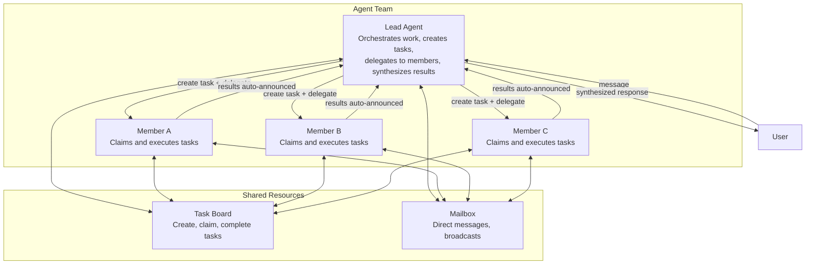
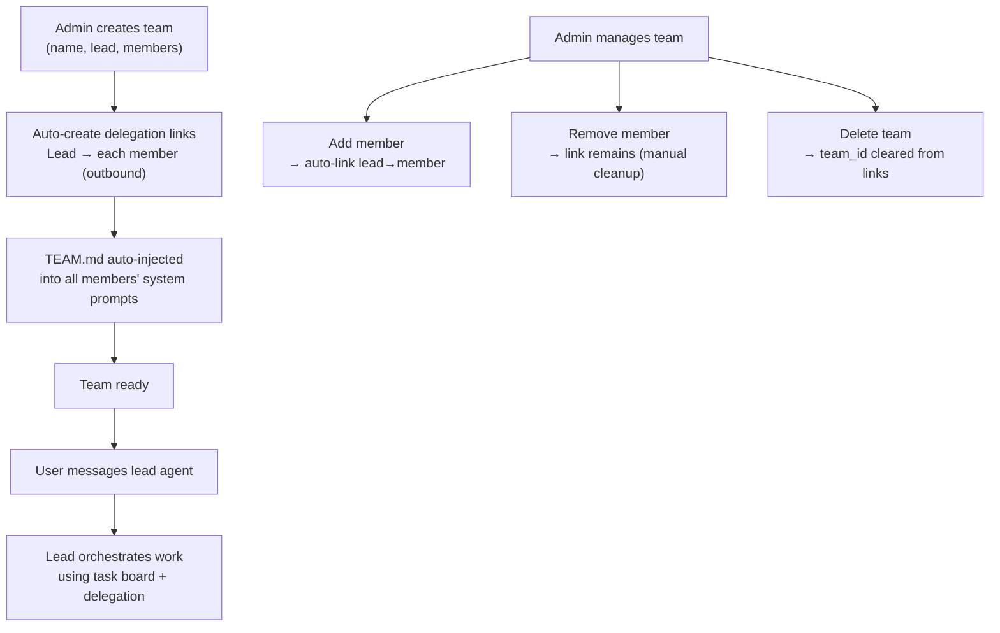
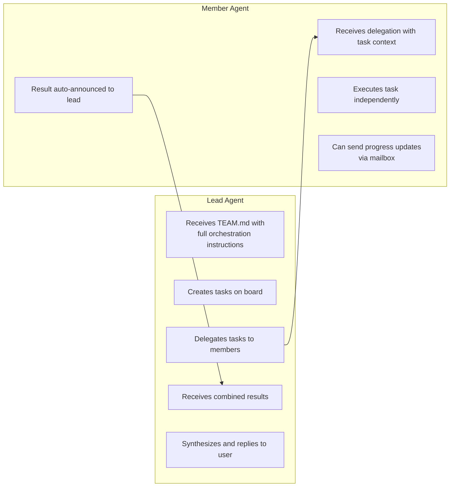
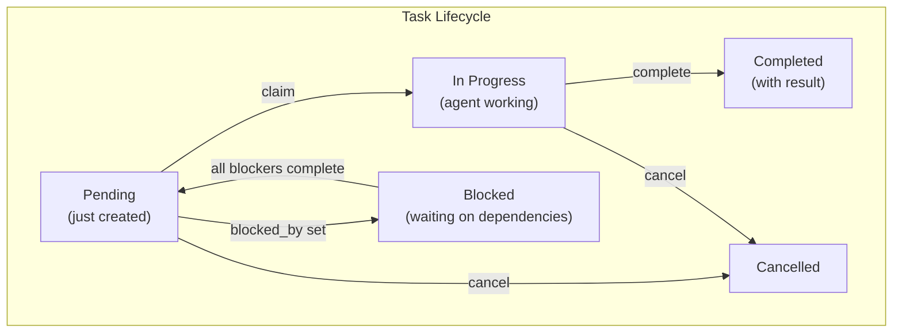
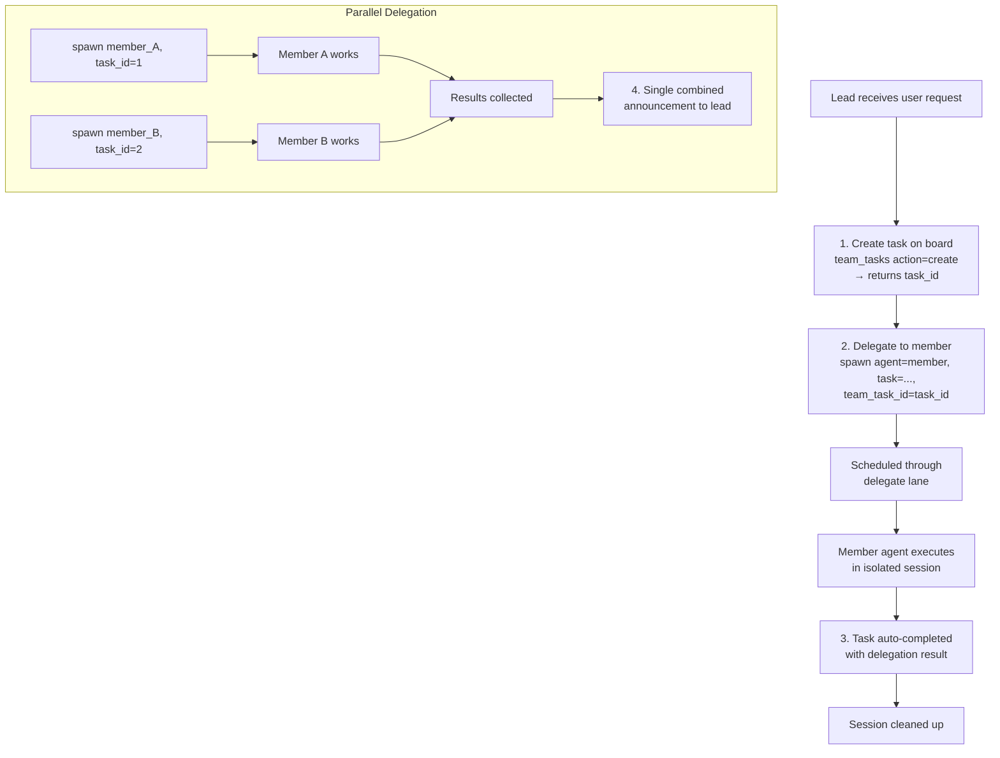
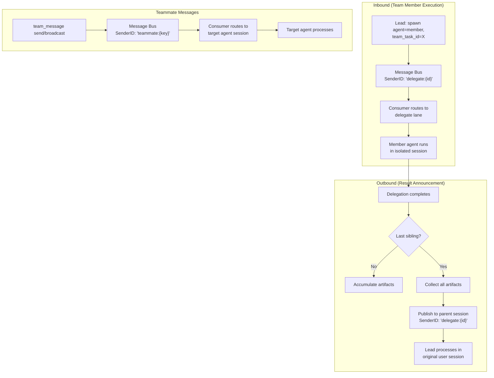

# 11 - Agent Teams

## 概述

Agent Teams 实现协作式多 Agent 编排。一个团队由一个 **lead** Agent 和一个或多个 **member** Agent 组成。Lead 通过在共享任务板上创建任务并委派给成员来编排工作。成员独立执行任务并回报结果。通信通过内置邮箱系统进行。

Teams 构建在委派系统之上（参见 [03-tools-system.md](./03-tools-system.md) 第 7 节），增加了结构化协调：任务跟踪、并行工作分发和结果聚合。

---

## 1. Team 模型



### 核心设计原则

- **以 Lead 为中心**：只有 Lead 在其系统提示中接收 `TEAM.md`，包含完整的编排指令。成员按需通过工具发现上下文——不会在空闲 Agent 上浪费 token。
- **强制任务跟踪**：来自 Lead 的每次委派都必须关联到任务板上的任务。系统会强制执行这一点——没有 `team_task_id` 的委派会被拒绝。
- **自动完成**：当委派完成时，其关联的任务会自动标记为完成。无需手动记账。
- **并行批处理**：当多个成员同时工作时，结果会被收集并在单个组合公告中传递给 Lead。

---

## 2. Team 生命周期



### 创建流程

1. 通过 key 或 UUID 解析 Lead Agent
2. 解析所有成员 Agent
3. 创建团队记录，状态为 `status=active`
4. 添加 Lead 为成员，角色为 `role=lead`
5. 添加每个成员，角色为 `role=member`
6. 自动创建从 Lead 到每个成员的出站 Agent 链接（direction: outbound, max_concurrent: 3，标记 `team_id`）
7. 使 Agent 路由器缓存失效，以便下次请求时注入 TEAM.md

后续添加成员时，同样的自动链接会发生。团队设置创建的链接会标记 `team_id`——这将其与手动创建的委派链接区分开。

---

## 3. Lead 与 Member 角色

Lead 和成员有根本不同的职责和工具访问权限。



### Lead 看到的内容（TEAM.md）

Lead 的系统提示包含 `TEAM.md` 部分，内容有：

- 团队名称和描述
- 完整的队友列表及其角色和专业领域（来自 `frontmatter`）
- **强制工作流程指令**：始终先创建任务，然后带着任务 ID 进行委派
- **编排模式**：顺序（A→B）、迭代（A→B→A）、并行（A+B→review）、混合
- **通信指南**：分配工作时通知用户，后续轮次分享进度

### Member 看到的内容（TEAM.md）

成员获得更简单的版本：

- 团队名称和队友列表
- 专注于执行委派工作的指令
- 如何通过邮箱向 Lead 发送进度更新
- 可用的任务板操作（list、get、search——无 create/delegate）

---

## 4. Task Board（任务板）

任务板是一个共享工作跟踪器，所有团队成员可通过 `team_tasks` 工具访问。



### 操作

| 操作 | 描述 | 使用者 |
|------|------|--------|
| `create` | 创建任务（包含主题、描述、优先级、blocked_by） | Lead |
| `claim` | 原子性地认领一个待处理任务 | 成员（或通过委派自动认领） |
| `complete` | 标记任务完成并附带结果摘要 | 成员（或通过委派自动完成） |
| `cancel` | 取消任务并说明原因 | Lead |
| `list` | 列出任务（过滤：active/completed/all，排序：priority/newest） | 所有人 |
| `get` | 获取完整任务详情，包括结果 | 所有人 |
| `search` | 对主题 + 描述进行全文搜索 | 所有人 |

### 原子认领

两个 Agent 抢占同一任务在数据库层面被阻止。认领操作使用条件更新：`SET status = 'in_progress', owner = agent WHERE status = 'pending' AND owner IS NULL`。更新一行表示认领成功；零行表示已被他人抢占。无需分布式互斥锁。

### 任务依赖

任务可以声明 `blocked_by`——前置任务 ID 列表。被阻塞的任务保持 `blocked` 状态，直到所有前置任务完成。当任务通过 `complete` 完成时，所有阻塞条件现已满足的依赖任务会自动从 `blocked` 转换为 `pending`。

### 用户范围

- 委派和系统频道查看团队的所有任务
- 终端用户只看到他们触发的任务（按用户 ID 过滤）
- 列表分页：每页 20 个任务
- 结果截断：`get` 为 8,000 字符，搜索摘要为 500 字符

---

## 5. Team Mailbox（团队邮箱）

邮箱通过 `team_message` 工具实现团队成员之间的点对点通信。

| 操作 | 描述 |
|------|------|
| `send` | 通过 Agent key 向特定队友发送私信 |
| `broadcast` | 向所有队友发送消息（除自己外） |
| `read` | 读取未读消息，自动标记为已读 |

### 消息格式

发送团队消息时，它会通过消息总线流转，带有 `"teammate:"` 前缀：

```
[Team message from {sender_key}]: {message text}
```

接收 Agent 将其作为入站消息处理，通过委派调度器通道路由。响应会发布回原始频道，以便用户（和 Lead）可以看到。

### 使用场景

- **Lead → Member**："请从任务板上认领一个任务"
- **Member → Lead**："任务部分完成，需要澄清需求"
- **Member → Member**：处理相关任务的队友之间的跨协调
- **Broadcast**：Lead 同时向所有成员分享上下文更新

---

## 6. 委派集成

Teams 与委派系统深度集成。强制工作流程确保每一项委派工作都被跟踪。



### Task ID 强制执行

当团队成员委派工作时，系统要求有效的 `team_task_id`：

- **缺少 Task ID**：委派被拒绝，错误信息解释要求。错误包括待处理任务列表以帮助 LLM 自我纠正。
- **无效 Task ID**：如果 LLM 幻觉出不存在的 UUID，错误会包括待处理任务作为提示。
- **跨团队 Task ID**：如果任务属于不同的团队，委派被拒绝。
- **自动认领**：委派开始时，关联的任务会自动被认领（状态：pending → in_progress）。

### 自动完成

当委派完成（成功或失败）：

1. 关联任务被标记为 `completed`，附带委派结果
2. 创建团队消息审计记录（from member → lead）
3. 委派会话被清理（删除）
4. 委派历史被保存，包含团队上下文（team_id、team_task_id、trace_id）

### 并行委派批处理

当 Lead 同时向多个成员委派：

- 每个委派在委派通道中独立运行
- 中间完成累积其结果（artifacts）
- 当**最后一个**兄弟委派完成时，所有累积的结果被收集
- 单个组合公告传递给 Lead，包含所有结果
- 每个单独的任务仍独立自动完成——批处理只影响公告

### 公告格式

组合公告包括：

- 每个成员 Agent 的结果，清晰分隔
- 交付物和媒体文件（自动交付）
- 耗时统计
- 给 Lead 的指导：向用户展示结果、委派后续任务或请求修订

如果所有委派都失败，Lead 会收到友好的错误通知，指导重试或直接处理。公告还会要求 Lead 在重试前通知用户遇到了小问题。

---

## 7. TEAM.md —— 系统注入的上下文

`TEAM.md` 是在 Agent 解析时生成的虚拟文件。它不存储在磁盘或数据库中——它根据当前团队配置动态渲染，并包装在 `<system_context>` 标签中注入系统提示。

### 生成触发器

在 Agent 解析期间，如果 Agent 属于某个团队：
1. 加载团队数据
2. 加载团队成员
3. 生成适合角色的 TEAM.md 内容
4. 作为上下文文件注入

### 内容差异

| 部分 | Lead | Member |
|------|------|--------|
| 团队名称 + 描述 | 是 | 是 |
| 队友列表及角色 | 是 | 是 |
| 强制工作流程（create→delegate） | 是 | 否 |
| 编排模式 | 是 | 否 |
| 通信指南 | 是 | 否 |
| 任务板操作（完整） | 是 | 有限 |
| "只做工作"指令 | 否 | 是 |
| 进度更新指导 | 否 | 是 |

### 编排模式（仅 Lead）

Lead 的 TEAM.md 描述三种编排模式：

- **顺序**：成员 A 完成 → Lead 审查 → 带着A的输出委派给成员 B
- **迭代**：成员 A 起草 → 成员 B 审查 → 带着 B 的反馈返回 A
- **混合**：成员 A+B 并行工作 → Lead 审查组合输出 → 委派给 C

### 负面上下文注入

如果 Agent 不属于任何团队且没有委派目标，系统注入负面上下文：
- "You are NOT part of any team. Do not use team_tasks or team_message tools."
- "You have NO delegation targets. Do not use spawn with agent parameter."

这防止 LLM 浪费迭代探测不可用的能力。

---

## 8. 消息路由

团队消息通过消息总线流转，有特定的路由规则。



### 路由前缀

| 前缀 | 来源 | 目的地 | 调度器通道 |
|------|------|--------|-----------|
| `delegate:` | 委派完成 | 父 Agent 的原始会话 | delegate |
| `teammate:` | 团队邮箱消息 | 目标 Agent 的会话 | delegate |

### 会话上下文保留

当委派或团队消息完成时，结果被路由回**原始用户会话**（而非新会话）。这通过元数据传播实现：

- `origin_channel`：用户发送消息的频道（如 telegram）
- `origin_peer_kind`：DM 或群组上下文
- `origin_local_key`：线程/主题上下文以正确路由（如论坛主题 ID）

这确保结果落在正确的对话线程中，即使在 Telegram 论坛主题或飞书话题讨论中。

---

## 9. 访问控制

团队通过团队设置支持细粒度访问控制。

### 团队级设置

| 设置 | 类型 | 描述 |
|------|------|------|
| `AllowUserIDs` | 字符串列表 | 只有这些用户可以触发团队工作 |
| `DenyUserIDs` | 字符串列表 | 这些用户被阻止（拒绝优先） |
| `AllowChannels` | 字符串列表 | 只有来自这些频道的消息触发团队工作 |
| `DenyChannels` | 字符串列表 | 阻止来自这些频道的消息 |

系统频道（`delegate`、`system`）始终通过访问检查。空设置表示开放访问。

### 链接级设置

每个委派链接（lead→member）有自己的设置：

| 设置 | 描述 |
|------|------|
| `UserAllow` | 只有这些用户可以触发此特定委派 |
| `UserDeny` | 阻止这些用户使用此委派（拒绝优先） |

### 并发限制

| 层级 | 范围 | 默认值 |
|------|------|--------|
| 每链接 | 从 Lead 到特定成员的同时委派数 | 3 |
| 每 Agent | 针对任何单个成员的总并发委派数 | 5 |

当达到限制时，错误消息为 LLM 推理编写："Agent at capacity (5/5). Try a different agent or handle it yourself."

---

## 10. 委派上下文

### SenderID 清除

在同步委派中，被委派 Agent 的上下文会清除 `senderID`。这很关键，因为委派是系统发起的——被委派者不应继承调用者的群组写入权限，否则会错误地拒绝文件写入。每个被委派 Agent 有自己的写入者列表。

### Trace 链接

委派追踪通过 `parent_trace_id` 链接到父追踪。这允许追踪系统显示完整的委派链：用户请求 → Lead 处理 → 成员委派 → 成员执行。

---

## 11. 事件

团队发出事件用于实时 UI 更新和可观测性。

| 事件 | 时机 |
|------|------|
| `delegation.started` | 异步委派开始 |
| `delegation.completed` | 委派成功完成 |
| `delegation.failed` | 委派失败 |
| `delegation.cancelled` | 委派被取消 |
| `team_task.created` | 新任务添加到任务板 |
| `team_task.completed` | 任务标记为完成 |
| `team_message.sent` | 邮箱消息已送达 |

---

## 文件参考

| 文件 | 用途 |
|------|------|
| `internal/gateway/methods/teams.go` | 团队 CRUD RPC 处理器，团队创建/成员添加时的自动链接创建 |
| `internal/tools/team_tool_manager.go` | 团队工具的共享后端，团队缓存（5 分钟 TTL），团队解析 |
| `internal/tools/team_tasks_tool.go` | 任务板工具：list、get、create、claim、complete、cancel、search |
| `internal/tools/team_message_tool.go` | 邮箱工具：send、broadcast、read，通过总线路由消息 |
| `internal/tools/delegate.go` | DelegateManager：同步/异步委派，团队任务强制执行，自动完成 |
| `internal/tools/delegate_state.go` | 活跃委派跟踪，artifacts 累积，会话清理 |
| `internal/tools/delegate_policy.go` | 访问控制：用户权限，团队访问，并发检查 |
| `internal/tools/delegate_events.go` | 委派事件广播 |
| `internal/agent/resolver.go` | TEAM.md 生成（buildTeamMD），在 Agent 解析时注入 |
| `internal/agent/systemprompt_sections.go` | TEAM.md 在系统提示中渲染为 `<system_context>` |
| `internal/store/team_store.go` | TeamStore 接口（22 个方法），数据类型 |
| `internal/store/pg/teams.go` | PostgreSQL 实现：teams、tasks、messages、handoff routes |
| `cmd/gateway_managed.go` | 团队工具连接，缓存失效订阅 |
| `cmd/gateway_consumer.go` | delegate/teammate 前缀的消息路由 |

---

## 交叉引用

| 文档 | 相关内容 |
|------|----------|
| [03-tools-system.md](./03-tools-system.md) | 委派系统，Agent 链接，质量门控，评估循环 |
| [06-store-data-model.md](./06-store-data-model.md) | 团队表结构，delegation_history，handoff_routes |
| [08-scheduling-cron.md](./08-scheduling-cron.md) | 委派调度器通道（并发 100），cron |
| [09-security.md](./09-security.md) | 委派安全，钩子递归防止 |