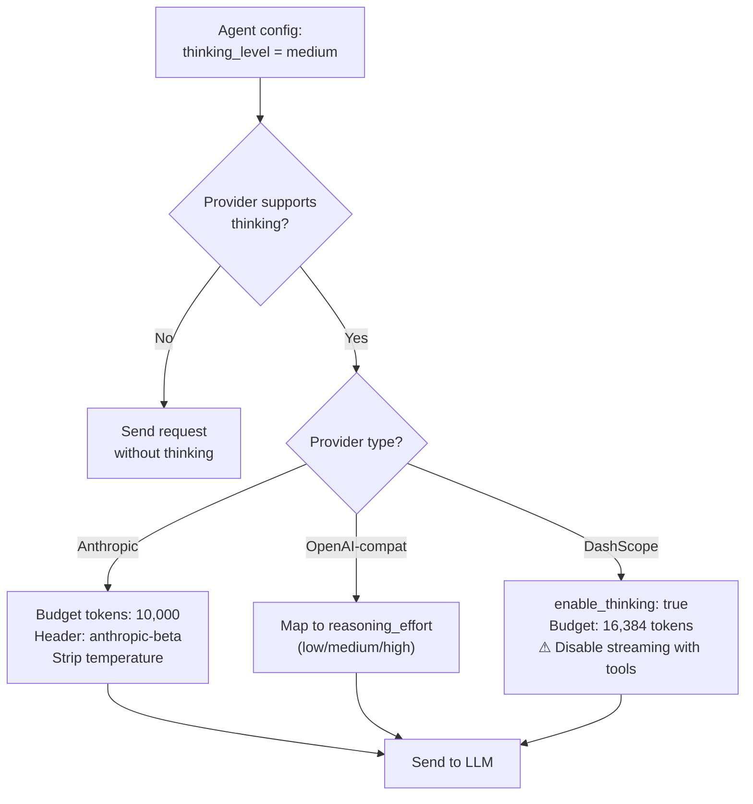
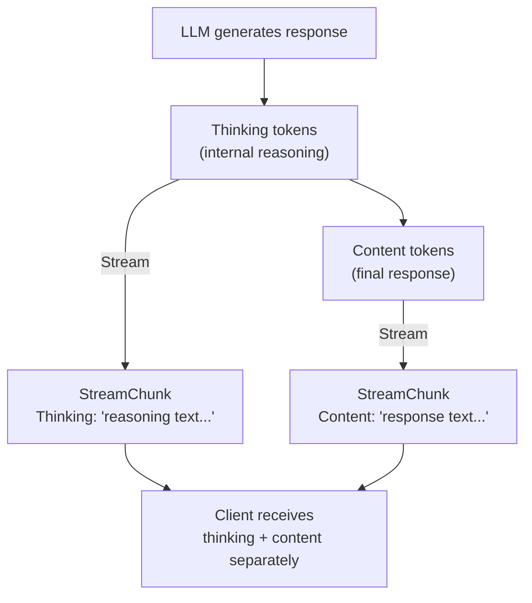
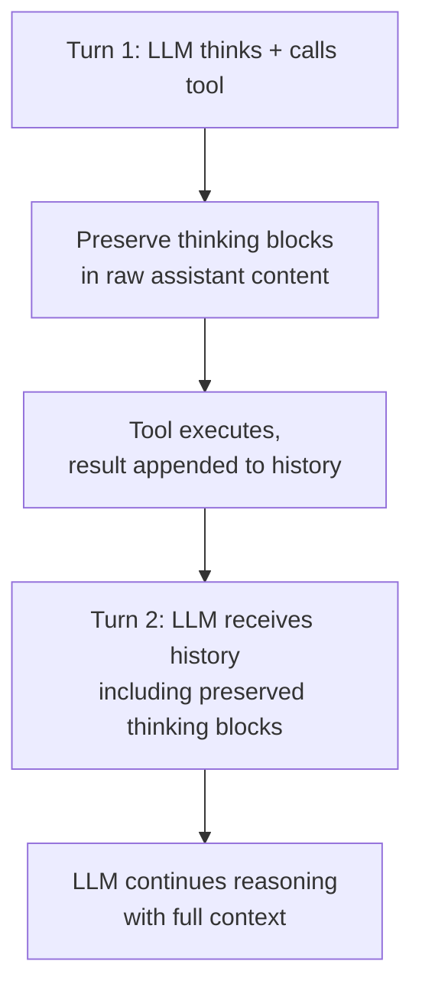

# 12 - Extended Thinking（扩展思考）

## 概述

Extended Thinking 允许 LLM 提供商在生成最终响应之前"大声思考"。启用后，模型会生成内部推理 token，以提高复杂任务的响应质量——代价是额外的 token 使用和延迟。GoClaw 通过统一的 `thinking_level` 配置支持多个提供商的 Extended Thinking。

---

## 1. 配置

思考通过 `thinking_level` 设置按 Agent 控制。

| 级别 | 行为 |
|------|------|
| `off` | 禁用思考（默认） |
| `low` | 最少思考——快速推理 |
| `medium` | 适度思考——平衡推理 |
| `high` | 最多思考——复杂任务的深度推理 |

设置可以配置为：
- **按 Agent**：在 Agent 配置中（适用于该 Agent 的所有用户）
- **按用户覆盖**：通过 `user_agent_overrides` 表（保留供将来使用）

---

## 2. 提供商支持

每个提供商将抽象的 `thinking_level` 映射到自己的实现参数。

### Anthropic（原生）

| Thinking Level | Budget Tokens |
|:-:|:-:|
| low | 4,096 |
| medium | 10,000 |
| high | 32,000 |

启用思考时：
- 在请求体中添加 `thinking: {type: "enabled", budget_tokens: N}`
- 设置 `anthropic-beta: interleaved-thinking-2025-05-14` 请求头
- 移除 `temperature` 参数（Anthropic 要求——思考时不能使用 temperature）
- 自动调整 `max_tokens` 以适应思考预算（预算 + 8,192 缓冲）

### OpenAI-Compatible（OpenAI、Groq、DeepSeek 等）

将 `thinking_level` 直接映射到 `reasoning_effort`：
- `low` → `reasoning_effort: "low"`
- `medium` → `reasoning_effort: "medium"`
- `high` → `reasoning_effort: "high"`

推理内容在流式响应的 `reasoning_content` 字段中返回。

### DashScope（阿里 Qwen）

| Thinking Level | Budget Tokens |
|:-:|:-:|
| low | 4,096 |
| medium | 16,384 |
| high | 32,768 |

通过 `enable_thinking: true` 加 `thinking_budget` 参数启用思考。

**重要限制**：DashScope 在有工具时不支持流式传输。当 Agent 启用了工具且思考处于活动状态时，提供商会自动回退到非流式模式（单个 `Chat()` 调用），并合成 chunk 回调以维持事件流。

---

## 3. 流式传输

当思考处于活动状态时，推理内容与常规内容一起流式传输到客户端。

### 提供商特定的流式事件

| 提供商 | Thinking 事件 | Content 事件 |
|------|---------------|---------------|
| Anthropic | content blocks 中的 `thinking_delta` | content blocks 中的 `text_delta` |
| OpenAI-compat | delta 中的 `reasoning_content` | delta 中的 `content` |
| DashScope | 有工具时无法流式传输（回退到非流式） | 同上 |

### Token 估算

思考 token 按 `character_count / 4` 估算用于上下文窗口跟踪。这个粗略估算确保 Agent 循环在计算上下文使用量时能考虑思考开销。

---

## 4. 工具循环处理

Extended Thinking 与多轮工具对话交互。当 LLM 调用工具后需要继续推理时，思考块必须在各轮之间正确保留。

### Anthropic Thinking 块保留

Anthropic 要求思考块（包括其加密签名）在后续轮次中回传。GoClaw 通过 `RawAssistantContent` 处理：

1. 流式传输期间，原始内容块被累积——包括带有 `signature` 字段的 `thinking` 类型块
2. 当助手消息被追加到历史记录时，原始块被保留
3. 在下一次 LLM 调用时，这些块原样发送回去，确保 API 可以验证思考连续性

这对正确性至关重要：如果思考块被丢弃或修改，Anthropic API 可能拒绝请求或产生降级的响应。

### 其他提供商

OpenAI-compatible 提供商将思考/推理内容作为元数据处理。`reasoning_content` 在流式传输期间累积，但不需要特殊的回传处理——每轮的推理是独立的。

---

## 5. 限制

| 提供商 | 限制 |
|------|------|
| DashScope | 有工具时无法流式传输——回退到非流式模式 |
| Anthropic | 启用思考时移除 temperature 参数 |
| 所有 | 思考 token 计入上下文窗口预算 |
| 所有 | 思考增加延迟和成本，与预算级别成正比 |

---

## 文件参考

| 文件 | 用途 |
|------|------|
| `internal/providers/types.go` | ThinkingCapable 接口，StreamChunk.Thinking 字段，OptThinkingLevel 常量 |
| `internal/providers/anthropic.go` | Anthropic 思考实现：预算映射、请求头注入、temperature 移除 |
| `internal/providers/anthropic_stream.go` | 流式传输：thinking_delta 处理、RawAssistantContent 累积 |
| `internal/providers/anthropic_request.go` | 请求构建：工具循环的思考块保留 |
| `internal/providers/openai.go` | OpenAI-compat：reasoning_effort 映射、reasoning_content 流式传输 |
| `internal/providers/dashscope.go` | DashScope：思考预算、工具+流式传输限制回退 |

---

## 交叉引用

| 文档 | 相关内容 |
|------|----------|
| [02-providers.md](./02-providers.md) | 提供商架构，支持的提供商 |
| [01-agent-loop.md](./01-agent-loop.md) | LLM 迭代循环，流式 chunk 处理 |